# Serverless with Azure Functions

## Overview

Functions have been the basic building blocks of software since the first lines of code were written and the need for code organization and reuse became a necessity. Azure Functions expand on these concepts by allowing developers to create "serverless", event-driven functions that run in the cloud and can be shared across a wide variety of services and systems, uniformly managed, and easily scaled based on demand. In addition, Azure Functions can be written in a variety of languages, including C#, JavaScript, Python, Bash, and PowerShell, and they're perfect for building apps and nanoservices that employ a compute-on-demand model.

In this lab, you will create an Azure Function that monitors a blob container in Azure Storage for new images, and then performs automated analysis of the images using the Microsoft Cognitive Services [Computer Vision API](https://www.microsoft.com/cognitive-services/en-us/computer-vision-api). Specifically, The Azure Function will analyze each image that is uploaded to the container for adult or racy content and create a copy of the image in another container. Images that contain adult or racy content will be copied to one container, and images that do not contain adult or racy content will be copied to another. In addition, the scores returned by the Computer Vision API will be stored in blob metadata.

### Objectives

In this hands-on lab, you will learn how to:

- Create an Azure Function App
- Write an Azure Function that uses a blob trigger
- Add application settings to an Azure Function App
- Use Microsoft Cognitive Services to analyze images and store the results in blob metadata

### Prerequisites

**Optional**: Install the [Microsoft Azure Storage Explorer](http://storageexplorer.com). If you do not have administrative rights on your machine, skip this step. Alternatively, you can use the Azure Storage Web interface in the Azure Portal to perform the operations.

### Resources

[Click here](./resources/pictures.zip) to download a zip file containing the resources used in this lab. Copy the contents of the zip file into a folder on your hard disk. You will need it later.

---

## Exercises

This hands-on lab includes the following exercises:

- Exercise 1: Create an App Service Plan and an Azure Function App
- Exercise 2: Add an Azure Function
- Exercise 3: Add a subscription key to application settings
- Exercise 4: Test the Azure Function
- Exercise 5: View blob metadata

Estimated time to complete this lab: **45-60** minutes.

## Exercise 1: Create an App Service Plan and an Azure Function App

Before you can write an Azure Function you need to create an Azure Function App as the deployment target and the execution environment. In addition, we will create an App Service Plan to avoid a shared resource conflict in our lab environment. In your own subscription you can instead use another option, the so-called "Consumption Plan" to avoid the extra creation of an App Service Plan. For more information, see [Azure Functions - Scale and Hosting](https://docs.microsoft.com/en-us/azure/azure-functions/functions-scale)

In this exercise, you will create an App Service Plan and an Azure Function App using the Azure Portal. Then you will add the three blob containers to the storage account that is created for the Function App: one to store uploaded images, a second to store images that do not contain adult or racy content, and a third to contain images that *do* contain adult or racy content.

### Task 1: Create an App Service Plan

1. Open the [Azure Portal](https://portal.azure.com) in your browser. If asked to log in, do so using your provided lab account or your own Azure subscription.

1. Click **+ Create a resource**, followed by searching for **App Service Plan**
    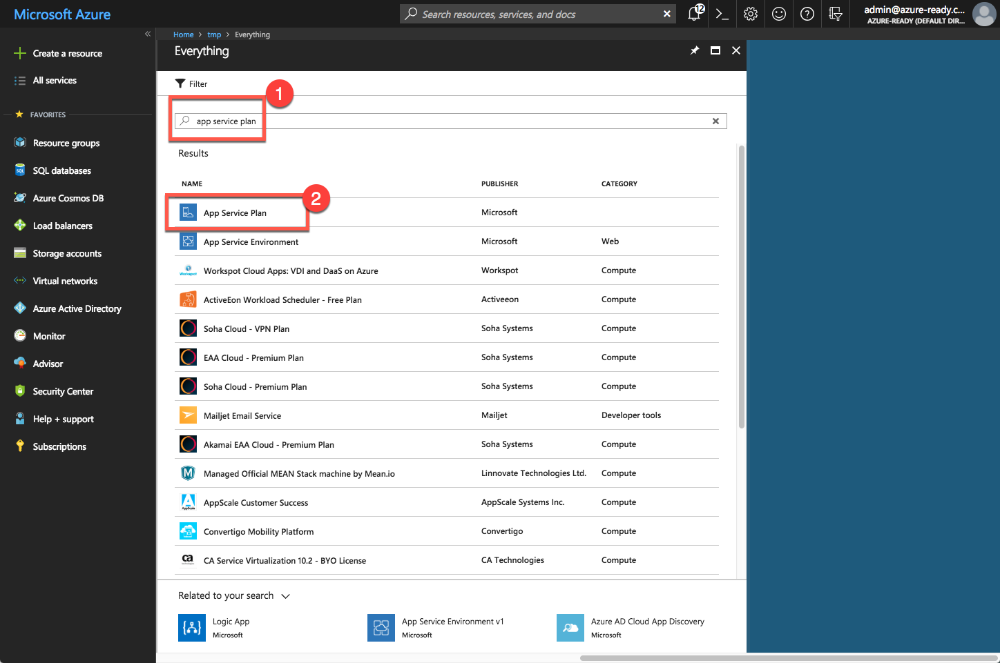

1. Confirm the start of the App Service Plan creation process.
    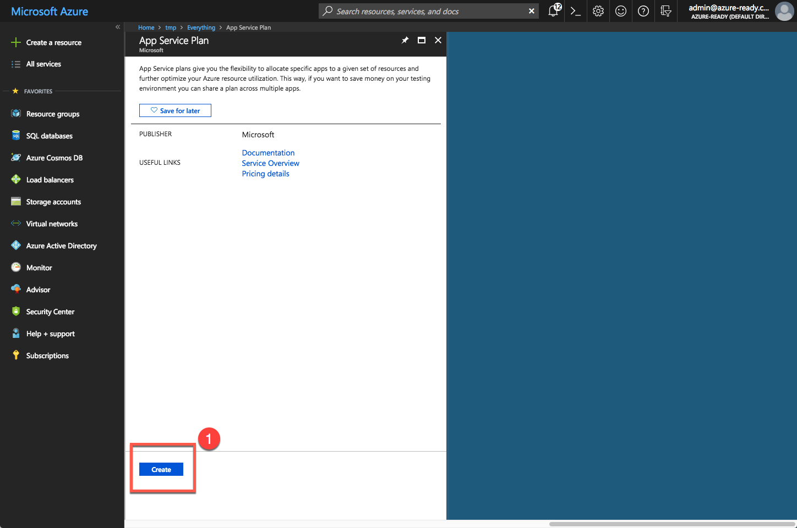

1. Provide App Service Plan configuration details.
    - Make sure you select the existing resource group in (2).
    - Make sure you change the Pricing Tier in (5) as described in the next step.
    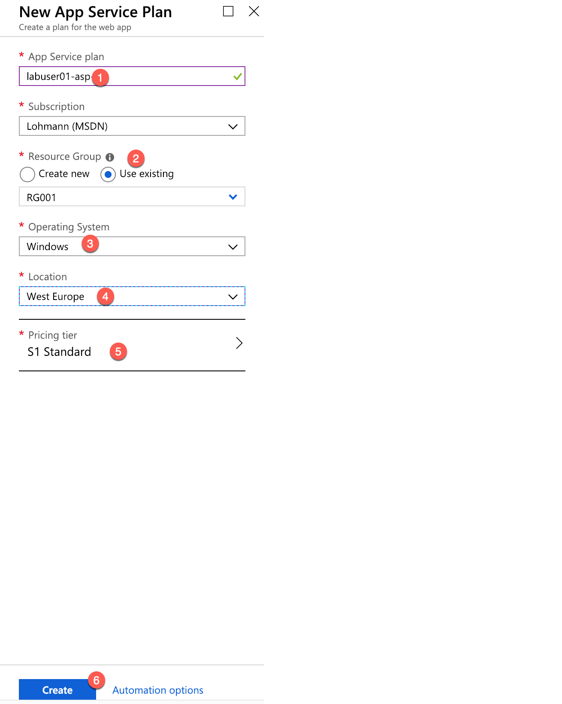

1. Change the Pricing Tier to S1.
    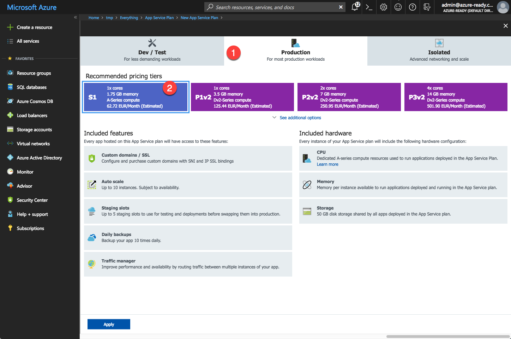

1. After the pricing tier has been updated, confirm the creation.
    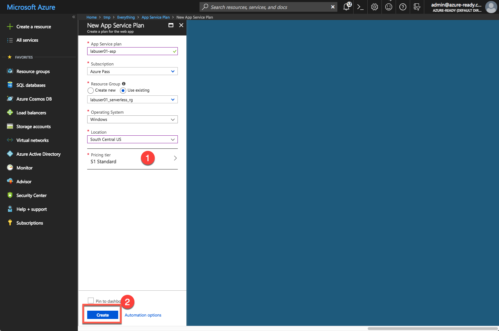

1. The deployment should finish a couple of minutes later.
    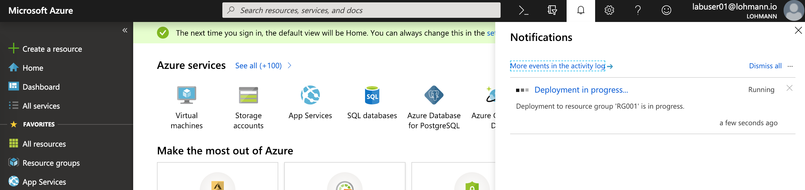
    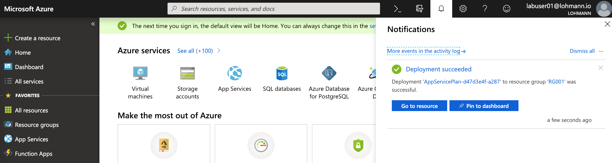
    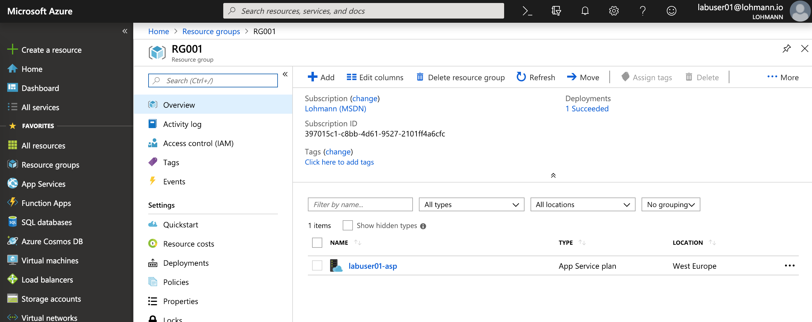

### Task 2: Create a Function App

1. Now we are going to create a **Function App** that references the created App Service Plan. Click **+ Create a resource**, followed by **Compute** and **Function App** or search for it.
    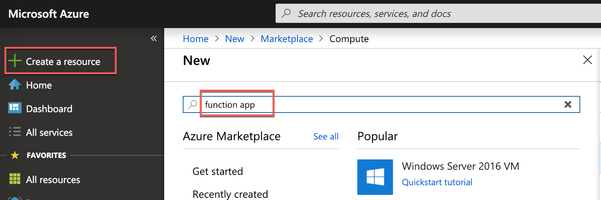

1. Enter an app name that is unique within Azure. Under **Resource Group**, select **Use Existing** and choose "labuserXX_serverless_rg" (XX = your lab user number) as the resource-group name to create a resource group for the Function App.

    If you are using your own subscription, feel free to setup your own resource group. Choose the **Location** nearest you (e.g. Southcentral US or West Europe), and accept the default values for all other parameters. Then click **Create** to create a new Function App.

    Make sure to select your App Service Plan in the Hosting Plan configuration.

    > If you are in a shared subscription lab environment do **not** use the Consumption Plan. Instead choose the previously created app service plan.
    > The app name becomes part of a DNS name and therefore must be unique within Azure. Make sure a green check mark appears to the name indicating it is unique. You probably **won't** be able to use "functionslab" as the app name.

    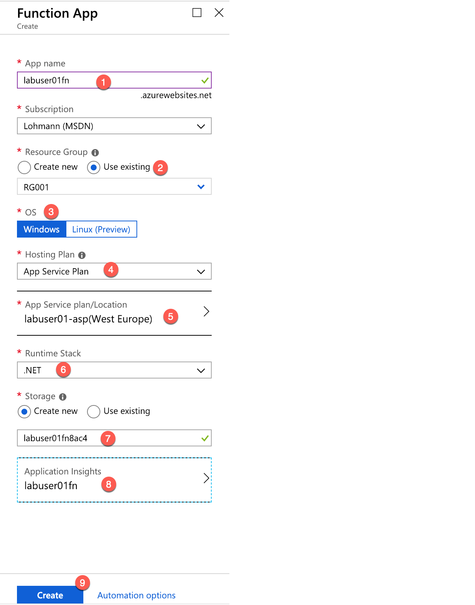

### Task 3: Uploading the test data

1. Click **Resource groups** in the ribbon on the left side of the portal, and then click the resource group created for the Function App.

    

1. Periodically click the **Refresh** button at the top of the blade until "Deploying" changes to "Succeeded," indicating that the Function App has been deployed. Then click the storage account that was created for the Function App. The name of the storage account has random parts to it - specifically for your deployment. So expect it to be different than shown at the screenshot.

    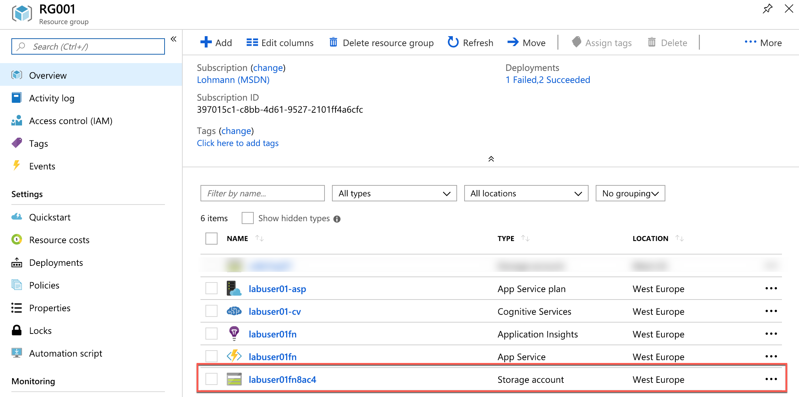

1. Click **Blobs** to view the contents of blob storage.

    

1. Click **+ Container**. Type "uploaded" into the **Name** box and set **Public access level** to **Private**. Then click the **OK** button to create a new container.

     

1. Repeat Step 13 to add containers named "accepted" and "rejected" to blob storage.

1. Confirm that all three containers were added to blob storage.

     

The Azure Function App has been created and you have added three containers to the storage account created for it. The next step is to add an Azure Function.

## Exercise 2: Implement an Azure Function

Once you have created an Azure Function App, you can add Azure Functions to it. In this exercise, you will add a function to the Function App you created in the first exercise and write C# code that uses the [Computer Vision API](https://www.microsoft.com/cognitive-services/en-us/computer-vision-api) to analyze images added to the "uploaded" container for adult or racy content.

1. Return to the blade for the "labuserXX_serverless_rg" resource group and click the Azure Function App that you created in the first exercise. 

    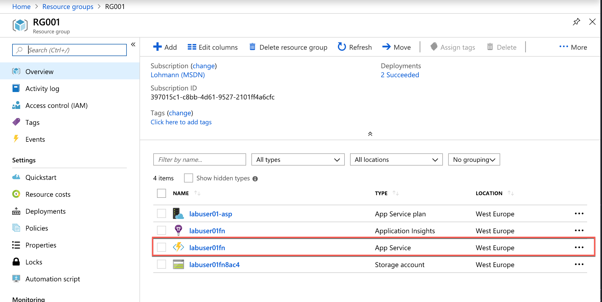

1. Click the **+** sign to the right of **Functions**. Set the language to **CSharp**, and then click **Custom function**.

    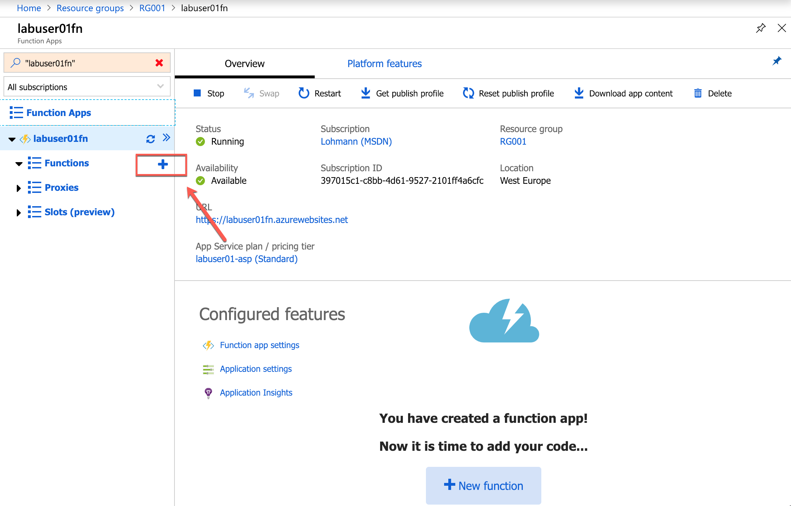

1. Set **Language** to **C#**. Then click **BlobTrigger - C#**.
  
    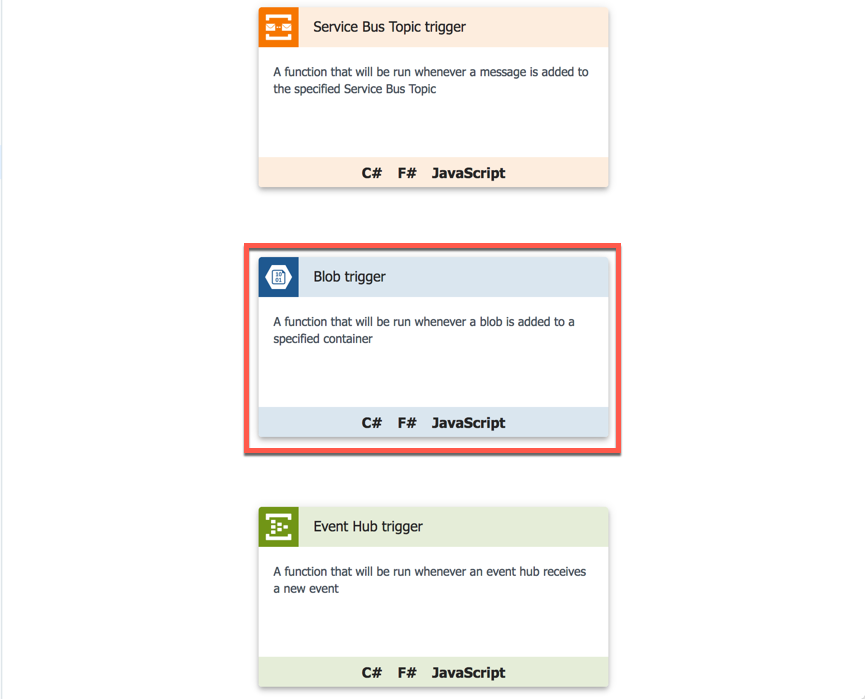

1. Enter "BlobImageAnalysis" (without quotation marks) for the function name and "uploaded/{name}" into the **Path** box. (The latter applies the blob storage trigger to the "uploaded" container that you created in Exercise 1.) Then click the **Create** button to create the Azure Function.

    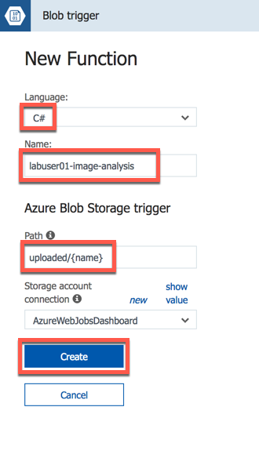

1. Replace the code shown in the code editor with the following statements:

    ```C#
    using Microsoft.WindowsAzure.Storage.Blob;
    using Microsoft.WindowsAzure.Storage;
    using System.Net.Http.Headers;
    using System.Configuration;

    public async static Task Run(Stream myBlob, string name, TraceWriter log)
    {
        log.Info($"Analyzing uploaded image {name} for adult content...");

        var array = await ToByteArrayAsync(myBlob);
        var result = await AnalyzeImageAsync(array, log);

        log.Info("Is Adult: " + result.adult.isAdultContent.ToString());
        log.Info("Adult Score: " + result.adult.adultScore.ToString());
        log.Info("Is Racy: " + result.adult.isRacyContent.ToString());
        log.Info("Racy Score: " + result.adult.racyScore.ToString());

        if (result.adult.isAdultContent || result.adult.isRacyContent)
        {
            // Copy blob to the "rejected" container
            StoreBlobWithMetadata(myBlob, "rejected", name, result, log);
        }
        else
        {
            // Copy blob to the "accepted" container
            StoreBlobWithMetadata(myBlob, "accepted", name, result, log);
        }
    }

    private async static Task<ImageAnalysisInfo> AnalyzeImageAsync(byte[] bytes, TraceWriter log)
    {
        HttpClient client = new HttpClient();

        var key = ConfigurationManager.AppSettings["SubscriptionKey"];
        client.DefaultRequestHeaders.Add("Ocp-Apim-Subscription-Key", key);

        HttpContent payload = new ByteArrayContent(bytes);
        payload.Headers.ContentType = new MediaTypeWithQualityHeaderValue("application/octet-stream");

        var endpoint = ConfigurationManager.AppSettings["VisionEndpoint"];
        var results = await client.PostAsync(endpoint + "/analyze?visualFeatures=Adult", payload);
        var result = await results.Content.ReadAsAsync<ImageAnalysisInfo>();
        return result;
    }

    // Writes a blob to a specified container and stores metadata with it
    private static void StoreBlobWithMetadata(Stream image, string containerName, string blobName, ImageAnalysisInfo info, TraceWriter log)
    {
        log.Info($"Writing blob and metadata to {containerName} container...");

        var connection = ConfigurationManager.AppSettings["AzureWebJobsStorage"].ToString();
        var account = CloudStorageAccount.Parse(connection);
        var client = account.CreateCloudBlobClient();
        var container = client.GetContainerReference(containerName);

        try
        {
            var blob = container.GetBlockBlobReference(blobName);

            if (blob != null)
            {
                // Upload the blob
                blob.UploadFromStream(image);

                // Get the blob attributes
                blob.FetchAttributes();

                // Write the blob metadata
                blob.Metadata["isAdultContent"] = info.adult.isAdultContent.ToString();
                blob.Metadata["adultScore"] = info.adult.adultScore.ToString("P0").Replace(" ","");
                blob.Metadata["isRacyContent"] = info.adult.isRacyContent.ToString();
                blob.Metadata["racyScore"] = info.adult.racyScore.ToString("P0").Replace(" ","");

                // Save the blob metadata
                blob.SetMetadata();
            }
        }
        catch (Exception ex)
        {
            log.Info(ex.Message);
        }
    }

    // Converts a stream to a byte array
    private async static Task<byte[]> ToByteArrayAsync(Stream stream)
    {
        Int32 length = stream.Length > Int32.MaxValue ? Int32.MaxValue : Convert.ToInt32(stream.Length);
        byte[] buffer = new Byte[length];
        await stream.ReadAsync(buffer, 0, length);
        stream.Position = 0;
        return buffer;
    }

    public class ImageAnalysisInfo
    {
        public Adult adult { get; set; }
        public string requestId { get; set; }
    }

    public class Adult
    {
        public bool isAdultContent { get; set; }
        public bool isRacyContent { get; set; }
        public float adultScore { get; set; }
        public float racyScore { get; set; }
    }
    ```

    ```Run``` is the method called each time the function is executed. The ```Run``` method uses a helper method named ```AnalyzeImageAsync``` to pass each blob added to the "uploaded" container to the Computer Vision API for analysis. Then it calls a helper method named ```StoreBlobWithMetadata``` to create a copy of the blob in either the "accepted" container or the "rejected" container, depending on the scores returned by ```AnalyzeImageAsync```.

1. Click the **Save** button at the top of the code editor to save your changes. Then click **View files**.

    

1. Click **+ Add** to add a new file, and name the file **project.json**.

    

1. Add the following statements to **project.json**:

    ```json
    {
        "frameworks": {
            "net46": {
                "dependencies": {
                    "WindowsAzure.Storage": "7.2.0"
                }
            }
        }
    }
    ```

1. Click the **Save** button to save your changes. Then click **run.csx** to go back to that file in the code editor.

    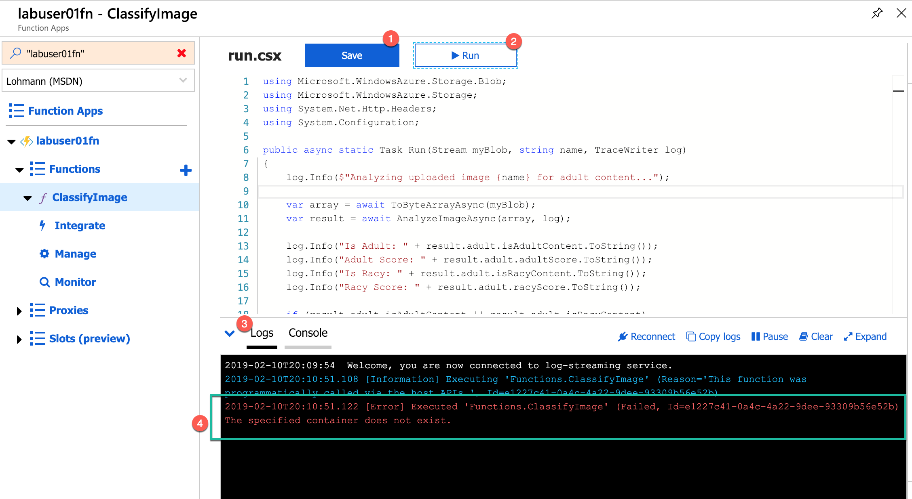

    _Saving the project file_

An Azure Function written in C# has been created, complete with a JSON project file containing information regarding project dependencies. The next step is to add an application setting that the Azure Function relies on.

## Exercise 3: Add a subscription key to application settings

The Azure Function you created in Exercise 2 loads a subscription key for the Microsoft Cognitive Services Computer Vision API from application settings. This key is required in order for your code to call the Computer Vision API, and is transmitted in an HTTP header in each call. It also loads the base URL for the Computer Vision API (which varies by data center) from application settings. In this exercise, you will subscribe to the Computer Vision API, and then add an access key and a base URL to application settings.

1. In the Azure Portal, click **+ Create a resource**, followed by **AI + Cognitive Services** and **Computer Vision API**.

    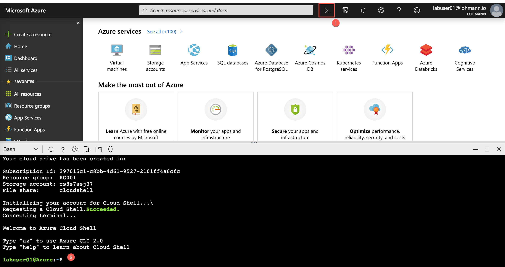

1. Enter "VisionAPI" into the **Name** box and select **S1** as the **Pricing tier**. Under **Resource Group**, select **Use existing** and select the "labuserXX_serverless_rg" resource group that you created for the Function App in Exercise 1. Check the **I confirm** box, and then click **Create**.

    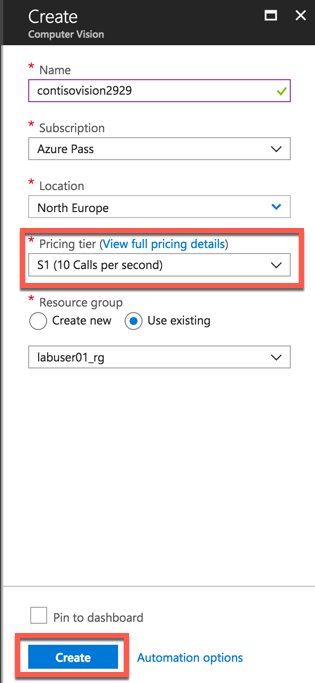

1. Return to the blade for "labuserXX_serverless_rg" and click the Computer Vision API subscription that you just created.

    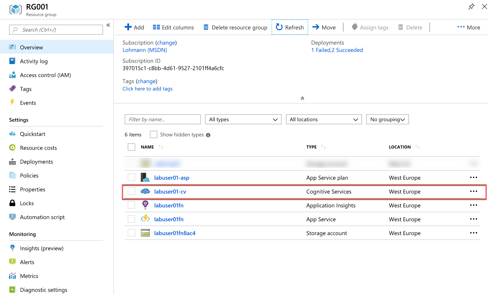

1. Copy the URL under **Endpoint** into your favorite text editor so you can easily retrieve it in a moment. Then click **Show access keys**.

    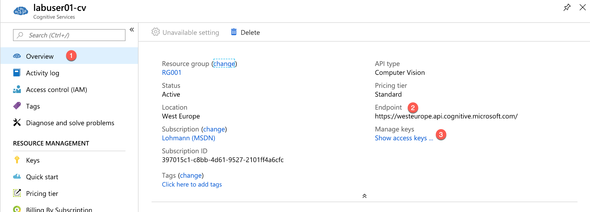

1. Click the **Copy** button to the right of **KEY 1** to copy the access key to the clipboard.

    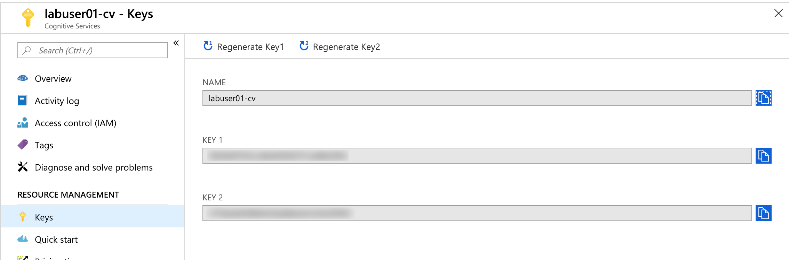

1. Return to the Function App in the Azure Portal and click the app name in the ribbon on the left. Then click **Application settings**.

    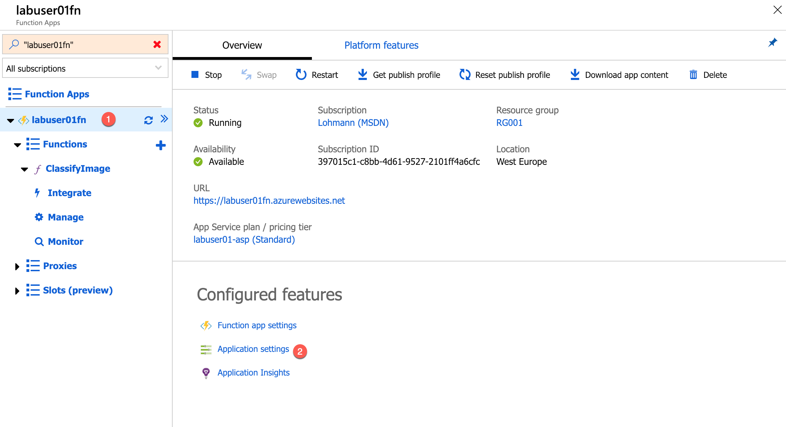

1. Scroll down to the "Application settings" section. Add a new app setting named "SubscriptionKey" (without quotation marks), and paste the subscription key that is on the clipboard into the **Value** box. Then add a setting named "VisionEndpoint" and set its value to the endpoint URL you saved in Step 4. Finish up by clicking **Save** at the top of the blade.

    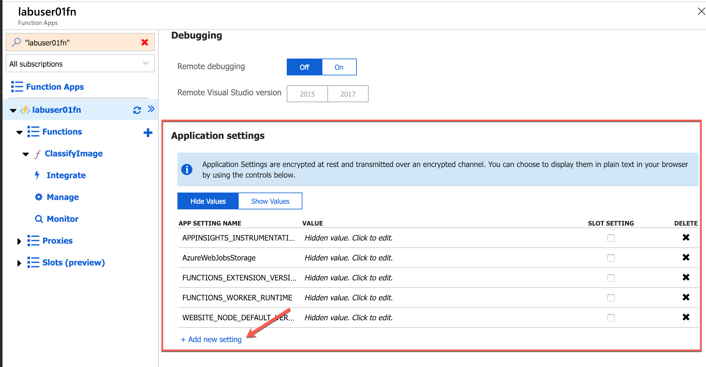

1. The app settings are now configured for your Azure Function. It's a good idea to validate those settings by running the function and ensuring that it compiles without errors. Click **BlobImageAnalysis**. Then click **Run** to compile and run the function. Confirm that no compilation errors appear in the output log, and **ignore** any exceptions that are reported on binding to the storage item. This is expected not to work as the event's parameter is not provided to our function when we click "Run".

    

The work of writing and configuring the Azure Function is complete. Now comes the fun part: testing it out.

## Exercise 4: Test the Azure Function

Your function is configured to listen for changes to the blob container named "uploaded" that you created in Exercise 1. Each time an image appears in the container, the function executes and passes the image to the Computer Vision API for analysis. To test the function, you simply upload images to the container. In this exercise, you will use the Azure Portal to upload images to the "uploaded" container and verify that copies of the images are placed in the "accepted" and "rejected" containers.

1. In the Azure Portal, go to the resource group created for your Function App. Then click the storage account that was created for it.

    

1. Click **Blobs** to view the contents of blob storage.

    

1. Click **uploaded** to open the "uploaded" container.

    

1. Click **Upload**.

    

1. Click the button with the folder icon to the right of the **Files** box. Select all of the files in this lab's "Resources" folder. Then click the **Upload** button to upload the files to the "uploaded" container. If you have not downloaded the resources yet, [click here](./resources/pictures.zip) to download a zip file containing the images used in this lab.

    

1. Return to the blade for the "uploaded" container and verify that eight images were uploaded.

    

1. Close the blade for the "uploaded" container and open the "accepted" container.

    

1. Verify that the "accepted" container holds seven images. **These are the images that were classified as neither adult nor racy by the Computer Vision API**.

    > Because you chose "Consumption Plan" when creating the Function App, it may take a few minutes for all of the images to appear in the container. If necessary, click **Refresh** periodically until you see all seven images.

    

1. Close the blade for the "accepted" container and open the blade for the "rejected" container. Verify that the "rejected" container holds one image. **This image was classified as adult or racy (or both) by the Computer Vision API**.

    

The presence of seven images in the "accepted" container and one in the "rejected" container is proof that your Azure Function executed each time an image was uploaded to the "uploaded" container. If you would like, return to the BlobImageAnalysis function in the portal and click **Monitor**. You will see a log detailing each time the function executed.

## Exercise 5: View blob metadata

What if you would like to view the scores for adult content and raciness returned by the Computer Vision API for each image uploaded to the "uploaded" container? The scores are stored in blob metadata for the images in the "accepted" and "rejected" containers, but blob metadata can't be viewed through the Azure Portal.

In this exercise, you will use the cross-platform [Microsoft Azure Storage Explorer](https://storageexplorer.com) to view blob metadata and see how the Computer Vision API scored the images you uploaded. **Alternatively,** you can also use the Azure Portal and the built-in storage explorer.

1. If you haven't installed the Microsoft Azure Storage Explorer, go to [https://storageexplorer.com](https://storageexplorer.com) and install it now. Versions are available for Windows, MacOS, and Linux.

1. Start Storage Explorer. If you are asked to log in, do so using the same account you used to log in to the Azure Portal.

1. Find the storage account that was created for your Azure Function App in [Exercise 1](#Exercise1) and expand the list of blob containers underneath it. Then click the container named "rejected."

    

1. Right-click (on a Mac, Command-click) the image in the "rejected" container and select **Properties** from the context menu.

    

1. Inspect the blob's metadata. *IsAdultContent* and *isRacyContent* are Boolean values that indicate whether the Computer Vision API detected adult or racy content in the image. *adultScore* and *racyScore* are the computed probabilities.

    

1. Open the "accepted" container and inspect the metadata for some of the blobs stored there. How do these metadata values differ from the ones attached to the blob in the "rejected" container?

You can probably imagine how this might be used in the real world. Suppose you were building a photo-sharing site and wanted to prevent adult images from being stored. You could easily write an Azure Function that inspects each image that is uploaded and deletes it from storage if it contains adult content.

## Summary

In this hands-on lab you learned how to:

- Create an Azure Function App
- Write an Azure Function that uses a blob trigger
- Add application settings to an Azure Function App
- Use Microsoft Cognitive Services to analyze images and store the results in blob metadata

This is just one example of how you can leverage Azure Functions to automate repetitive tasks. Experiment with other Azure Function templates to learn more about Azure Functions and to identify additional ways in which they can aid your research or business.
