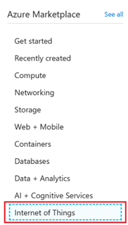
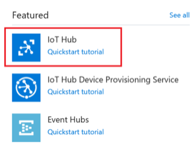
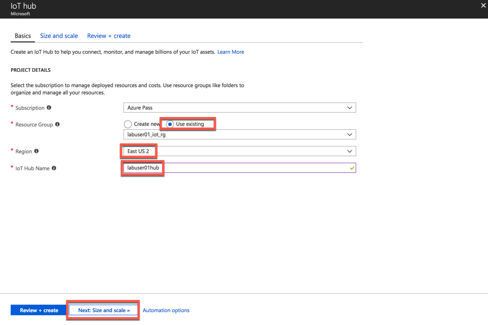

# Introduction to Azure IoT Hub

Azure IoT Hub is a fully managed service that enables reliable and secure bidirectional communications between millions of IoT devices and a solution back end. Azure IoT Hub:

* Provides multiple *device-to-cloud* and *cloud-to-device* communication options. These options include one-way messaging, file transfer, and request-reply methods.
* Provides built-in declarative message routing to other Azure services.
* Provides a queryable store for device metadata and synchronized state information.
* Enables secure communications and access control using per-device security keys or X.509 certificates.
* Provides extensive monitoring for device connectivity and device identity management events.
* Includes device libraries for the most popular languages and platforms.

The IoT Hub enables you to:

* **Establish** bi-directional communication with billions of IoT devices
* **Authenticate** per device for security-enhanced IoT solutions
* **Register** devices at scale with IoT Hub Device Provisioning Service
* **Manage** your IoT devices at scale with device management
* **Extend** the power of the cloud to your edge device

## Task 1: Create an IoT Hub

Create an IoT Hub to connect your real device or simulator to this IoTHub and start sending data.

Click on **Create a resource** and click on **Internet of Things**

Click on **IoTHub**

If you are working in a shared lab environment, make sure you select the resource group which is assigned to you, e.g. `labuser01_iot_rg`.

In the Name field, enter a unique name for your IoT hub. The name of your IoT hub must be **unique** across all IoT hubs. **Important**, please select as location `East US 2`.

In the Tier filed, select **S1 tier**.

You can choose from several tiers depending on how many features you want and how many messages you send through your solution per day. The free tier is intended for testing and evaluation. It allows 500 devices to be connected to the IoT hub and up to 8,000 messages per day. Each Azure subscription can create one IoT Hub in the free tier.

The **S1** tier allows total of 400,000 messages per unit per day.

For details about the other tier options, see [Choosing the right IoT Hub tier](https://azure.microsoft.com/en-us/pricing/details/iot-hub/).
