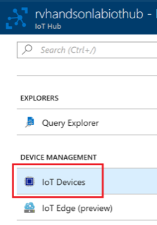
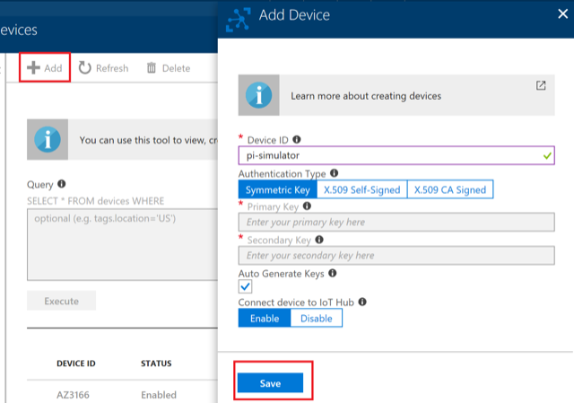

# Connect PI Simulator to IoT Hub

In this lab you will:

* Learn to create a device using Azure Portal

* Connect the simulator to IoT Hub

* Send telemetry data to Azure

## Task 1: Create a Device

Go To your IoT Hub in the portal and click on **IoT Devices**

Click on **+ Add** and enter a **Device ID** and click **Save**.

Click on the device and copy the primary key connection string. 

## Task 2: Configure the Pi Simulator

Please go to the [PI Simulator_](https://azure-samples.github.io/raspberry-pi-web-simulator/#GetStarted).

Replace the connection string with the primary key connection string copied in the previous steps:

After you copy the connection string should look like below

Click Run and start sending messages. LED will start blinking

Messages will start flowing into IoT Hub

> You will work with Labs in the Next Module to Visualize the Data flowing into IoT Hub