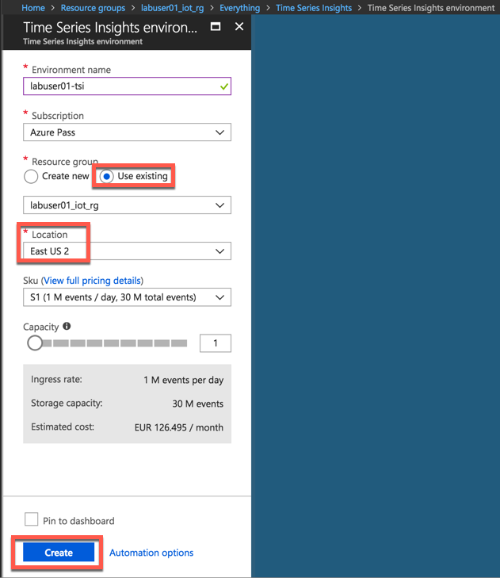
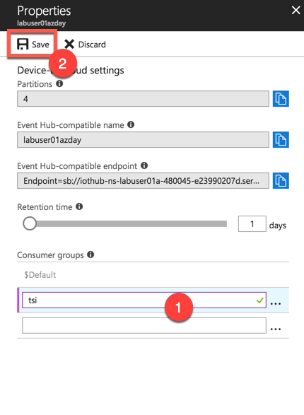
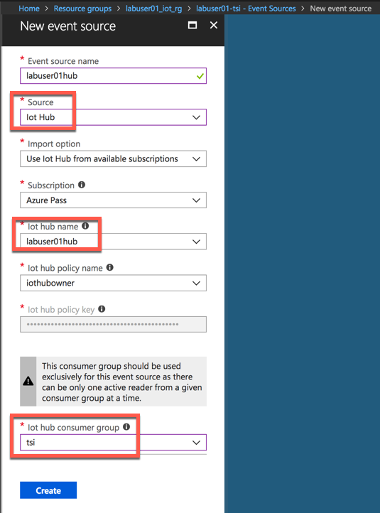

# Visualize Time Series Data with Azure Time Series Insights

## Overview

Azure Time Series Insights is a fully managed analytics, storage, and visualization service for managing IoT-scale time-series data in the cloud. It provides massively scalable time-series data storage and enables you to explore and analyze billions of events streaming in from all over the world in seconds. Use Time Series Insights to store and manage terabytes of time-series data, explore and visualize billions of events simultaneously, conduct root-cause analysis, and to compare multiple sites and assets.

Time Series Insights has four key jobs:

* First, it's fully integrated with cloud gateways like Azure IoT Hub and Azure Event Hubs. It easily connects to these event sources and parses JSON from messages and structures that have data in clean rows and columns. It joins metadata with telemetry and indexes your data in a columnar store.
* Second, Time Series Insights manages the storage of your data. To ensure data is always easily accessible, it stores your data in memory and SSD’s for up to 400 days. You can interactively query billions of events in seconds – on demand.
* Third, Time Series Insights provides out-of-the-box visualization via the TSI explorer. 
* Fourth, Time Series Insights provides a query service, both in the TSI explorer and by using APIs that are easy to integrate for embedding your time series data into custom applications.

In this lab you will learn

* how to set up a Time Series Insights environment
* explore
* analyze time series data of your IoT solutions or connected things

## Task 1: Create a Time Series Insights Instance

Click on **Create a Resource** and click on **Internet of Things**

Click on **Time Series Insights**

Select the resource group you previously created and click **Create** button

## Task 2: Create a distinct consumer group

Before connecting the Timeseries Insights instance with the IoT Hub, we need to make sure that a distinct consumer group is created in the IoT Hub. Consumer groups are used by applications to *pull* data from Azure IoT Hub - that's why the Time Series Insights consumer group should be distinct.

Navigate to your IoT Hub and create a new consumer group:

## Task 3: Create Event Source

Create Event Source to connect to IoTHub. Please make sure you use a unique Consumer Group. Time Series Insights has a requirement to have its own unique consumer group

Select the appropriate consumer group and click Create button

## Task 4: Setup Time Series Insights

Go To Time Series Insights, Click on Go To Environment which will take you to Time Series Insights Explorer

If you get Data Access Policy Error execute the following steps

Go To Environment Topology and 

Click on Add Button

Select Contributor Role

Select User

## Task 5: Time Series Insights Explorer

In this task you will play around with the *Time Series Insights Explorer*. The follwing steps will provide you an overview on how to interact with the data. Feel free to explore the features yourself.

Go To Time Series Insights Explorer. Please use the *Chrome* Browser, if the UI does not load properly. This is a known issue and is already worked on.

Split By ID. You will see data flowing from two devices. MXChip and Pi Simulator. 

Select humidity and Split By ID. You will see data flowing from two devices. MXChip and Pi Simulator.

Right Click to Explore events. You can download events in CSV and JSON format by clicking on **CSV or JSON** buttons

Create a perspective by clicking on the image shown below

Click **+** to add a new query

Select Temperature and split by Device ID and click on perspective image.

Create a chart by selecting a timeframe with drag feature

Create a Chart by adding a predicate

Perspective with 4 different charts and also changed Title

Click on Heatmap

View data in a table

