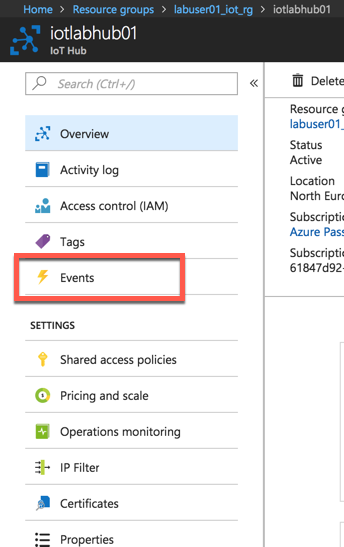
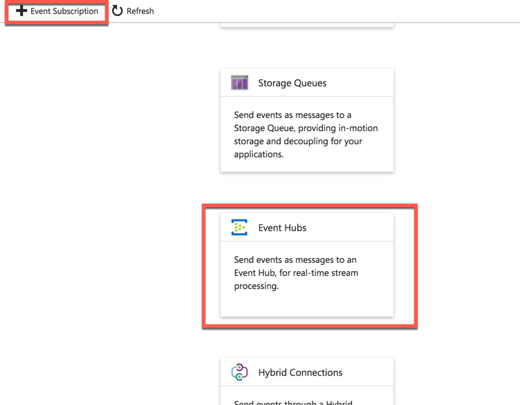

# React to Critical Device Lifecycle Events and Trigger Actions

## Overview

Azure IoT Hub integrates with Azure Event Grid so that you can send event notifications to other services and trigger downstream processes. Configure your business applications to listen for IoT Hub events so that you can react to critical events in a reliable, scalable, and secure manner. For example, build an application to perform multiple actions like updating a database, creating a ticket, and delivering an email notification every time a new IoT device is registered to your IoT hub.

In this lab you will learn how to

* Create logic app to be able to send email notifications

* Create Event Grid

* Connect IoT Hub to Event Grid

## Task 1: Create Logic App

Create a Logic App to be able to send email notifications

Click on **Create a resource**


Click on **Enterprise Integration**


Click on **Logic Apps**


Use existing resource group created in previous steps and press Create


Using Logic App Designer, Create New App


Select HTTP Request


Provide a Sample Payload

```json
[{
  "id": "56afc886-767b-d359-d59e-0da7877166b2",
  "topic": "/SUBSCRIPTIONS/<Subscription ID>/RESOURCEGROUPS/<Resource group name>/PROVIDERS/MICROSOFT.DEVICES/IOTHUBS/<IoT hub name>",
  "subject": "devices/LogicAppTestDevice",
  "eventType": "Microsoft.Devices.DeviceCreated",
  "eventTime": "2018-01-02T19:17:44.4383997Z",
  "data": {
    "twin": {
      "deviceId": "LogicAppTestDevice",
      "etag": "AAAAAAAAAAE=",
      "status": "enabled",
      "statusUpdateTime": "0001-01-01T00:00:00",
      "connectionState": "Disconnected",
      "lastActivityTime": "0001-01-01T00:00:00",
      "cloudToDeviceMessageCount": 0,
      "authenticationType": "sas",
      "x509Thumbprint": {
        "primaryThumbprint": null,
        "secondaryThumbprint": null
      },
      "version": 2,
      "properties": {
        "desired": {
          "$metadata": {
            "$lastUpdated": "2018-01-02T19:17:44.4383997Z"
          },
          "$version": 1
        },
        "reported": {
          "$metadata": {
            "$lastUpdated": "2018-01-02T19:17:44.4383997Z"
          },
          "$version": 1
        }
      }
    },
    "hubName": "egtesthub1",
    "deviceId": "LogicAppTestDevice",
    "operationTimestamp": "2018-01-02T19:17:44.4383997Z",
    "opType": "DeviceCreated"
  },
  "dataVersion": "",
  "metadataVersion": "1"
}]
```


## Task 2: Setup Notification by Sending Email

Click on New Step


Add an action


Choose Mail


Finish Mail Actions


Sign in to email


Create Email template (use the provided O365 credentials to login)


Finally, click on **save**.

## Task 3: Integrate with IoT Hub

Copy Request URL which will be put into the WebHook endpoint URL in the following step:


Now, go to the Event Grid



Click on Events



Copy the URL from previous steps into Subscriber Endpoint and click create


## Task 4: Add Device and Test Notification

Go To IoTHub -> IoT Devices (Device Management) -> Add


Click Save button to create a new device


You Should get an email notification


## Task 5: Delete Device and Test Notification

Go To IoTHub -> IoT Devices (Device Management) -> Select Device you created in previous step -> Delete


You Should get an email notification

