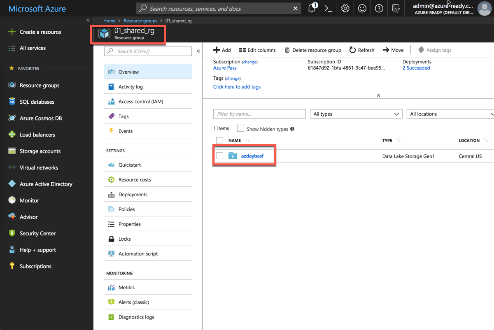
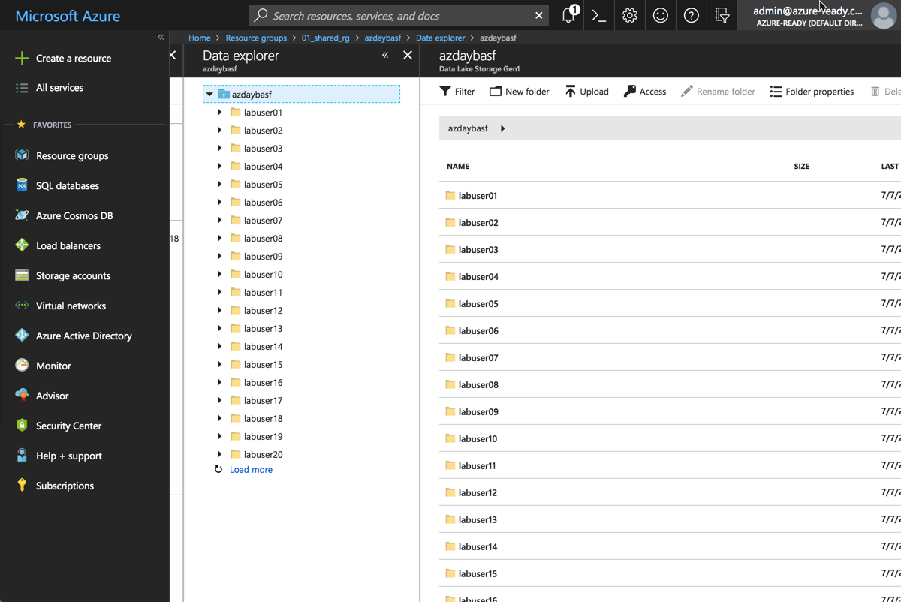
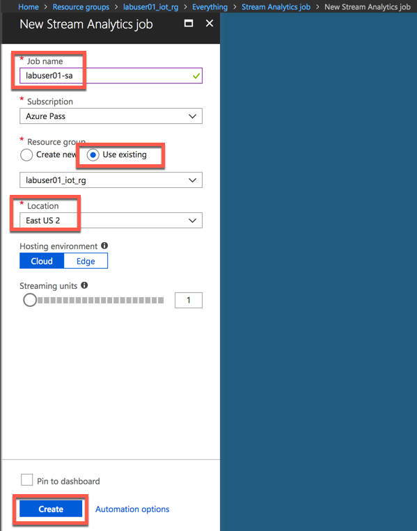
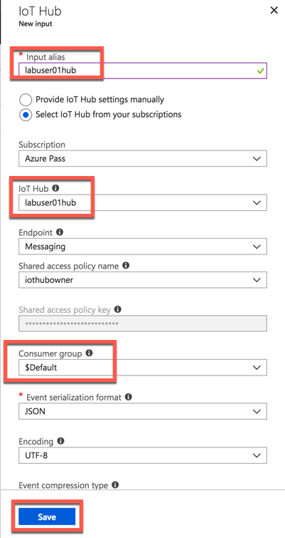
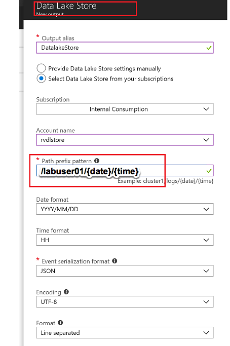
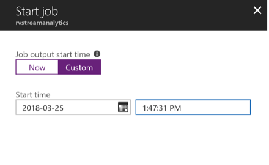
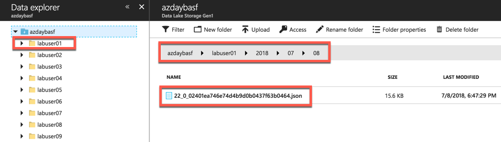

# Cold Path Storage with Azure Datalake

## Overview

Azure Data Lake Store is an enterprise-wide hyper-scale repository for big data analytic workloads. Azure Data Lake enables you to capture data of any size, type, and ingestion speed in one single place for operational and exploratory analytics. Data Lake Store can store trillions of files. A single file can be larger than one petabyte in size. This makes Data Lake Store ideal for storing any type of data including massive datasets like high-resolution video, genomic and seismic datasets, medical data, and data from a wide variety of industries.

The data is kept secure as:

* it is always encrypted
* uses TLS to protect dat in motion
* the encryption is streamlined by using service or user-managed HSM-backed keys in Azure Key Vault.

Single sign-on (SSO), multi-factor authentication, and seamless management of millions of identities is built-in through Azure Active Directory. Authorize users and groups with fine-grained POSIX-based ACLs for all data in your store and enable role-based access controls. Meet security and regulatory compliance needs by auditing every access or configuration change to the system.

## Task 1: Explore the Data Lake Store Configuration

> This setup only applies if you run this lab in a shared setup. If you use your own subscription, you have to create a Datalake Storage account on your own.

In this lab we are using a pre-deployed shared instance of the Azure Data Lake store which is located in the `01_shared_rg` Resource Group.



Have a look at the folders:


Each lab user has a dedicated folder. This will become important when we setup the streaming.

## Task 2: Create Stream Analytics Job

Azure Stream Analytics is a managed event-processing engine set up real-time analytic computations on streaming data. The data can come from devices, sensors, web sites, social media feeds, applications, infrastructure systems, and more.


Click on **Data + Analytics**


Click on **Stream Analytics Job**


Stream Analytics job cab be created to run on the cloud as well as on the Edge. You will chose to run this on the cloud



Add Input for Streaming Job


Select IoTHub as Input


Make sure to provide a consumer group. Each consumer group allows up to 5 output sinks/consumers. Make sure you create a new consumer group for every 5 output sinks and you can create up to 32 consumer groups.



Add Data Lake Store as Output for Streaming Job


Select Data Lake Store as output sink


Select the Data Lake Store account you created in previous steps and provide folder structure to stream data to the store

`/labuser01/{date}/{time}` with Date=YYYY/MM/DD format and Time=HH format will equate to `/labuser01/2018/03/30/11` on the store. **Change labuser01 to your labuser ID.**



You now have to authorize the data lake store connection for Stream Analytics. This provides Stream Analytics access to write to the data lake store


You will see a popup and once the popup closes Authorize button will be greyed out after azuthorization is complete. There are exception cases where popup doesnt appear.In this case try again in incognito mode


## Task 3: Edit Stream Analytics Query

Now, edit the query for your Streaming Job. Here you define inputs and outputs:


Replace with this query definition:

```sql
SELECT
    *, System.Timestamp as time
INTO
    DatalakeStore
FROM
    IotHub
```

Save the query


Accept by pressing yes


## Task 4: Start Streaming Analytics Job

Start the stream job which will read data from IoTHub and store data in Data lake Store


You can pick custom time to go back a few hours to pick up data from when your device has started streaming



Wait till job goes into running state, if you see errors could be from your query, make sure syntax is correct


## Task 5: Explore Streaming Data

Go to Data Lake store data explorer and drill down to your folder. For example `/labuser01/` folder.You will see new subfolders folders created with YYYY/MM/DD/HH format.



You will see json files, with one file per hour, explore the data


