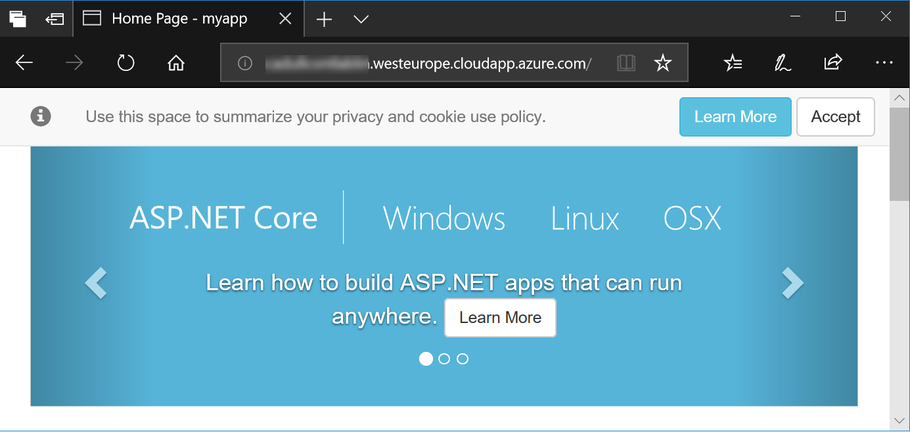

# Introduction to Containers on Azure

## Overview

Containers are revolutionizing the way how software is being deployed. This lab will provide the foundation for working with containers and enable participants to deploy single container applications to the Azure cloud. The lab will start with a general introduction to the Docker environment, then show how applications can be containerized using so-called Dockerfiles and published to Azure Container Registry (ACR). Finally, we will be deploying the dockerized application to Azure Container Instances (ACI) and Azure Web Sites.

### Why containers?

All too often, differences between our development environments ("runs on my machine!") and production environments lead to problems on releasing our app: version conflicts, subtle configuration issues, noisy neighbor applications taking all resources.

   

Containers help solve this problem by virtualizing the interfaces the app has to the operating system (and thus to the rest of the world), like network calls, the file system, and so on.

   

This way, if an app runs in my container, it can run anywhere, because the world looks the same to it, regardless where the container is. It can always listen on its favorite network port, has all its libraries with it and all configuration files are tailored to exactly its needs.

   

### Objectives

In this hands-on lab, you will learn how to:

- Use Docker to run containers
- Containerize applications with Dockerfiles and docker build
- Push containerized applications as Container Images to Azure Container Registries (ACR) 
- Deploy containerized applications to Azure Container Instances (ACI) and Azure Websites.

### Prerequisites

Typically these should be preconfigured for your (if in doubt, ask your instructor):
- An active Azure subscription or resource group to which you have contributor permissions.
- A Linux machine running in Azure with access to the cloud and the following components installed:
   - Docker ([installation instructions](https://docs.docker.com/install/linux/docker-ce/ubuntu/))
   - .NET Core SDK ([installation instructions](https://www.microsoft.com/net/download/linux-package-manager/ubuntu16-04/sdk-current))

---

Estimated time to complete this lab: **90-120** minutes.

## Exercise 1: Log on to your VM

1. Open the [Azure Portal](https://portal.azure.com), log on with your lab account, if necessary. You can see the currently logged on account in the top right of the portal:

    

    If this is not the lab user that was provided to you, please start a new "In Private" or "Incognito" window and start the Azure portal again.

1. Start the Azure Cloud Shell (Bash) by clicking the console icon in the top bar of the portal:

   

    In case you have not worked with the Azure Cloud Shell before, you will be asked a few questions. Click **Bash (Linux)** and **Create Storage**, accept all defaults. Your console should then look like this:

   

1. Log on to the machine with the user and machine address provided by your instructor, by typing the following command into the cloud shell:

    ```sh
    ssh <user>@<machine adress> 
    ```

    For example:

    ```sh
    ssh labuser29@labuser29-xxxx.westeurope.cloudapp.azure.com
    ```
    (Pasting into the cloud shell will likely require using the browser's context menu. Thus, if it does not work, try a right click into the console with your mouse)

    You will be asked whether to accept this new host (enter **yes**) and for the password (enter the password provided by your instructor).

    After this login succeeds, we have a bash shell running right in the Linux VM, in which we will work with Docker.

1. To test whether Docker is indeed installed type:

    ```sh
    docker --version 
    ```
    This should display the docker version.

## Exercise 2: Run a web server in a container

For a start, we will be running a very powerful and lightweight web server called [nginx](https://www.nginx.com/). This web server is available as a pre-packaged container image at [Docker Hub](https://hub.docker.com/_/nginx/).

1. We will tell docker to pull the nginx image from Docker Hub and let it run in our docker engine with a single command. Type:

    ```sh
    docker container run --name mynginx -d nginx
    ```

    The `-d` flag in the command tells Docker that the container should run detached, in the background. We do not currently want to interact with it directly. We just want it to run silently with default settings, listening on its default port.

1.  The engine just reports a lengthy id, which does not help us much understanding what is going on. Let's see whether the container actually started. To see all running containers, type: 
    
    ```sh
    docker container ls
    ```
    This returns all running containers with their name and a few more fields. In case you do not find your container in the list, something has gone wrong. To troubleshoot, you would... 
    
    ```sh
    docker container ls --all
    ```

    ..., which lists all non-running containers as well, and then use...

    ```sh
    docker container logs <containername>
    ```

    ..., to find out what the container reported while starting (or trying to start). In our case, the container logs will show nothing yet.

1. The container we just started already serves as a webserver, listening on port 80, but we cannot see its webpage yet. So far, the container is only attached to an internal virtual network called 'bridge', that can only be accessed from other containers on that network and our VM, which is hosting the network and the container. So, let's run another instance of nginx, but now we will map the containers port 80 to an externally visible port on the VM:

    ```sh
    docker container run --name mynginxwithport -d -p 80:80 nginx
    ```

    The `-p 80:80` flag tells docker to map the VM's port 80 to the containers port 80, so that the container now virtually listens on the VM's own port 80. If that port is already reserved by another process on the VM, our call would fail.

1. On your own machine (not the Lab-VM), open the web browser of your choice and navigate to the address of your VM (the same you used to log on the machine in the beginnning) as `http://<machine address>`:

   

1. **Optional**: In case you want to get a glimpse of how the internal networking works, check the webserver from within the VM: You can find out the container's IP address by inspecting the default docker network 'bridge':

    ```sh
    docker network inspect bridge
    ```

    With that IP address, you can then curl the web servers start page like this:

    ```sh
    curl http://<container ip>
    ```

## Exercise 3: Create and containerize a .NET Core Web App

Now that we know how to run a pre-packaged app from a public container registry like Docker Hub, we would like to see the same for our own applications. We will create a new .NET Core app (no coding required) and put that into a container image like the nginx image we used in the preceding exercise.

1. First we need to clean up, because we will want to reuse port 80, on which the container from the last exercise is still listening. (**CAUTION:** This will silently remove ALL running and non-running containers):

    ```sh
    docker container rm -f $(docker container ls -a -q)
    ```

    This command consists of two parts: `docker container ls` within the brackets lists all (`-a` flag) containers with only their IDs (`-q` flag). `docker container rm` then takes all these IDs and removes the containers, even if they are still running (`-f`).

1. Now let's create our .NET Core Web App. That's easy:

    ```sh
    mkdir myapp
    cd myapp
    dotnet new mvc
    ```

    This creates a new directory, into which we navigate with `cd` and then use `dotnet new mvc` to initiate a web application with the same name as the directory (see [this article](https://docs.microsoft.com/en-us/aspnet/core/tutorials/first-mvc-app-xplat/start-mvc?view=aspnetcore-2.1) to learn more about this process).

    For a first test of the application, let's run it:

    ```sh
    dotnet run
    ```

    This will run the application in .NET Core's own web server (called Kestrel) and listen on port 5000. If everything is ok, Kestrel will tell us that it is now listening at two development ports:

    ```txt
    Using launch settings from /home/...
    [...]
    Now listening on: https://localhost:5001
    Now listening on: http://localhost:5000
    Application started. Press Ctrl+C to shut down.
    ```
    Press `Ctrl+C` to stop the application.

1. To actually put it in a container, we first need to 'publish' the application into a deployable package:

    ```sh
    dotnet publish -o package
    ```

    This compiles the application and puts it into the folder 'package'. 

1. To put the packaged app into a container image, we now need to create a so called 'Dockerfile'. Type:

    ```sh
    nano Dockerfile
    ```

    This creates an empty file with the name 'Dockerfile' and opens the nano text editor to edit the file. Copy and paste the following text into the text editor:

    ```Dockerfile
    FROM microsoft/dotnet:2.1-aspnetcore-runtime
    WORKDIR /app
    COPY package .
    ENTRYPOINT ["dotnet", "myapp.dll"]
    ```
    This Dockerfile tells docker how to put our app into a container image. In the first line it defines the base image to be used with the `FROM` keyword. Our image will just be a thin additional layer on top of that base image, thus this base image needs to contain everything we need to run our app, in this case that is the ASP.NET Core runtime.

    The `WORKDIR` instruction in the second line defines the working directory for subsequent instructions and - if this is the last `WORKDIR` in the Dockerfile - for the running container. In case the given directory does not yet exist in the file system of the base image, the directory is created by docker.

    The `COPY` instruction then copies our application package from the so called build context (more on this in the next steps) into the container image. In this case we use `package` (a path in the build context) on the left side as source and . (a path within the container image starting at the working directory) on the right side as target, which means that we want to copy everything in the *package* folder right into our working directory.

    The `ENTRYPOINT` finally defines what will happen at start time of the container. In this case, we want to start the `dotnet` executable with the app's code in "`myapp.dll`" as an argument. The entrypoint can be any executable with any arguments. The process that is started through the entrypoint defines the lifecycle of the container - the container will stay alive as long as this entry process is alive.

    The [Docker documentation](https://docs.docker.com/) has more information on [Dockerfile instructions](https://docs.docker.com/engine/reference/builder/) and [best practices](https://docs.docker.com/develop/develop-images/dockerfile_best-practices/).

1. In the nano editor, save the text with `Ctrl+O` and exit nano with `Ctrl+X`.

1. Build the Dockerfile with:

    ```sh
    docker image build --tag myappimage .
    ```

    The ``--tag`` flag defines the tag (effectively: the name) under which the image will be available to run containers with it. The `.` at the end of the command defines the build context, from which docker can copy files into the container (see the `COPY` statement in the Dockerfile). The `.` defines that we simply pass the local directory (recursively with all subdirectories) as the build context. Docker sends the build context to the docker engine as the first step of the build process.

1. After the docker build finishes, the newly created image should be available in the list of images on this docker host. Use the following command to list these images:

    ```sh
    docker image ls
    ```

1. Now we can finally run the image as a container:

    ```sh
    docker container run --name myapp -d -p 80:80 myappimage
    ```

1. On your own machine (not the Lab-VM), open the web browser of your choice and navigate to the address of your VM (the same you used to log on the machine in the beginnning) as `http://<machine address>`:

   

Our application is now running in a container and we can access it publically. But it is running on a single VM, which means our application will fail if this single VM fails. Maybe even more important: We would need to secure and manage the VM on our own. In summary: We are still on the level of IaaS (Infrastructure as a Service). With the next level - PaaS (Platform as a Service) - we will get rid of the responsibility for infrastructure and automatically get a much better reliability. That will be the topic for exercises 4 and 5. 

##  Exercise 3.a: **Optional**: Upgrade Dockerfile to use multi-stage build

In the preceding exercise we created our app container by first building and packaging the application outside of the container world by issuing the `dotnet publish -o package` command directly on the VM that currently is our 'development machine'. The resulting package then was copied into our container with the `COPY` command. This works, but to some extent it defeats our original purpose to make sure that the outside world always looks the same to our beloved app. For example, the version of the .NET Core CLI on our dev machine might be another one as the one in the base image `microsoft/dotnet:2.1-aspnetcore-runtime`. Or some system library we rely on behaves slightly differently because some configuration item has been set to another value somewhere in the file system.

To solve this problem, the building and packaging steps themselves should be running in a container as well.

1. For building and packaging a .NET Core app, we need the .NET SDK installed. The base image we used in the preceding exercise only has the runtime, not the SDK, thus we need another base image. Additionally, we need to execute the publish command right within the container, which we can achieve using the `RUN` instruction. Change your Dockerfile to look like this:

   ```Dockerfile
   FROM microsoft/dotnet:2.1-sdk
   WORKDIR /source
   COPY . .
   RUN dotnet publish --output /app --configuration Release
   WORKDIR /app
   ENTRYPOINT ["dotnet", "myapp.dll"]
   ```

1. (Optional) Build and run the container image again with:

    ```sh
    docker image build --tag myappimage .
    docker container rm -f myapp
    docker container run --name myapp -d -p 80:80 myappimage 
    ```
    It should just work as it did before. The only real difference is that we built the whole thing right within our container image and we changed the `WORKDIR` in between. Yet the resulting image is not what we would like to run in production. It contains not only the runtime and our app, it carries the SDK as well. Running this image in production would be like shipping the factory along with the car. The additional files and packages in the image not only make it larger and thus less quick to deploy and start, they only make the image less secure by providing additional attack surface, an attacker might exploit to get access to our application. This needs to be changed.

1. To solve the dilemma that we want to build within the image but we do not want the build tools in the image, we use a concept called Multi Stage Builds. This is achieved with the `AS` keyword that allows us to define a name for an image that can be directly used within the same Dockerfile. This image can then be used in additional images defined in the same Dockerfile to copy files out of it with the `--from` flag.
    
    Change your dockerfile to look like this:
    ```Dockerfile
    # Stage 1
    FROM microsoft/dotnet:2.1-sdk AS  builder
    WORKDIR /source
    COPY . .
    RUN dotnet publish --output package  --configuration Release
    # Stage 2
    FROM  microsoft/dotnet:2.1-aspnetcore-runtime
    WORKDIR /app
    COPY --from=builder /source/package .
    ENTRYPOINT ["dotnet", "myapp.dll"]
    ```
    
1. Build and run the container image again with:

    ```sh
    docker image build --tag myappimage .
    docker container rm -f myapp
    docker container run --name myapp -d -p 80:80 myappimage 
    ```

The second stage in the last Dockerfile produces our production image, which is based on `microsoft/dotnet:2.1-aspnetcore-runtime` again, so that we have a tiny and more secure resulting containerized application again, but still running the build in a container as well.

## Exercise 4: Create Azure Container Registry (ACR) and push image

1. Open the Cloud Shell (in case you are stilled logged into the VM, just type `exit` and you should be back).

1. Create an ACR with Azure CLI:

   ```sh
   az acr create --name <registry name> --resource-group <resource group> --sku basic
   ```

    Where...
    *  `<registry name>` is a name that you can freely choose, but that must still be available as `<registry name>.azurecr.io`.
    *  `<resorce group>` is the name of the rexource group that you have contributor permissions to (when in doubt, ask your instructor).

    Now we have our own private registry running in Azure available at `<registry name>.azurecr.io`. But we cannot yet access it from our machine. To enable this:

   ```sh
    az acr update --n <registry name> -g <resource group> --admin-enabled true
    az acr credential show -n <registry name> -g <resource group>
    ```

    Note the password and username.

1. Log in to the Docker VM again with:

    ```sh
    ssh <user>@<machine adress> 
    ```
    For example:

    ```sh
    ssh Carsten@cadullcontlablin.westeurope.cloudapp.azure.com 
    ```

1. Now we can log in with docker into our registry (replace `<registry name>` with your registry's name):

    ```sh
    docker login <registry name>.azurecr.io
    ```
    You will be prompted for username and password - enter the credentials noted in the previous step.

1. If we are successfully logged in, we can now push our image 'myappimage' (from the previous exercise) to the registry. The registry an image is pulled from or pushed to is always encoded in its image tag. Thus, to push to our own registry, we first need to tag our image:

    ```sh
    docker image tag myappimage <registry name>.azurecr.io/myappimage:v1.0
    ```

1. Now we can finally push:

    ```sh
    docker image push <registry name>.azurecr.io/myappimage:v1.0
    ```

1. To see our image in the registry, in the Azure portal, navigate to our newly created registry: Type your registry's name in the search bar at the top of the portal, click it. Click **Repositories** on the left, choose the **'myappimage'** repository and click the **'v1.0'** tag.). There you might want to expand the **Manifest** to see the structure of our app container image. 

Now we are ready to deploy to any Azure service from our registry.

## Exercise 5: Deploy to Azure Container Instances (ACI)

The easiest way to deploy a container to a PaaS service in Azure is to use ACI, which can be seen as "serverless" containers. The Azure platform takes care of everything that needs to be in place in the background, like the container host on which the container will run. We will never need to care about patching or securing the infrastructure and can focus on developing and securing our application itself.

1. Open the Cloud Shell (in case you are stilled logged into the VM, just type `exit` and you should be back).

1. Look up the credentials for your registry again.

1. The actual deployment itself is done with a single command:

    ```sh
    az container create --resource-group <resource group> --name myapp --image <registry name>.azurecr.io/myappimage:v1.0 --cpu 1 --memory 1 --registry-login-server <registry name>.azurecr.io --registry-username <registry user> --registry-password <registry password> --dns-name-label <some unique name> --ports 80 
    ```

    Where `<some unique name>` is the prefix for the public DNS name under which your container will be available.

1. Track the progress of your deployment with:

    ```sh
    az container show --resource-group <resource group> --name myapp --query instanceView.state
    ```
1. Once the state is 'Running', you can look up the full address of your container by running `az container show` again but without the `--query` flag. Look up the `fqdn` field in the output of the command and copy its value. 

1. On your own machine (not the Lab-VM), open the web browser of your choice and navigate to the address you just copied: `http://<fqdn>`. This should show you the same view of our app as in the previous exercise.

1. To troubleshoot, you can use:

    ```sh
    az container logs --resource-group <resource group> --name myapp
    ```
    This will give you the same type of logs as in the previous exercises, when we called `docker logs`, only that this time the container is running in the cloud.

ACI (specifically with the `az container` commands) can be treated as your giant Docker engine in the cloud that is just there, no setup required. This enables great use cases, a few of which are described in the [Azure documentation](https://azure.microsoft.com/en-us/services/container-instances/). For example, any batch process that simply runs in the background (some data but not serving any traffic interactively), would be a perfect fit for ACI. Our sample app though is just a simple web app - and for such single-container web apps there is an even better fit available for running in the cloud: Azure App Service. Which is the topic of the next exercise. 

## Exercise 6: Deploy to Azure App Service

So far in this lab, we looked at our containers in a generic way: Some process needs to run and optionally listen on a specific network port. Yet this might be anything, web, mail, a database engine - on this generic level, any added service (like adding authentication) needs to be connected to our application manually.

Azure App Service is specifically designed for web apps and thus adds many features like simple SSL setup or simple Azure Active Directory integration for authentication that can be turned on by setting simple switches. Azure App Service Web Apps support containers (Linux and Windows) as a deployment vehicle, thus for our simple web app, this is the best fit for letting it run as a PaaS in the cloud.

1. First we need to create an App Service Plan (for more info see the [Azure documentation](https://docs.microsoft.com/en-us/azure/app-service/azure-web-sites-web-hosting-plans-in-depth-overview)). An App Service Plan defines the size (and price), available features and more settings for our Web App. In your Cloud shell, execute this command:

    ```sh
    az appservice plan create --name myappserviceplan --resource-group <resource group> --sku B1 --is-linux
    ```

    This creates an app service plan in the B1 size category with support for Linux containers.

1. The actual thing that is running a website in Azure App Service is the (aptly named) Web App. We create one with this command:

    ```sh
    az webapp create --resource-group <resource group> --plan myappserviceplan --name <app name> --deployment-container-image-name <registry name>.azurecr.io/myappimage:v1.0
    ```

    Where `<app name>` is a name that must be still available as the FQDN `<app name>.azurewebsites.net`. This creates a web app and alreay tells it where it can pull the container image to run as a container in this web app.

1. On your own machine (not the Lab-VM), open the web browser of your choice and navigate to: `http://<app name>.azurewebsites.net`. This will not work yet:

    

1. In the Azure portal, navigate to your web app by entering "<app name>" in the search bar at the top and selecting **Container settings** on the left. It should be showing a problem with the container image:

    

1. The pulling of the image does not work, because by default it is  trying to pull from Docker hub, where our image cannot be found. We need to tell the web app to pull from our registry:

    ```sh
    az webapp config container set --name <app name> --resource-group <resource group> --docker-custom-image-name <registry name>.azurecr.io/myappimage:v1.0 --docker-registry-server-url https://<registry name>.azurecr.io
    ```
    You might need to restart the web app a few times before it starts working:
    ```sh
    az webapp restart --name <app name> --resource-group <resource group>
    ```
    Only in case your ACR is in a different resource group or subscription than the web app, you might see an error like "Authentication failed" in the logs in the **Container settings** in the portal. This is because the app is not by default authenticated for any ACR. The easiest way to fix this would then be adding the credentials for the registry that we noted in the previous exercise. To do so, use this command:

    ```sh
    az webapp config container set --name <app name> --resource-group <resource group> --docker-registry-server-user <registry user> --docker-registry-server-password <registry password>
    ```

1. One of the features of Web Apps that can make life easier for us is that it automatically adds https (SSL) support, without us needing to install and configure certificates. Now to enforce SSL for our app, we do:

    ```sh
    az webapp update -g <resource group> -n <app name> --https-only true
    ```

    Now, when we browse to our web app again with `http://<app name>.azurewebsites.net`, whe should automatically be redirected to `https://<app name>.azurewebsites.net`.

---

## Summary

We now have everything in place to containerize and deploy applications to Azure. The start of everything is the Dockerfile we created, representing the gateway from "out there in the wild" into the new world of containers, where our app will always run in its own beautiful isolated space. We as well created a container registry, which is the foundation for any deployment of containers to a production platform.

Finally, the deployment methods to App Service (for web apps, utilizing the battle tested features of App Service like integrated Authentication or SSL support) or Azure Container Instances (more lightweigt and generic) represent production ready runtime options for **single**-container applications. **Multi**-container applications (e.g. any microservice application) require more, they need *orchestration*, a concept that nowadays we typically address by using an orchestration service like Kubernetes. This will be the topic of our next lab!