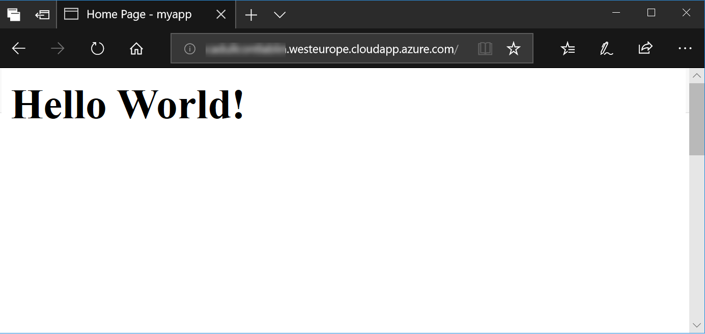

## Exercise 3: Create and containerize a Java Web App (with Maven and Tomcat)

First we need to create our minimal Java Web App. In a typical develoment setup we would do this by issuing a `mvn archetype:generate` command of the Maven tool directly on the develoment machine. That command bootstraps a minimal project that can run immmediately (as a "walking skeleton") and serves as the start point for incremental development of the real application. We would then build the application and put it into some kind of deployment package.

Yet this approach always bears the risk that the dev machine has some configuration or framework version that does not fit our target environment. And wasn't one of the main goals of containerization to avoid such issues?
    
Additionally, we would need to have Maven installed on our dev machine, which is not necessarily the case for our docker machine in this exercise.

Thus, instead of working directly on the docker host machine (our dev machine), we will use a container to do this. Fortunately, there is a prepackaged container available on Docker Hub that already has everything we need - Maven installed in the correct version. We will use this to bootstrap and build our app.

1. Start by entering these commands:

    ```sh
    mkdir myapp
    cd myapp
    ```

    This creates the folder for our app development and we change into it. Now continue with this:

    ```sh
    docker run -it --rm -v "$(pwd)":/usr/src/myapp -w /usr/src/myapp maven:3.3-jdk-8 sh 
    ```

    Phew. Four new concepts introduced in one command. Let's explore them one by one:

    * The two flags `-it` tell docker to run the new container `i`nteractively and attach a `t`erminal to it. This means we will be able to directly work in the container from now on.
    * Flag `--rm` means that the container will be removed immediately after we are done with it. We will only need the container for performing a few ad-hoc tasks, so it's a good idea to clean up after ourselves immediately and not leave the useless container around.
    * `-v` mounts a folder from the file system of the docker host into the container with the syntax `-v hostfolder:containerfolder`. In this case we want to map the current folder (returned by`$(pwd)`) to be mapped to a folder `/usr/src/myapp` in the container file system. If that folder does not exist in the container yet, it will be created.
    * Finally, we use `-w` to set the working folder to the `/usr/src/myapp` folder we just mapped.
    
    In combination, these settings represent a very useful setup: We now have a shell, running directly in the container, with all tools of the container available, but our file system actions in the current directory will be directly mapped to the current folder we just had in the host file system. We are effectively using ready-made and preconfigured tools without having to install them. They just appear magically as long as we need them and then they are gone again.

1. Now let's create our application: 

    ```sh
    mvn -B archetype:generate \
    -DarchetypeGroupId=org.apache.maven.archetypes \
    -DarchetypeArtifactId=maven-archetype-webapp \
    -DarchetypeVersion=1.3 \
    -DgroupId=com.mycompany.app \
    -DartifactId=myapp \
    -Dversion=1.0-SNAPSHOT
    ```

    This initiates a web application with the name 'myapp' and a few other settings (see [here](https://maven.apache.org/archetype/maven-archetype-plugin/) and [here](https://maven.apache.org/plugins-archives/maven-archetype-plugin-1.0-alpha-7/examples/webapp.html) to learn more about this process).

   1. Now we need to build the application into a deployable package:

    ```sh
    cd myapp
    mvn clean install
    ```

    This compiles the application and puts it into the archive file `/usr/src/myapp/myapp/target/myapp.war`. 

1. Exit the container:

    ```sh
    exit
    ```

    We are now back in our docker host's shell. To see that we actually produced something, list the contents of the 'myapp/target' folder:

    ```sh
    ls myapp/target
    ```

    Magic! We just built a Java application with Maven without having Maven installed!

1. To put the packaged app into a container image, we now need to create a so called 'Dockerfile'. Type:

    ```sh
    nano Dockerfile
    ```

    This creates an empty file with the name 'Dockerfile' and opens the nano text editor to edit the file. Copy and paste the following text into the text editor:

    ```Dockerfile
    FROM tomcat:alpine
    WORKDIR /usr/local/tomcat/webapps
    COPY myapp/target/myapp.war .
    RUN mv myapp.war ROOT.war
    RUN rm -rf ROOT
    CMD ["catalina.sh", "run"]
    ```
    This Dockerfile tells docker how to put our app into a container image. In the first line it defines the base image to be used with the `FROM` keyword. Our image will just be a thin additional layer on top of that base image, thus this base image needs to contain everything we need to run our app, in this case that is the ASP.NET Core runtime.

    The `WORKDIR` instruction in the second line defines the working directory for subsequent instructions and - if this is the last `WORKDIR` in the Dockerfile - for the running container. In case the given directory does not yet exist in the file system of the base image, the directory is created by docker.

    The `COPY` instruction then copies our application package from the so called build context (more on this in the next steps) into the container image. In this case we use `package` (a path in the build context) on the left side as source and . (a path within the container image starting at the working directory) on the right side as target, which means that we want to copy everything in the *package* folder right into our working directory.

    The `ENTRYPOINT` finally defines what will happen at start time of the container. In this case, we want to start the `catalina.sh` script, which belongs to the tomcat base image configuration. The entrypoint can be any executable with any arguments. The process that is started through the entrypoint defines the lifecycle of the container - the container will stay alive as long as this entry process is alive.

    The [Docker documentation](https://docs.docker.com/) has more information on [Dockerfile instructions](https://docs.docker.com/engine/reference/builder/) and [best practices](https://docs.docker.com/develop/develop-images/dockerfile_best-practices/).

1. In the nano editor, save the text by pressing `Ctrl+O` and then `Enter`.

1. Exit nano with `Ctrl+X`.

1. Build the Dockerfile with:

    ```sh
    docker image build --tag myappimage .
    ```

    The ``--tag`` flag defines the tag (effectively: the name) under which the image will be available to run containers with it. The `.` at the end of the command defines the build context, from which docker can copy files into the container (see the `COPY` statement in the Dockerfile). The `.` defines that we simply pass the local directory (recursively with all subdirectories) as the build context. Docker sends the build context to the docker engine as the first step of the build process.

1. After the docker build finishes, the newly created image should be available in the list of images on this docker host. Use the following command to list these images:

    ```sh
    docker image ls
    ```

1. Now we can finally run the image as a container:

    ```sh
    docker container run --name myapp -d -p 80:80 myappimage
    ```

1. On your own machine (not the Lab-VM), open the web browser of your choice and navigate to the address of your VM (the same you used to log on the machine in the beginnning) as `http://<machine address>`:

   

Our application is now running in a container and we can access it publically. But it is running on a single VM, which means our application will fail if this single VM fails. Maybe even more important: We would need to secure and manage the VM on our own. In summary: We are still on the level of IaaS (Infrastructure as a Service). With the next level - PaaS (Platform as a Service) - we will get rid of the responsibility for infrastructure and automatically get a much better reliability. That will be the topic for exercises 4 and 5. 