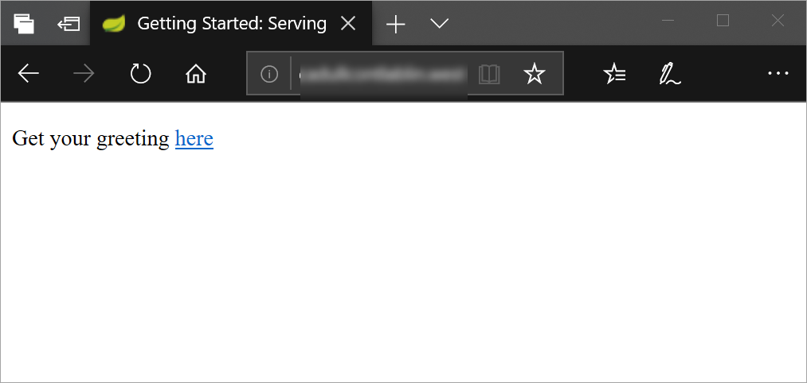
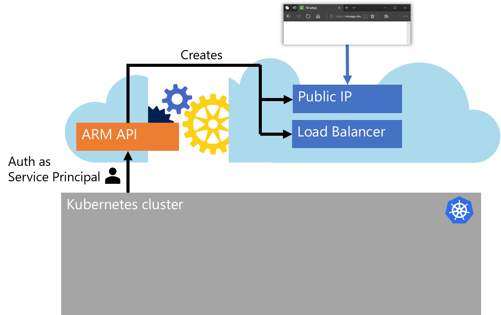
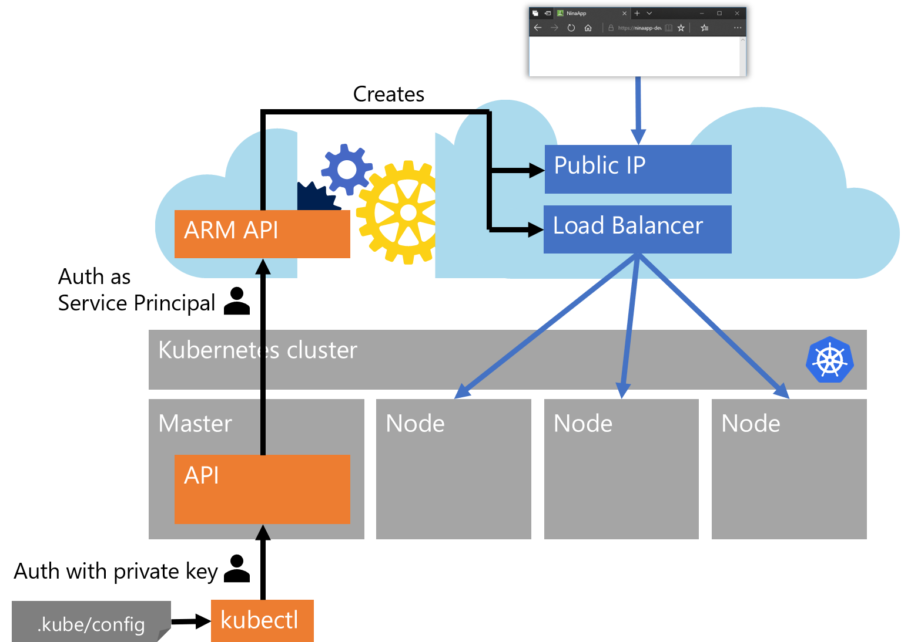
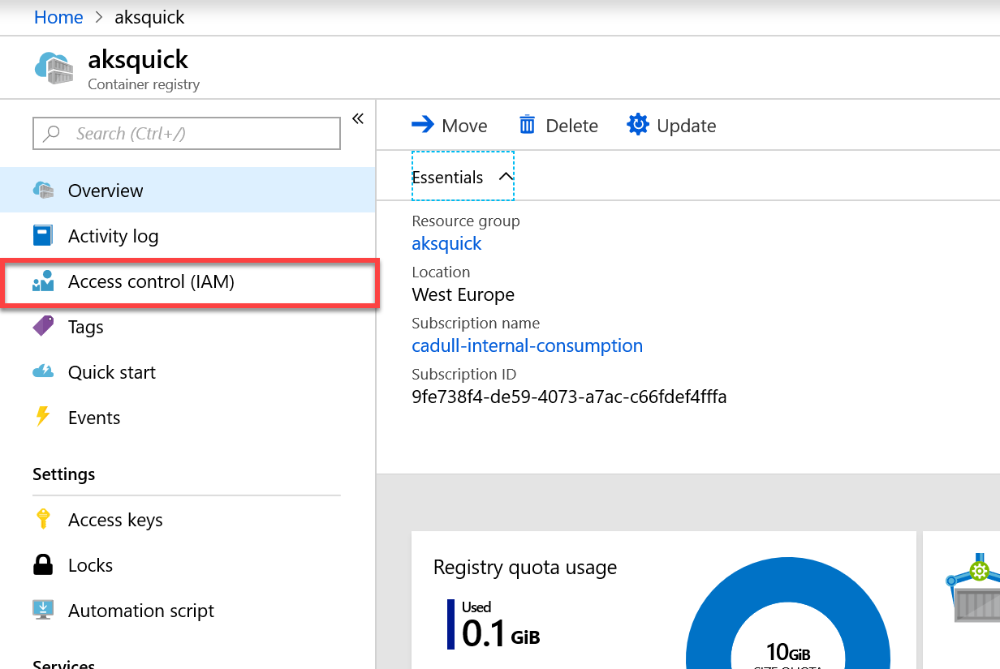

# Introduction to Container Orchestration and Azure Kubernetes Service (AKS)

## Overview

Containers provide a great solution to isolate individual apps and services from the rest of the world, so that they can run anywhere and require no special configuration regarding the target platform on which they run. Yet containerization alone deals mostly at the level of processes and does not answer many of the questions that arise when running services in production - like service discovery, load balancing, reliability and so on. This is typically addressed using container orchestration tools. Kubernetes has emerged as an industry-wide de-facto standard for container orchestration. Kubernetes originated from a group of Google engineers who destilled much of their learnings with container orchestration into an open source project. That project quickly gained reputation for the quality of its design and created a vibrant community and ecosystem.

One central advantage of Kubernetes is its declarative [API concept](https://kubernetes.io/docs/concepts/overview/kubernetes-api/) that does not only provide for an unmatched elegance in designing desired state of a distributed application, but as well is available transparently on any Kubernetes cluster, regardless of where it runs, on premises or on any cloud provider. 

Setting up and maintaining a Kubernetes cluster is far from trivial though, which is wy a managed service like Azure Kubernetes Service (AKS), can greatly accelerate the adoption and ease the operation of Kubernetes.

### Objectives

In this hands-on lab, you will learn how to:

- Create an AKS cluster
- Push multi-container applications to Azure Container Registries (ACR) using docker-compose
- Orchestrate multi-container applications in AKS using kubectl, the Kubernetes Command Line Interface

[//]: # (- Use Helm charts to simplify Kubernetes deployments and upgrades)

### Prerequisites

Typically these should be preconfigured for you (if in doubt, ask your instructor):
* An active Azure subscription or resource group to which you have contributor permissions.
* An Ubuntu Linux machine running in Azure with access to the cloud and:
    * Docker installed ([installation instructions](https://docs.docker.com/install/linux/docker-ce/ubuntu/)).
    * Git installed ([installation instructions](https://git-scm.com/download/linux))

---

Estimated time to complete this lab: **120-180** minutes.

## Exercise 1: Log on to your VM

1. Open the [Azure Portal](https://portal.azure.com), log on with your lab account, if necessary. You can see the currently logged on account in the top right of the portal:

    

    If this is not the lab user that was provided to you, please start a new "In Private" or "Incognito" window and start the Azure portal again.

1. Start the Azure Cloud Shell (Bash) by clicking the console icon in the top bar of the portal:

   

    In case you have not worked with the Azure Cloud Shell before, you will be asked a few questions. Click **Bash (Linux)** and **Create Storage**, accept all defaults. Your console should then look like this:

   

1. Log on to the machine with the user and machine address provided by your instructor, by typing the following command into the cloud shell:

    ```sh
    ssh <user>@<machine adress> 
    ```

    For example:

    ```sh
    ssh labuser29@labuser29-xxxx.westeurope.cloudapp.azure.com
    ```

    (Pasting into the cloud shell will likely require using the browser's context menu. Thus, if it does not work, try a right click into the console with your mouse)

    You will be asked whether to accept this new host (enter **yes**) and for the password (enter the password provided by your instructor).

    After this login succeeds, we have a bash shell running right in the Linux VM, in which we will work with Docker.

1. To test whether Docker is indeed installed type:

    ```sh
    docker --version 
    ```
    This should display the docker version.
---
**Tip:** *You can open another instance of cloud shell by starting a new browser tab or window and navigating to [https://shell.azure.com](https://shell.azure.com). This way you can easily switch between the VM and the cloud shell.*

---

## Exercise 2: Build the container images for our app

This exercise assumes a certain knowledge of Docker. In case you never worked with docker before, it is highly recommended to first go through the [_Containers on Azure_ lab](../containers_on_azure/containers_on_azure.md).

1. On the Linux VM, download our app's source code with the following command:

    ```sh
    git clone https://github.com/cadullms/greetings
    ```
    You should as well open the repository in your web browser (e.g. by clicking [here](https://github.com/cadullms/greetings)) and have a look at the Dockerfiles for the [myapi](https://github.com/cadullms/greetings/blob/master/myapi/Dockerfile) and [myapp](https://github.com/cadullms/greetings/blob/master/myapp/Dockerfile) containers. These Dockerfiles create a very simple app and REST API service. For more information on the app see its [Readme](https://github.com/cadullms/greetings/blob/master/README.md).

    As our application consists of two containers we will need to set up something to enable them to talk to each other. In the next steps we will be using Kubernetes for this, but to just try whether the containers will run, there is a more lightweight solution.

    We could create a docker (virtual) network and pass that as an argument to the `docker container run` statements. That way we would have an isolated playground network with its own isolated DNS (You can learn more about the capabilities of Docker networking [here](https://docs.docker.com/network/)).

    Yet there is an even easier solution: `docker-compose`. With `docker-compose` we can configure our network and containers in a declarative way, using a docker-compose file. We have it already prepared.
    
1. Change into the directory 'greetings' and list its contents:

    ```sh
    cd greetings
    ls
    ```

    Among others you should see a file named `docker-compose.yaml`. This is a stub we will now edit.

1. Start editing the file with `nano` (or vi, if you prefer it):

    ```sh
    nano docker-compose.yaml
    ```

    You should see something like this:

    ```yaml
    version: '3'
    services:
    app:
        build: myapp/.
        image: "${REGISTRY}myapp:${TAG-latest}"
    api:
        build: myapi/.
        image: "${REGISTRY}myapi:${TAG-latest}"
    ```

    This file defines two "services", `app` and `api`. Each service has a `build` as well that links to a location in the file system in which a build context with a Dockerfile is located. This will enable us to control the Docker build process for all containers at once. The `image` part defines a name for for each container image already. These will automatically be used when we build the file with docker-compose. Finally, the names are also parameterized, so that we can pass in a version tag and registry name later on to enable directly pushing to our container registry with the docker-compose build.

    You can learn more about docker-compose files from the [Docker docs](https://docs.docker.com/compose/compose-file/).

1. Add a port mapping to enable testing from the outside. Change the 'docker-compose.yaml' to look like this:

    ```yaml
    version: '3'
    services:
      app:
        build: myapp/.
        image: "${REGISTRY}myapp:${TAG-latest}"
        ports:
          - 80:8080
      api:
        build: myapi/.
        image: "${REGISTRY}myapi:${TAG-latest}"
    ```

    This tells docker to map port 80 from the docker host to the `app` container's port 8080, on which our application listens.

1. In the nano editor, save the text by pressing `Ctrl+O` and then `Enter`, then press `Ctrl+X` to exit nano. In case you chose `vi` as your editor you probably know what to do to exit and write the file.

1. Now let's see if it works. Start the whole thing with:

    ```sh
    docker-compose up
    ```
    This will build the container images, create a docker network (that is implicitly defined for each docker-compose file), create the two containers, attach them to the network and start them. In this mode, docker will also conveniently show us the logs from both containers directly on our console.

1. On your own machine (not the Lab-VM), open the web browser of your choice and navigate to the address of your VM (the same you used to log on the machine in the beginnning) as `http://<machine address>`:

    

    In the application that comes up, you can click the link to the "greetings" page, enter a message and see the result. The "message" is being sent to our `api` in the background, which has a list of greetings in memory. The app then shows a list of all greetings that were entered so far.

1. Stop the containers by pressing `Ctrl+C`, which initiates a graceful shutdown of the containers.

## Exercise 3: Create an AKS cluster

The next step is to create an AKS cluster to run our application in with a complete production ready orchestrator. For now, we will only create the cluster (as this takes a while) and come back to deploy stuff into it later on.

1. Open the Cloud Shell (in case you are stilled logged into the VM, just type `exit` and you should be back).

1. Create the AKS cluster with Azure CLI:

    ```sh
    az provider register --namespace Microsoft.ContainerService
    az aks create --name <cluster name> --resource-group <resource group> --generate-ssh-keys
    ```

    Where...
    *  `<cluster name>` is a name that you can freely choose, but that must still be available (the tool will tell you if it is).
    *  `<resorce group>` is the name of the resource group that you have contributor permissions to (when in doubt, ask your instructor).
    *  The command `az provider register --namespace Microsoft.ContainerService` is not needed in most cases, yet some subscriptions do not have the provider installed by default and reregistering it is a safe operation.
    
    This creates an AKS cluster with three agent (worker) nodes with default sizes and default settings. It as well creates an additional resource group in your Azure subscription and a so-called Service Principal (SP) in your Azure Active Directory (AAD). The SP is the technical identity (like a service account) that our cluster will later use to authenticate against the Azure Resource Manager API (ARM API). This is needed because certain operations, like publishing a service to the internet, require new Azure resources like a public IP that will be created by the cluster on-the-fly.
    
    
    
    These dynamic resources will all be created in the additional resource group. Thus, AKS adds the SP to the resource group as a contributor. 

    The `az` command should still be running, yet we do not need to wait for it to finish. As soon as the command says '..Running...' you can safely exit it with `Ctrl+C` and the deployment will continue in the background.

## Exercise 4: Create Azure Container Registry (ACR) and push image

So far we only ran the containers on our own docker host (our Linux VM). To be able to deploy to other container environments, we need a [registry](https://docs.docker.com/registry/). We will push our image to the registry, so that others can pull it from there. Azure offers a managed service for this, called Azure Container Registry (ACR), which we will use in this lab.

1. Open the Cloud Shell (in case you are stilled logged in to the VM, just type `exit` and you should be back).

1. Create an ACR with Azure CLI:

    ```sh
    az acr create --name <registry name> --resource-group <resource group> --sku basic
    ```

    Where...
    *  `<registry name>` is a name that you can freely choose, but that **should** consist only of lowercase characters and must still be available as `<registry name>.azurecr.io`.
    *  `<resorce group>` is the name of the resource group that you have contributor permissions to (when in doubt, ask your instructor).

    Now we have our own private registry running in Azure available at `<registry name>.azurecr.io`. We say that it is a **private** registry (although it is running in the public cloud), because it is protected by authentication. By default, access to the registry is restricted to identities that were granted permissions through Azure Active Directory (AAD) and Role Based Access Control (RBAC). Yet for the purpose of this lab, we will use an easier option: A credentials based authentication mechanism called the [Admin account](https://docs.microsoft.com/en-us/azure/container-registry/container-registry-authentication#admin-account). To enable it and get the credentials, use these commands:

   ```sh
    az acr update --n <registry name> -g <resource group> --admin-enabled true
    az acr credential show -n <registry name> -g <resource group>
    ```

    Note the password and username.

1. Log in to the Docker VM again with:

    ```sh
    ssh <user>@<machine adress> 
    ```
    For example:

    ```sh
    ssh labuser29@labuser29-xxxx.westeurope.cloudapp.azure.com
    ```

1. Now we can log in with docker into our registry (replace `<registry name>` with your registry's name):

    ```sh
    docker login <registry name>.azurecr.io
    ```

    You will be prompted for username and password - enter the credentials noted in the previous step.

1. If we are successfully logged in, we can now push our images to the registry. With docker-compose we can do this for all our container images at once. We only need to set the `REGISTRY` environment variable first (the one we use in our 'docker-compose.yaml' file), so that docker-compose knows where to push to (replace `<registry name>` with the name of your registry and make sure that the trailing slash after `azurecr.io` keeps incact):

    ```sh
    export REGISTRY="<registry name>.azurecr.io/"
    export TAG="v1.0"
    docker-compose build
    docker-compose push
    ```

1. To see our image in the registry, in the Azure portal, navigate to our newly created registry: Type your registry's name in the search bar at the top of the portal, click it. Click **Repositories** on the left, choose the **myapp** repository and click the **v1.0** tag.). There you might want to expand the **Manifest** to see the structure of our app container image.

Now we are ready to deploy to AKS from our registry.

## Exercise 5: Deploy a Pod with `kubectl`

As the images are pushed to our registry already, we can control the deployment to our cluster directly from the cloud shell.

1. Open the Cloud Shell (in case you are stilled logged in to the VM, just type `exit` and you should be back).

1. To control the cluster we need a tool called `kubectl`. This can be automatically installed for us by `az`. Type:

    ```sh
    az aks install-cli
    ```
    **Note**: You might get an "access denied" error for this command in the cloud shell in case the kubectl is already installed. In that case, we will use the already installed version. Ignore the error message and go on. 

1. Additionally, we need to be able to authenticate against our cluster. This is typically achieved with a private key in a file with the path '.kube/config' in our user profile. To get this file, `az` can help us again:

    ```sh
    az aks get-credentials --name <cluster name> --resource-group <resource group>
    ```
    Now we should have everything in place:

    

1. To verify, let's try a very simple operation:

    ```sh
    kubectl get nodes
    ```

    This will show us all nodes (machines) that are part of our cluster. If this does not work, it could be that the cluster creation has not finished yet. You might want to check that in the Azure portal in the "Deployments" section of your resource group.

1. The actual deployment is done using configuration files in yaml that are applied to the cluster. We will use a nice text editor for this, that is directly integrated into the cloud shell. In the toolbar of the shell click **Open editor**:

    

    This opens a text editor above the shell.

1. Paste the following text into the editor and replace `<registry name>` with your registry's name:

    ```yaml
    apiVersion: v1
    kind: Pod
    metadata:
      name: myapp
      labels:
        app: myapp
    spec:
      containers:
      - name: myapp
        image: <registry name>.azurecr.io/myapp:v1.0
        ports:
        - containerPort: 8080
    ```

    Then, in the upper right corner of the editor click `...`, choose **Save** and name the file ``myapp-pod.yaml``.

    This is our first entry into the declarative API of Kubernetes. We are defining a `Pod`, which is the vehicle we use in Kubernetes to run containers in. No container can run without a pod in Kubernetes.

1. Let's upload this configuration to our cluster. In the shell type:

    ```sh
    kubectl apply -f myapp-pod.yaml
    ```
    This will apply the configuration yaml to the cluster and tell the cluster about our **desired state**. The desired state is that there should be one pod named "myapp", running one container with our "myapp" image from our registry. Kubernetes will now try to make sure that the **actual state** matches our desired state. In the background it schedules a pod to run on one of the nodes (we currently do not care on which one), pull the container image and start the container.

1. We can find out how successful Kubernetes is in creating this pod as desired:

    ```sh
    kubectl get pod myapp
    ```

    This will show us the current state of this pod. Which apparently is not so good. It says the status is "ImagePullBackOff" with 0 restarts, which basically means that Kubernetes has tried to pull our image but failed.

1. To diagnose such issues we can have a deeper look at the pod:

    ```sh
    kubectl describe pod myapp
    ```
    Somewhere in the output of this command we see "`unauthorized: authentication required`" - and now everything should be clear: The cluster does not yet have the privileges to authenticate against our private registry. We will fix this in the next few steps, utilizing the fact that the cluster can talk to Azure resources using its Service Principal (SP) identity. We can use this as well to grant access for pulling images from the registry.

1. To find out the id of the cluster's SP, use this command (with replaced names):

    ```sh
    az aks show -n <cluster name> -g <resource group> --query "servicePrincipalProfile.clientId"
    ```

    Copy the ID without the quotes.

1. In the Azure portal, navigate to your registry, by typing its name into the search bar at the top.

1. On the left side locate the "Access Control" section and click on it:

    

1. Click **Add**.

1. In the **Add permissions** pop up, in **Role** choose **Reader**.

1. In the **Select** search box, paste the SP ID you copied from the cloud shell.

1. Click on your AKS SP name.

1. Click **Save**.

1. Now back in the cloud shell, try `kubectl get pod myapp` for a few times. It should eventually switch from the "ImagePullBackOff" state to "Running", which means that your pod is running the container it pulled from your private registry.

1. Clean up: 

    ```sh
    kubectl delete pod myapp
    ```

## Exercise 6: Deploy Deployments and Services with `kubectl`

So far we only deployed a pod that is not accessible from the outside. Now we should go on and deploy the full solution.

1. In the cloudshell, get the source code for our application (just like we already did before on the Linux VM), so that we can access some more advanced config yaml files:

    ```sh
    git clone https://github.com/cadullms/greetings
    ```
1. Change into the directory '`greetings/k8s/config`'. This directory contains one config file for our `myapp` service and one for `myapi`.

1. Start the `code` editor again (if it is not running already) and open the file '`myapp.yaml`'.

1. In the code editor, scroll to the bottom of the '`myapp.yaml`' file and locate the image name '`<registry name>.azurecr.io/myapp:v1.0`'. Change this to the name of your registry. Save the file, but do not close it yet.

1. Explore the config file. Note that it defines two objects: A `Deployment` and a `Service`. This ist the most common setup for applications in Kubernetes:

    * Instead of having just one pod, which might die and is a single point of failure, we define a `Deployment` that defines a template for pods and how many `replicas` of that template we would like to have. The [Deployment](https://kubernetes.io/docs/concepts/workloads/controllers/deployment/) (or better: its implicitly created [ReplicaSet](https://kubernetes.io/docs/concepts/workloads/controllers/replicaset/)) then continually watches the actual number of pods and (if that does not match the desired replica count) either deletes pods or creates new pods accordingly. Additionally to that scaling functionality, it as well takes care of upgrading to new versions of container images with zero downtime using [rolling updates](https://kubernetes.io/docs/concepts/workloads/controllers/deployment/#updating-a-deployment).
    * In order for the consumer of the pods to have a single address it can connect to (instead of figuring out on it's own to which of the potentially many pods it should connect), we define the `Service`. The [service](https://kubernetes.io/docs/concepts/services-networking/service/) acts as a facade in front of the pods and provides a single constant address for consumers to use. The `myapp` service should be available externally, which we achieve with its `type: LoadBalancer`, and has a selector `app: myapp`, which means that the service will load balance requests to all pods with that label (note that our deployment defines exactly that label in the file).

    The last three lines in '`myapp.yaml`' set an environment label for the `myapp` container, the `API_BASE_URL`, which is the url our app uses for accessing our API service (you can see that in [this code file](https://github.com/cadullms/greetings/blob/master/myapp/src/main/java/com/example/myapp/GreetingController.java)). Leave the value for this as 'http://myapi:8080'. In the next step we will find out why that address will perfectly work here.

1. Repeat the steps to change the image name for file '`myapi.yaml`' (but do not close it yet).

1. Explore the '`myapi.yaml`' file. The `myapi` service is only available inside the cluster (`type: ClusterIP`) and the internal DNS service in the cluster will automatically resolve the service name '`myapi`' to the IP address of the service. Thus, the `myapp` pods will always be able to access the API service at http://myapi:8080. 

1. Apply both config files to our cluster:

    ```sh
    kubectl apply -f myapp.yaml
    kubectl apply -f myapi.yaml
    ```
1. To see the state of the services we just created, type:

    ```sh
    kubectl get svc
    ```
    This will show three services, two of them ours. The myapp service is the only one that should get an external IP. The external IP for the myapp service most probably is still `<pending>`. This is because just now the cluster is talking to the Azure API to create a new public IP for it.

    While this is happening, we can alredy do something in parallel...

1. We can experience the internal service discovery by logging on to one of our `myapp` pods. First we need to find out one of the dynamically created names of the pods:

    ```sh
    kubectl get pods
    ```
    This will show all pods. Copy out one of the names starting with `myapi'.

1. With the copied name,  execute:

    ```sh
    kubectl exec -it <pod name> sh
    ```
    This will open a shell right within the running pod.

1. In the new shell, type:

    ```sh
    apk add curl
    curl http://myapi:8080/greetings
    ```
    The first command installs the `curl` tool, which is not included in our small production image by default. The second line then uses `curl` to talk to the API at it's internal cluster service address and get the list of "greetings" that are currently stored. You should get an empty list ('`[]`') as result, because we did not add any greetings yet. That will come in the next steps.

1. Exit the shell in the pod by typing `exit`.

1. Repeat:

    ```sh
    kubectl get svc
    ```
    Until the `myapp` service has an external IP.

1. On your own machine (not the Lab-VM), open the web browser of your choice and navigate to the address of the service like this `http://<external service IP>`. The app should be running and showing its full functionality, however limited that might be.

1. Add a few messages in the app and see how each one is nicely added to the list. This is because we chose for the `myapi` deployment to only have one replica. This is by no means a sound implementation though. As the container keeps the list only in memory without any persistence layer in the background, this service cannot be load balanced and will lose all its state on each restart of the pod.

1. Delete the single pod we have for `myapi`:

    ```sh
    kubectl delete pod $(kubectl get pod --selector app=myapi -o jsonpath='{.items[0].metadata.name}')
    ```

    This deletes the `myapi` pod. But this time, instead of manually copying the dynamic pod name (like we did before to exec into it), we used a trick this time. We called `kubectl get pod` inside the `$()` block with a selector and query that simply returns the dynamic name of the first `myapi` pod. This way we can do it in one step.

1. Watch what is going on by repeatedly using `kubectl get pod --selector app=myapi`.

    There are two interesing things happening now: The deployment (or its ReplicaSet) finds out that the desired number of pods is not running any longer and starts a new one. And once that new pod is up and running, our application has lost all its state, which you can see by using our app in the browser again.

1. Add a few new messages in the app.

1. Now let's see how these new messages are represented internally:

    ```sh
    kubectl exec -it $(kubectl get pod --selector app=myapp -o jsonpath='{.items[0].metadata.name}') sh
    ```

    And then, inside the pod:

    ```sh
    apk add curl
    curl http://myapi:8080/greetings
    ```

    This time, unlike our first try, you should see some messages being returned as JSON from the API.

1. **Optional**: Change the number of replicas in '`myapi.yaml`', reapply with `kubectl apply -f`, add a few messages in the app and see how the behavior of the app gets fully unpredictable for a replica count larger than 1.

## Exercise 7 (**Optional**): Deploy with Helm

Creating, maintaining and applying Kubernetes config files can become complex and error-prone, especially for applications with many services. As well, if different scenarios require different configurations for a part of the application (e.g.  the database layer is either delivered as containers or external databases are used), with config files, the user applying the files would need to know which ones to deploy and which not.

This is when [Helm](https://docs.helm.sh/helm/) charts come into play. The main advantage of Helm charts is that they provide an easy way of templating an arbitrary number of Kubernetes config files that together form one application. Another great feature of Helm is a repository concept much like the Docker repository concepts, only for Kubernetes apps consisiting of many containers, but that is out of the scope for this lab. With the templating feature of Helm, we can aggregate our yaml files into one cohesive chart and parameterize values that we would like to be able to change at deploy time like in our case the registry and the image tags.

1. Before we can use Helm, we need to prepare our cluster for it. Helm is basically only a client tool (already installed in the cloud shell) that relies on a service called `tiller`, which must be installed in the cluster. That service then performs the actual deployment of Kubernetes objects. Yet AKS clusters are by default installed with Role Based Access Control ([RBAC](https://kubernetes.io/docs/reference/access-authn-authz/rbac/)), which enables restricting permissions for certain operations to specific roles. By default, none of the services running in an AKS cluster can create or change other resources in the cluster. This can only be achieved if the service is using a so-called service account, which has a role assigned with the needed permissions. Let's prepare this service account and give it a cluster-admin role:

    ```sh
    kubectl -n kube-system create serviceaccount tiller
    kubectl create clusterrolebinding tiller --clusterrole cluster-admin --serviceaccount=kube-system:tiller
    ```

    The actual installation of tiller is then very easy, Helm can do it for us, the only thing we need to make sure is that we tell it to use the service account we created for it:

    ```sh
    helm init --service-account=tiller
    ```
1. Another preparation step is cleaning up again. To be able to redeploy our app with Helm, we first need to delete our current objects:

    ```sh
    kubectl delete pod myapp
    kubectl delete pod myapi
    kubectl delete svc myapp
    kubectl delete svc myapi
    ```
1. Change into the directory where our Helm chart is located, e.g.:

    ```sh
    cd ~/greetings/k8s/helm
    ```
1. Explore the files in this directory:

    * `Chart.yaml` contains some meta information like name and version of the chart.
    * `templates/myapp.yaml` contains deployment and service for our app, but with a few parameters in Go template notation in curly braces, like `{{.Values.registry}}` for the registry from which the image should be pulled.
    * `templates/myapi.yaml` contains deployment and service for the api, again with parameters.
    * `values.yaml` contains the default values for the parameters.

1. Now we will install the chart (replace `<registry name>` with your own registry's name):

    ```sh
    helm install . --set registry=<registry name>.azurecr.io
    ```
    The `.` specifies that we want to install the chart in the current directory, the `--set` flag overrides the default value for the registry in our `values.yaml` file (which would not work anyways).

1. Check the pods' health and service IP again with `kubectl get pod` and `kubectl get svc` and make sure the application works again by browsing its public IP.

---

## Summary and Outlook

We saw how to work with Docker, docker-compose, AKS, ACR and Helm to create a multi-container app with an approach that would work in mostly the same way for much larger microservice based apps as well.

For a real application, the next step would be to add state. There are two major options for this:

* Keep all state in an external managed service like Azure SQL, Azure MySQL, Azure CosmosDB, Table or Blob storage or any other kind of managed persistance layer. This is the recommended approach, because management, backup, replication, synchronization and efficient scaling of stateful services are all hard but generic problems that managed services can typically solve very well for you, so that you can focus on the development of your application.
* Keep state in a containerized service in your cluster. This adds another dimension of complexity to your setup. As containers are ephemeral by definition (their file system is only temporary), you will need to have external state mapped into your containers then. This can be solved in Azure with [persistent volumes](https://docs.microsoft.com/en-us/azure/aks/concepts-storage#persistent-volumes).

A typical scenario would be to combine those approaches. There are many predefined container images for database systems available on Docker hub like SQL Server, MySQL, MongoDB, and so on. These are ideal candidates for speeding up your development workflow: You never need to set up a database, but are free to spin up a new environment whenever you need one, e.g. for a quick experiment or test automation scenarios. You would include these in your docker-compose files or your local Kubernetes installation, but ideally without persistent state. The initial state should come from an init script or the app could init your dev/test database on its own.

For production you would choose the full featured managed service. Yet having that managed service be defined somewhere outside of Kubernetes objects would break our promise: Making everything portable by only defining configuration through the Kubernetes API, which is the same regardless of where the cluster is running. This problem is addressed by the [Open Service Broker](https://www.openservicebrokerapi.org/) concept. With that, you can define your backend services in a generic way right through the Kubernetes API and the service broker will take care of the platform specifics (See [this walkthrough](https://github.com/Azure/open-service-broker-azure/blob/master/docs/quickstart-aks.md#quickstart-open-service-broker-for-azure-on-an-azure-container-service-managed-cluster) of how to enable this for Azure).

Finally, [helm charts](https://docs.helm.sh/developing_charts/) are a very elegant way to have a single configuration capable of supporting all mentioned approaches: Containerized state for dev and managed state for prod with backend services defined through Open Service Broker.

All of this will be the topics of an upcoming lab...
