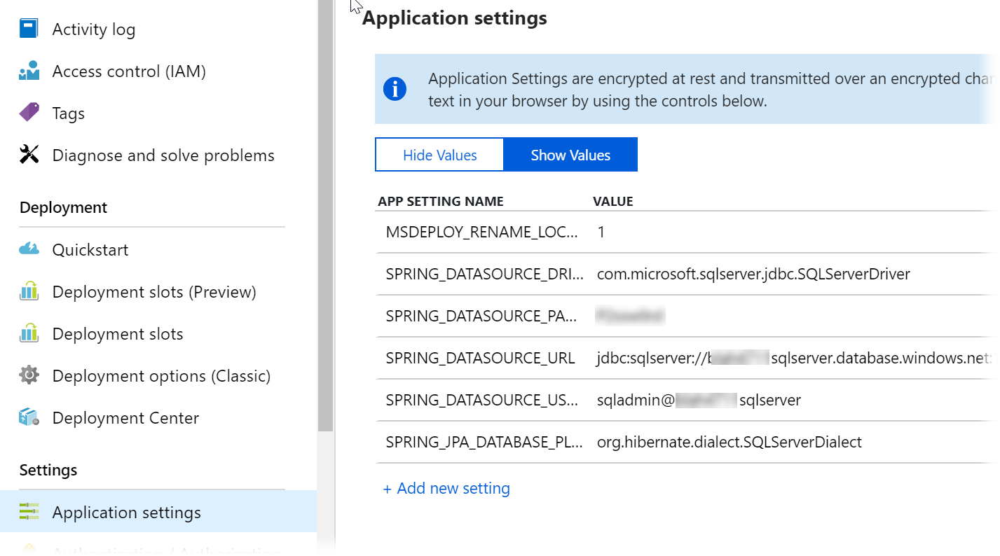
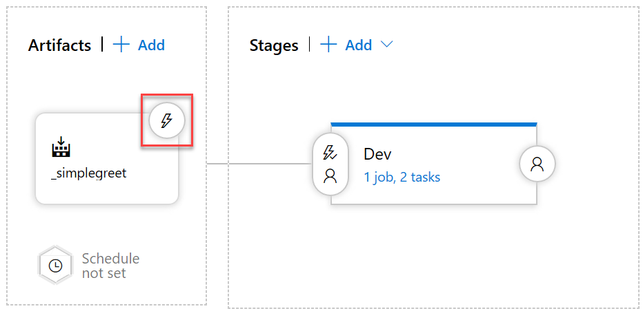
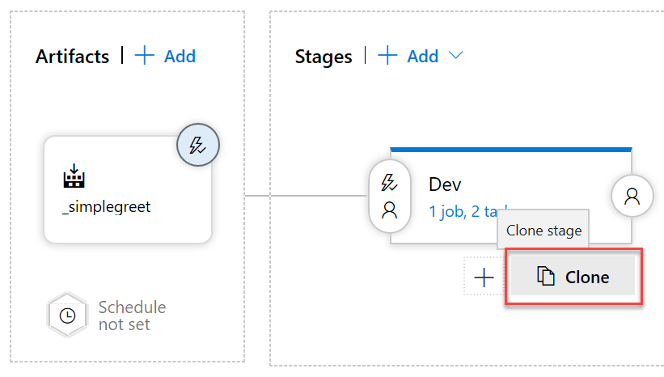
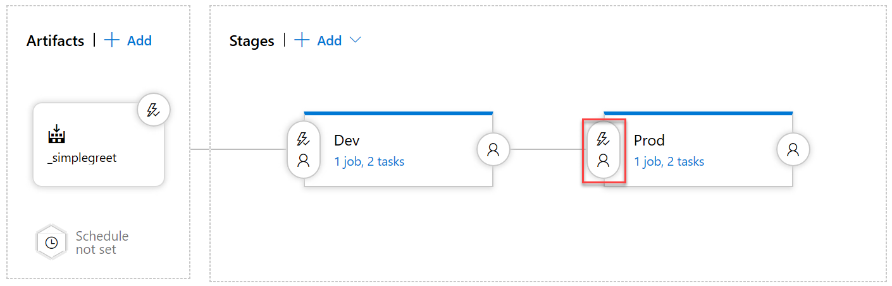
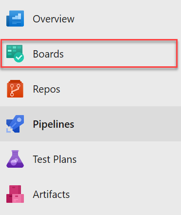
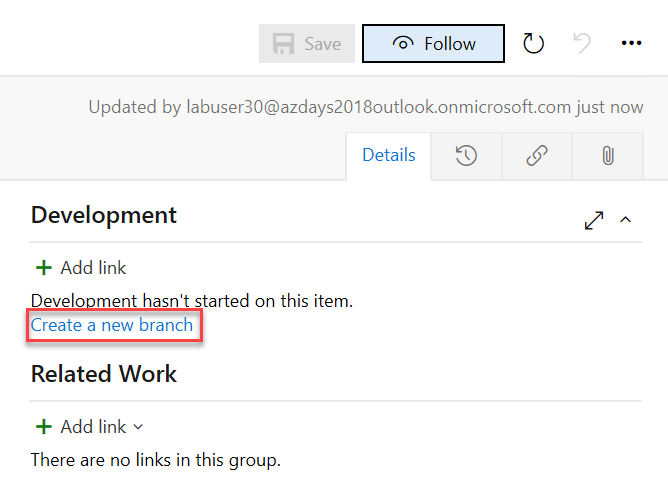
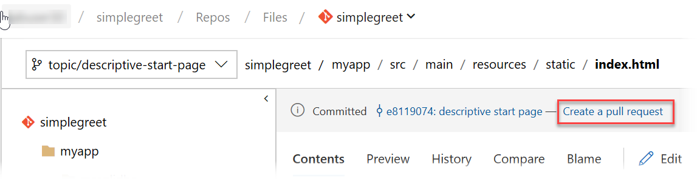
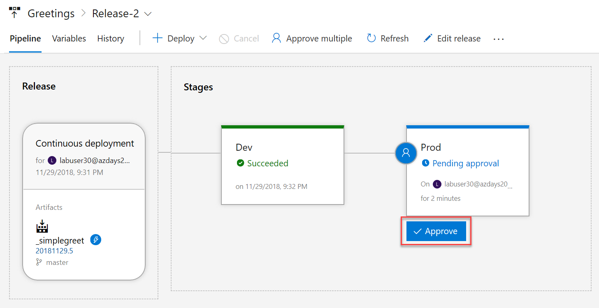
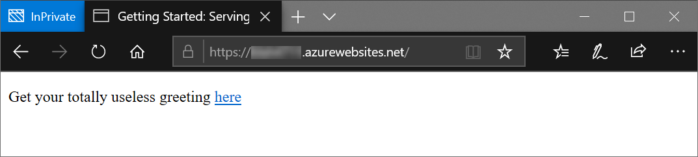

# Introduction to CI/CD with Azure DevOps

## Overview

### Objectives

In this hands-on lab, you will learn how to:

- Quickly set up two identical Azure environments using a (predefined) template
- Build a web application package in a Continuous Integration (CI) Build Pipeline
- Deploy the web application package to Azure environments with a Continuous Delivery (CD) Release Pipeline
- Track functional changes throughout the CI/CD Pipelines

### Prerequisites

Typically these should be preconfigured for you (if in doubt, ask your instructor):
* An active Azure subscription or at least two resource groups (one for "dev", one for "prod") to which you have owner permissions.
* A modern web browser (Edge, Chrome or Firefox preferred, Internet Explorer 11 to some degree) with internet access.

---

Estimated time to complete this lab: **120-180** minutes.

## Exercise 1: Log on to the Azure Cloud Shell

1. Open the [Azure Portal](https://portal.azure.com), log on with your lab account, if necessary. You can see the currently logged on account in the top right of the portal:

    

    If this is not the lab user that was provided to you, please start a new "In Private" or "Incognito" window and start the Azure portal again.

1. Start the Azure Cloud Shell (Bash) by clicking the console icon in the top bar of the portal:

   

    In case you have not worked with the Azure Cloud Shell before, you will be asked a few questions. Click **Bash (Linux)** and **Create Storage**, accept all defaults. Your console should then look like this:

   

---
**Tip:** *You can open another instance of cloud shell by starting a new browser tab or window and navigating to [https://shell.azure.com](https://shell.azure.com). This way you have more space and you can easily switch between the portal and the cloud shell.*

---

## Exercise 2: Create the Azure environments

We will start by creating the environemnts, to which we will deploy our application later on. Our environment will consist of one app service (containing a Java web app) and a Azure SQL Server database. 

We will have one development environment and one "production" environment, so that we will be able to safely test any change in an isolated environment that is as structurally similar to production as possible. This similarity is key to not experiencing production releases that fail badly because some detail in production was different from what we tested against.

In the past, keeping up the similarity of environments often was a matter of human discipline: Admins carefully documented all configuration steps they applied to any environment, so they could apply them to the other environment in the same way. Yet just like all processes that rely on human discipline, this approach is susceptible to human error - forgetting just one little detail can break the whole thing.

A good approach to solving this problem is called [Infrastructure as Code (IaC)](https://docs.microsoft.com/en-us/azure/devops/learn/what-is-infrastructure-as-code). In that approach, changes to an environment are always performed through scripts and templates that are version controlled and require no human interaction other than passing in some parameters. Implementing IaC is much easier for cloud environments than for traditional environments because **everything** (including all networking) in the cloud is *software-defined*, meaning that everything can be configured through an API. For Azure, that API is called Azure Resource Manager (ARM) and with [ARM templates](https://docs.microsoft.com/en-us/azure/azure-resource-manager/resource-group-authoring-templates) we can easily create our two environments in exactly the same way.

Well... "easily" in this case refers to the fact that our templates are already predefined for the exact needs of our application. Creating such templates can of course become complex. If you are interested in how these templates (and other IaC technologies) work: This will be the topic of an upcoming lab. For now, we will simply be using the template.

1. In the cloud shell, type:
    ```sh
    git clone https://github.com/cadullms/simplegreet 
    ```
    With this we are ready to create our two environments with only one command (per environment).
1. Briefly explore what you just downloaded (cloned) from github: In the toolbar of the shell click **Open editor**:

    

    This opens a text editor above the shell.
1. In the editor, navigate to the file `simplegreet/template/webapp-sql.json` and have a brief look at its json structure. This is the Azure Resource Manager (ARM) template that we are going to use to set up our environments.


1. In the cloud shell, execute this command:
    ```sh
    az group deployment create -g <resource group name> --template-file simplegreet/template/webapp-sql.json --parameters '{"name":{"value":"<a unique name>"}}' --no-wait
    ```
    Where...
    * `<resource group name>` is the name of your **Dev** resource group.
    * `<a unique name>` is a name in lower case letters that you can freely choose, but that must still be available as `<a unique name>.azurewebsites.net`. The name should contain 'dev' as well to indicate that this is the development version of the website we will deploy later. You might want to check the availability of the name by typing `nslookup <a unique name>.azurewebsites.net` in any shell and check whether that returns an IP already.

1. Repeat the preceding step with the **Prod** resource group and another unique name. We are not waiting for these operations now, they will run in the background. Eventually, once the operations succeed, we can check your new website in a browser at `https://<a unique name>.azurewebsites.net` - it will not contain our application yet but should show a generic app service page.

## Exercise 3: Set up Azure DevOps

1. In an additional Incognito/InPrivate browser tab, navigate to `https://dev.azure.com/`. You should be seeing something like:

    

1. Click **Start free**. If needed, log in with the credentials that were provided to you. Make sure that you are not logged in with another account than your lab user.

1. When asked, click **Continue**. This will create a so called `organization` with the name of your account (e.g. `labuser`). The organization is the root object for your work in Azure DevOps and contains projects.

1. You will arrive at a screen that asks you to **Create a project to get started**. At that screen, enter "simplegreet" as the project name, leave everything else as default, then click **Create project**. Now we have everything ready to start a full development project for free, including backlogs, kanban boards, code repositories, building and deploying software and much more.

## Exercise 4: Create a build and release agent

The agent is a piece of cross-platform software that can run anywhere in the cloud or on premises and connects to Azure DevOps to wait for jobs to be executed, like building a piece of software, running tests, deploying software, and so on. You can learn more about the different scenarios of using agents [here](https://docs.microsoft.com/en-us/azure/devops/pipelines/agents/agents?view=vsts). We will use the quickest option of running a private agent using our [build agent container image](https://hub.docker.com/r/microsoft/vsts-agent/) from Docker Hub.

For the creation of an agent we always need to authenticate against Azure DevOps. In the container we will not be able to do that interactively, thus we will be using another authentication option for Azure DevOps, a so-called Personal Access Token (PAT). Getting the PAT will be our first task.

Then, our containerized build agent will run in Azure Container Instances (ACI), a service in which we can run single containers without any up-front setup with just one command.

1. Create a PAT for your Azure DevOps organization as described [here](https://docs.microsoft.com/en-us/azure/devops/organizations/accounts/use-personal-access-tokens-to-authenticate?view=vsts). Use the scope **Agent Pools (read, manage)** for the PAT and copy it.

1. In the cloud shell, execute:
    ```sh
    az container create -g <resource group> -n <some name> --image microsoft/vsts-agent -e VSTS_ACCOUNT=<azure devops organization name> VSTS_TOKEN=<pat> --no-wait 
    ```
    Where `<resource group>` is one of the resource groups you were provided, `<azure devops organization name>` is the name of the Azure DevOps organization (usually starting with `labuser`) and `<pat>` is the PAT you just created.

    The operation will take a while. We will check the results later. For now, let's go on with our pipeline.

## Exercise 5: Import Code and Create the Azure DevOps Build Pipeline

To build something in a Build Pipeline, first we need some code. Luckily, we do not need to really develop something now, we will just import the code. Then we will create the pipeline with a so called yaml-Definition. This contains all information about how our code will be compiled and packaged in Azure DevOps.

1. In your browser, navigate to your Azure DevOps project. In case you are lost, you can just start brwose `https://dev.azure.com` and make sure you are logged in as your lab user.

1. In your project, click **Repos**:

    

    You will see an empty git repository.

1. In the repository view, under **or import a repository**, click **Import** and enter the url `https://github.com/cadullms/simplegreet` and click **Import**:

    

    This will start the import process, which should not take long. The imported repository is the same we cloned to get our infrastructure - it contains the code for our application as well.

1. Once the import has finished, your browser should show a code explorer view of the imported code. You can look at the `README.md` file to get some info about the application.

1. Briefly explore the application code in the `myapp` folder. The most interesting part for us is the file `pom.xml`, which contains all information we need to build the application with [Maven](https://maven.apache.org/). This is what an application developer would use to build the app on a dev machine, but we can (should) use the same file for building in the cloud. 

    But the `pom.xml` file itself is not enough for building in the cloud. Additional information is needed like on which type of agent the build should run on and where the result of the build should be put. All of this can be defined for an Azure DevOps build in a `yaml` file, which we will see in the next step.

1. Return to the root folder of the repository and inspect the file `azure-pipelines.yml`. This file defines that we should run in the `Default` agent queue (to which we added our private agent in the previous exercise) and a few steps to perform the actual product build. These are mainly two calls to the Maven toolset.

    * The first step is needed because for contractual reasons the JDBC driver for SQL Server is not available on the puplic Maven repository. Instead, we install it locally here from a version we have available in our repository.
    * The second steps calls Maven to do the actual build of the `pom.xml`.

1. To actually run the build, in the menu,  click **Pipelines**:

    

    You will see an empty list of Build Pipelines.

1. Click **New pipeline**. When asked, where your code is, choose **Azure Repos** and then select our repo. You should now see the content of the `azure-pipelines.yml` file. This is because by convention, if a file with that name exists in the root folder of a repo, by convention Azure DevOps assumes that this must be our build definition. You could as well choose another yml file or use a UI instead to define your build. You can explore those options [here](https://docs.microsoft.com/en-us/azure/devops/pipelines/get-started/?toc=/azure/devops/pipelines/toc.json&bc=/azure/devops/boards/pipelines/breadcrumb/toc.json&view=vsts).

1. Click **Run**. This will use all the settings as they are currently defined in the `azure-pipelines.yml` file, which is fine for us. You should see a build page where you can follow the progress of the build. The build should eventually succeed. The build is now defined as a Continuous Integration (CI) Build, which means that whenever new code is pushed to our repository, the build will run again. 

1. In the build result page, click **Artifacts**, then select **drop**:

    

    This will open an explorer for the artifacts our build produced. In this case it is just the `myapp.war` file.

The `myapp.war` application package we just built is the result of and concludes our CI Build Pipeline creation experience. This output artifact can now be used in the next part of our pipelines, the Release Pipeline, which is the topic of the next exercise.

## Exercise 6: Create the Azure DevOps Release Pipeline

The output of the CI part of CI/CD (like the .war file we just built) should always be independent of the actual environment we are deploying to: It should not contain any environment specifics like connection strings or even passwords, instead it should only have the default values for local development. Yet to actually deploy to the different environments (in this case, one dev and one prod environment) of course we need to make the environments known to the system and define the steps of how we can actually deploy the generic package to the specific environment.

1. In your project, navigate to **Pipelines**, **Releases**. This should open an empty list of Release Pipelines.

1. Click **New pipeline**. This will open a **Select a template** drawer to the right.

1. Choose **Azure App Service Deployment** and click **Apply**.

1. Name the stage "Dev", then close this drawer with the "x":

    

1. In the pipeline overview, under **Artifacts**, click **Add an artifact**.

1. Select our Build Pipeline, for the **Default version** choose **Latest from the build pipeline default branch with tags** and click **Add**.

1. In the pipeline overview, under **Stages**, in the **Dev** environment, click the task link:

    

    This opens the actual steps for automating the deployment to this stage/environment. Here we will now fill in the details of how we can connect to our Azure resources.

1. Under **Parameters**, **Azure Subscription**, choose your subscription:

    


1. Click **Authorize**. Azure DevOps then tries to automatically create a so-called [Service Principle](https://docs.microsoft.com/en-us/azure/active-directory/develop/app-objects-and-service-principals) that our automation can use to authenticate against the Azure API, so that we can create resources and deploy apps. There are two prerequisites for this:
    1. The currently logged on user must have permission to create a service principal.
    1. The currently logged on user must have permission to assign the Contributor role for the whole Azure subscription.

    More often than not, at least one of those prerequisites is not met. In your case the operation may fail as well, because typically you will be missing the permission to create role assignments for the whole subscription. 

1. (If the **Authorize** step failed) Click the **Manage** link for the **Azure subscription** and then click **New service connection**. This will open a dialog in which you can more selectively scope the Service Principal to only one of the resource groups you have **Owner** permissions to:

    

    If this fails as well, you would need to ask an administrator to create a Service Principal for you with at least **Contributor** permissions for the resource group and enter the information for that Service Principal manually in the dialog.

1. Repeat the previous step for the other resource group, but this time call the connection `Prod`.

1. Return to the new Release Pipeline you still have open in your other tab and choose the `Dev` connection for the **Azure Subscription** parameter. You might have to click the refresh button besides the drop-down box.

1. For **App Service Name** click the dropdown and you should see the app service we created in the beginning of this lab - select it:

    

1. Click the `+` button above the task list:

    

    This opens a drawer to the right containing many available tasks, ranging from simple oerations like copying files to complex integrations like creating VMs in VMWare or deploying to third party services like the Apple or Google App Stores. Even an AWS integration is available. You might want to try searching for your favorite service using the search box in the **Add tasks** drawer.

1. In the **Add tasks** drawer search box, type "bash", select the **Bash** task and click **Add**.

    As we are creating a Java application that is running in Tomcat, the easiest option to run our app as the root app is to rename its `.war` file to `ROOT.war`. We will do so with another step that will always be executed immediately before the deploy task that was already created by the template.

1. Drag the **Bash** task above the **Deploy Azure App Service** task.

1. In the **Bash** task, check the **Inline** radio button and enter the following command:

    ```shell
    mv _simplegreet/drop/myapp.war _simplegreet/drop/ROOT.war
    ```

1. In the **Deploy Azure App Service** task, for **Package or folder** enter `_simplegreet/drop/ROOT.war`.

1. Rename the pipeline to "Greetings":

    

1. If the pipeline has all steps in correct order now, click **Save**:

    

1. In the **Save** dialog, enter a comment if you like and click **OK**.

1. Next to the **Save** button, click **+Release**, **+Create new release**.

1. In the drawer coming up, click **Create**.

    In contrast to Build Pipelines, in Release pipelines we are not directly queueing the tasks to be performed immediately, instead we create a release, which keeps the exact versions of all artifacts in one place, so that this exact package can be deployed to the different stages at any time. By default, the single stage we have defined so far will be deployed automatically, but we can choose to not have any deployments be triggered automatically.
    
    Azure DevOps now shows you a page on which you can track the progress of the automated deployment. It should succeed.

    In the next step, let's verify our deployments so far using the Azure Portal.

1. Navigate to `https://portal.azure.com`, in the menu on the left, choose **Resource Groups** and select your `dev` resource group.

1. In the resource group you should see an app service plan, an app service and Azure SQL Server resources. Click on the app service and then click the **Browse** button. This will take you to the web site you just deployed at `https://<some name>.azurewebsites.net`. It will take a while for the app to come up at initial start, but eventually you should see an app inviting you to create a few greetings (almost the same app as the one we used in our previous lab).

1. Back in the portal, go to the **Application Settings** part of your app service, scroll down to **Application Settings**, and click **Show Values**. This will show you the environment specific values for this stage:

    

    These settings make sure that the web app code is using the correct JDBC driver with the correct connection string and a few more settings. These settings are passed to the application as environment variables, and fortunately Spring Boot allows [overriding its application settings](https://docs.spring.io/spring-boot/docs/current/reference/html/boot-features-external-config.html) via these environment variables (for .NET applications [the same approach applies](https://docs.microsoft.com/en-us/azure/app-service/web-sites-configure#app-settings)).

    The values itself come directly from the ARM template we deployed right in the beginning.
    
    It is highly recommended to always follow this approach, as it makes configuring different environments in the same way very easy, which we we will see in the next exercise.

## Exercise 7: Continuously deliver to Production

The first thing to "continuous" is that the transition from CI (building the product) to CD (delivering the product) needs to happen automatically. For Continuous Delivery it is not necessary to actually *deploy* every change in our code to *production* - but at least every change that is pushed to our master branch should be picked up as quickly as possible to be deployed and tested in an evironment that is as close to production as possible. This is the only way we can quickly find all those issues that do not come up on developer's machines (everybody knows the "works on my machine" problem, right?).

To actually deploy to production, we will extend our pipeline by adding a *Prod* stage. Deployment to that stage will be triggered automatically as well, but each release will need to be approved, to prevent changes rolling uncontrolled into production.

1. Navigate to your release pipeline and click the **Continuous deployment trigger** icon for our artifact:

    

1. In the **Continuous deployment trigger** drawer, set the trigger to **Enabled**, then under **Build branch filters** click **Add** and add an **Include** filter for the **master** branch. This way any topic/feature or other not-so-stable branches will not enter our release definition.

1. Clone the *Dev* stage:

    

1. Click the cloned stage, name it *Prod* and in the **Deployment process** section choose the *production* resource group and app service.

1. Click the **Pre-deployment conditions** for the production stage:

    

1. In the **Pre-deployment conditions** drawer, set **Pre-deployment approvals** to enabled and add your account name as approver. The approvers of a stage will be notified via email when a new approval is pending - in our setup this would only work if you set a real email for your user in the profile settings.

1. Click **Save** to save our changes. We will not try it yet. Instead we will trigger the whole process including building a new version of our application in the next exercise.

## Exercise 8: Track functional changes throughout the CI/CD Pipelines

Azure DevOps can do much more than just CI/CD, starting from organizing work in Backlogs and Boards. Typically, in Azure DevOps any change in our software is planned or prioritized through so-called work items, e.g. [User Stories](https://docs.microsoft.com/en-us/azure/devops/boards/work-items/guidance/agile-process-workflow?view=vsts#define-user-stories) or [Product Backlog Items](https://docs.microsoft.com/en-us/azure/devops/boards/work-items/guidance/scrum-process-workflow?view=vsts#define-pbis-and-bugs).

Additionally, work items are fully integrated to code repositories, build and release and more, so that all activities for a change can be tracked, even through branches and pull requests in version control. Work items can even [drive the development workflow](https://docs.microsoft.com/en-us/azure/devops/boards/backlogs/connect-work-items-to-git-dev-ops?view=vsts), which we will see in this exercise.

1. In the menu, select **Azure Boards**:

    

1. Click **+New Work Item** and select **User Story**. This will be the item to track our code change.

1. In the **New User Story** form, enter the title "Start page has a descriptive text" and click **Save**.

    User Stories should always describe the new *desired* state for our application. Our development work will then try to make sure that the *actual* state of the application will soon match the desired state. In this case, we imply that the current start page of our application is not descriptive enough. Let's fix that.

1. In the **Development** section of the User Story, click **Create a new branch**:

    

1. In the **Create a branch** dialog, enter "topic/descriptive-start-page" as the name of the branch and select the `master` branch of our repository, then click **Create branch**. The new branch is automatically linked to the work item, so that we can track the code changes we will implement in that branch to the work item. The name of the branch is following a convention that indicates that this is a topic branch, this makes finding and filtering those branches easier. You could as well use a convention like `feature/x` or `user-story/4711` - whatever works best for you. 

    In the mean time, Azure DevOps has automatically opened the new branch for you in the browser, so we can immediately start our work.
    
1. In the browser, navigate to `myapp/src/main/resources/static/index.html` and click **Edit**. This enables editing our code directly in the browser. While this is not recommended for real development work, our small change can perfectly be performed in this lightweight browser-based editor.

1. Locate the string "Get your greeting" in the html code and change it to "Get your totally useless greeting" (or any other string you might find more descriptive). The code should then look something like this:

    ```html
    <!DOCTYPE HTML>
    <html>
    <head>
        <title>Getting Started: Serving Web Content</title>
        <meta http-equiv="Content-Type" content="text/html; charset=UTF-8" />
    </head>
    <body>
        <p>Get your totally useless greeting <a href="/greeting">here</a></p>
    </body>
    </html>
    ```

1. Click **Commit...**, in the **Commit** dialog enter "descriptive start page" as **comment** and click **Commit**. We could make more changes in this way or do some real development on our development machine, pushing intermediary commits to our topic branch. All of these changes might trigger a CI builds, but will not be automatically deployed, because we filtered our release definition to only include the ``master`` branch.

    Thus, to get our code with the new start page deployed, we need to merge it into the ``master`` branch.

    We could do this directly, but the recommended workflow in any real development workflow is to use a so-called [pull request](https://docs.microsoft.com/en-us/azure/devops/repos/git/pull-requests?view=vsts) for this. A pull request automatically documents all the changes that were done for a topic/feature and provides a great workflow for reviewing changes.

    Ideally, in a real project, you should always enforce the use of pull requests using [branch policies](https://docs.microsoft.com/en-us/azure/devops/repos/git/branch-policies-overview?view=vsts).

1. As you commited some code recently, Azure DevOps conveniently offers you to create a pull request already in the current view:

    

    Click **Create a pull request**. This takes you to a pull request page summarizing all info about our efforts to implement the user story to make the start page more descriptive.

    You could enter reviewers here and start a conversation using direct code comments about the quality of your code. Further commits to the topic branch to improve the code would automatically be going into the pull request as well.

    For now we will just accept the changes.

1. In the **New Pull Request** page, click **Create**. This will create the pull request and publish it to all reviewers you might have entered. As we do not have any reviewers today, we can directly go on to finish the pull request.

1. In the pull request, click **Complete**.

1. In the **Complete pull request** dialog, click **Complete merge**. This will initiate a series of processes being carried out automatically:
    * The topic branch with all its code changes will be merged into the `master` branch.
    * The commit to the `master` branch will trigger a CI build, building a new version of our application (a new `myapp.war` file).
    * As the CI build was for the `master` branch, if the build was successful, a new release will automatically be created in the release definition.
    * The new release will automatically pick up the application package (our `myapp.war` file) and deploy it to the `Dev` stage.
    * In case the deployment to `Dev` went fine, the approval request for the `Prod` stage will be sent out.
    * Once the deployment to `Prod` is approved, the new package will finally be deployed to production.
    
    You can follow these events by navigating to the **Azure Pipelines** section again, then to the **Releases** section and clicking the current release. 

1. After the deployment to `Dev` finishes, check the result in your `Dev` application, by navigating to ``https://<dev app service name>.azurewebsites.net``.

1. If the `Dev` version is ok, you can approve the pending `Prod` deployment:

    

1. In the drawer, click **Approve**. Your approval will be documented, and the deployment will start.

1. Once the deployment finishes, navigate to your production application at `https://<prod app service name>.azurewebsites.net`. After a bit of initialization time (you might be seeing different error codes, before eventually it is going to work) you should see our new start page there:

    

This concludes our first entry into the world of continuously delivering software with Azure DevOps. There is much more to it, of course (see further down). As an extra challenge, if you still have time, you might want to explore in the next section how you can automate the creation of the environments themselves from a pipeline as well.

## Extra Challenge: Environment Provisioning Pipeline

Just like with any other automation effort, having the core IaC automation implemented with ARM templates (like we did in Exercise 2) is only have done. The problem is that even if your automation works fine once, it does not mean it is still going to work in two months. To make sure that we find problems early on, while we still can fix them, it is not enough to execute the thing once. We need to repeat this often, all the time, automatically!

In other words: We should not only automate the thing itself, executing the automation should be automated as well. Whenever we change something in our automation (in this case, in our ARM template), we should automatically apply that change to our environments through a pipeline, just like we deploy the code automatically.

To do so, follow these high-level steps (you should be able to figure out the detail by now):

1. Create an additional release pipeline with the **Empty template**. Call it "Greetings.Provisioning" or something similar.

1. Use our git repository as the artifact for the pipeline.

1. Create stages in the environment that mirror the stages of our product pipeline.

1. Use only one step per stage: The **Azure Resource Group Deployment** task. This task can use the same Azure Resource Manager service connections we already implemented for the product pipeline. In the task, choose the template from the git repository artifact and override the `name` parameter of the template (don't worry, all these settings can easily be set in the UI). 

1. Create a release for the pipeline and apply it to all environments again. The system will detect that there are no changes and should leave the existing environments untouched (idempotency).

1. Try changing a value like e.g. the size of the resources through the provisioning pipeline.

---

## Summary and Outlook

By now, we should a good basic understanding of what Azure Pipelines can achieve for CI/CD. This is only a part of the story though. A few additional things should always be part of a setup like this (for both the App Service and the CI/CD pipelines): 

* **Test Automation**. Currently there are no automated tests being executed in these pipelines. While this can be tolerable for a continuous Delivery workflow that still has manual approvals, it inhibits our ability to increase the deployment frequency. For some scenarios, the goal should be to actually deploy every code change right into production, as long as it passes all automated quality gates. Those quality gates must be quite good for this, and automated tests are the most important part. 

* **Slots**. App service supports so-called slots, which run in parallel for any app. These slots can be deployed to, the code be tested and warmed up in a non public slot and finally the production traffic can be switched to the new code in a zero-downtime manner. Warming up in this context means that some requests are sent to the app, so that all init processes can happen, before real traffic is routed to the app, reducing the wait time for clients. All of this can happen automatically from the pipeline.

* **Database deployments**. All deployment operations in a CI/CD pipeline must be idempotent, meaning that we can apply the operation as often as we want and it will always yield the same result, regardless of the previous state of our deployment target. Otherwise we would always check the state of the environment to make sure that the next change can be applied. This would defy the purpose of having CI/CD in the firt place.

    Web applications mostly are relatively easy to deploy automatically, because they are typically are stateless. Each call from a web client is served and then forgotten, no state should be persisted in a web apps file system. Exchanging that type of code is mostly just a matter of replacing the old app files with the new files, which is an idempotent operation in itself.
    
    In contrast, changes to databases or their schemas are much harder to be automated idempotently. The very purpose of the database is to keep state, so it cannot just be killed and recreated with the new schema. Instead, each change needs to take into account the current state of both data and schema and apply some kind of logic. E.g. if we apply a change twice to create a new table, that change would need to check whether that table already exists, so that it does not crash the second time.

    There are many techniques for doing idempotent database updates like schema migrations or SSDT with dacpac deployments for SQL Server.

* **Containers**. Building and deploying containerized applications can be much easier than working directly with web servers or databases in the CI/CD pipeline, because in general they are much more standardized from an operations perspective. Azure Pipelines has a number of predefined templates and features that make it particularly easy to build and deploy containerized applications.

* **Security**. The current environment has room for improvement regarding security. A Web Application Firewall (WAF) could be added in front of the app service and the SQL Server could use a more secure authentication mechanism than username/password based authentication with SQL logins, to name just two items that just cannot be implemented in a short lab like this.

* **Authentication and Encryption**. Typically we would use a custom domain for a real website, for which we would need a certificate safely stored in Azure Key Vault and we would use Azure Active Directory or an other identity provider to provide authentication for our code.

* **Much more...**