# Introduction to CI/CD with Azure DevOps

## Overview

### Objectives

In this hands-on lab, you will learn how to:

- Quickly set up two identical Azure environments using a (predefined) template
- Build a web application package in a Continuous Integration (CI) Build Pipeline
- Deploy the web application package to Azure environments with a Continuous Delivery (CD) Release Pipeline
- Track functional changes throughout the CI/CD Pipelines
- Use automated tests within the pipeline

### Prerequisites

Typically these should be preconfigured for you (if in doubt, ask your instructor):
* An active Azure subscription or at least two resource groups (one for "dev", one for "prod") to which you have contributor permissions.
* Contributor access to an Azure DevOps team project.
* Endpoint Creator access for the Azure DevOps team project (your account needs to be in the "Endpoint Creators" group in the team project).

---

Estimated time to complete this lab: **120-180** minutes.

## Exercise 1: Log on to the Azure Cloud Shell

1. Open the [Azure Portal](https://portal.azure.com), log on with your lab account, if necessary. You can see the currently logged on account in the top right of the portal:

    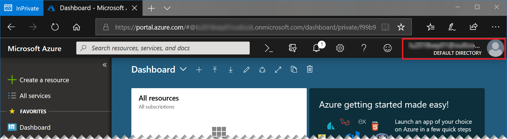

    If this is not the lab user that was provided to you, please start a new "In Private" or "Incognito" window and start the Azure portal again.

1. Start the Azure Cloud Shell (Bash) by clicking the console icon in the top bar of the portal:

   

    In case you have not worked with the Azure Cloud Shell before, you will be asked a few questions. Click **Bash (Linux)** and **Create Storage**, accept all defaults. Your console should then look like this:

   

---
**Tip:** *You can open another instance of cloud shell by starting a new browser tab or window and navigating to [https://shell.azure.com](https://shell.azure.com). This way you have more space and you can easily switch between the portal and the cloud shell.*

---

## Exercise 2: Create the Azure environments

1. In the cloud shell, type:
    ```sh
    git clone https://github.com/cadullms/simplegreet 
    ```
    With this we are ready to create our two environments with only one command (per environment).
1. Briefly explore what you just downloaded (cloned) from github: In the toolbar of the shell click **Open editor**:

    

    This opens a text editor above the shell.
1. In the editor, navigate to the file `simplegreet/template/webapp-sql.json` and have a brief look at its json structure. This is the Azure Resource Manager (ARM) template that we are going to use to set up our environments. If you are interested in how templates like this work: This will be the topic of an upcoming lab. For now, we will simply be using the template.
1. In the cloud shell, execute this command:
    ```sh
    az group deployment create -g <resource group name> --template-file simplegreet/template/webapp-sql.json --parameters '{"name":{"value":"<a unique name>"}}' --no-wait
    ```
    Where...
    * `<resource group name>` is the name of your **Dev** resource group.
    * `<a unique name>` is a name in lower case letters that you can freely choose, but that must still be available as `<a unique name>.azurewebsites.net`. The name should contain 'dev' as well to indicate that this is the development version of the website we will deploy later. You might want to check the availability of the name by typing `nslookup <a unique name>.azurewebsites.net` in any shell and check whether that returns an IP already.
1. Repeat the preceding step with the **Prod** resource group and another unique name. We are not waiting for these operations now, they will run in the background. Eventually, once the operations succeed, we can check your new website in a browser at `https://<a unique name>.azurewebsites.net` - it will not contain our application yet but should show a generic app service page.

## Exercise 3: Set up Azure DevOps

1. In an additional Incognito/InPrivate browser tab, navigate to `https://dev.azure.com/`. You should be seeing something like:

    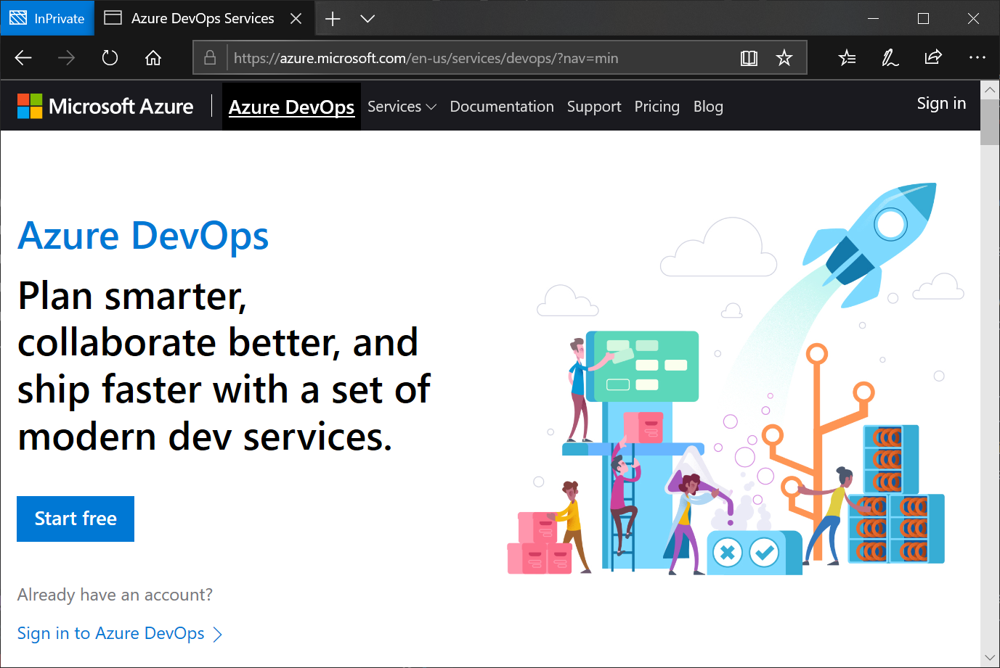

1. Click **Start free**. If needed, log in with the credentials that were provided to you. Make sure that you are not logged in with another account than your lab user.

1. When asked, click **Continue**. This will create a so called `organization` with the name of your account (e.g. `labuser`). The organization is the root object for your work in Azure DevOps and contains projects.

1. You will arrive at a screen that asks you to ***Create a project to get started**. At that screen, enter "simplegreet" as the project name, leave everything else as default, then click **Create project**. Now we have everything ready to start a full development project for free, including backlogs, kanban boards, code repositories, building and deploying software and much more. What is not included in the *free* version of Azure DevOps is the compute power that is needed for performing the resource-intensive tasks of actually building and deploying software. Thus, to enable our CI/CD pipeline, we need to add one piece: A build agent. We will do that in the next exercise.

## Exercise 4: Create a build and release agent

The agent is a piece of cross-platform software that can run anywhere in the cloud or on premises and connects to Azure DevOps to wait for jobs to be executed, like building a piece of software, running tests, deploying software, and so on. You can learn more about the different scenarios of using agents [here](https://docs.microsoft.com/en-us/azure/devops/pipelines/agents/agents?view=vsts). We will use the quickest option of running a private agent using our [build agent container image](https://hub.docker.com/r/microsoft/vsts-agent/) from Docker Hub.

For the creation of an agent we always need to authenticate against Azure DevOps. In the container we will not be able to do that interactively, thus we will be using another authentication option for Azure DevOps, a so-called Personal Access Token (PAT). Getting the PAT will be our first task.

Then, our containerized build agent will run in Azure Container Instances (ACI), a service in which we can run single containers without any up-front setup with just one command.

1. Create a PAT for your Azure DevOps organization as described [here](https://docs.microsoft.com/en-us/azure/devops/organizations/accounts/use-personal-access-tokens-to-authenticate?view=vsts). Use the scope **Agent Pools (read, manage)** for the PAT and copy it.

1. In the cloud shell, execute:
    ```sh
    az container create -g <resource group> -n <some name> --image microsoft/vsts-agent -e VSTS_ACCOUNT=<azure devops organization name> VSTS_TOKEN=<pat> --no-wait 
    ```
    Where `<resource group>` is one of the resource groups you were provided, `<azure devops organization name>` is the name of the Azure DevOps organization (usually starting with `labuser`) and `<pat>` is the PAT you just created.

    The operation will take a while. We will check the results later. For now, let's go on with our pipeline.

## Exercise 5: Import Code and Create the Azure DevOps Build Pipeline

To build something in a Build Pipeline, first we need some code. Luckily, we do not need to really develop something now, we will just import the code. Then we will create the pipeline with a so called yaml-Definition. This contains all information about how our code will be compiled and packaged in Azure DevOps.

1. In your browser, navigate to your Azure DevOps project. In case you are lost, you can just start brwose `https://dev.azure.com` and make sure you are logged in as your lab user.

1. In your project, click **Repos**:

    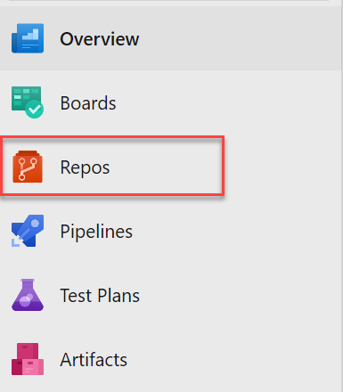

    You will see an empty git repository.

1. In the repository view, under **or import a repository**, click **Import** and enter the url `https://github.com/cadullms/simplegreet` and click **Import**:

    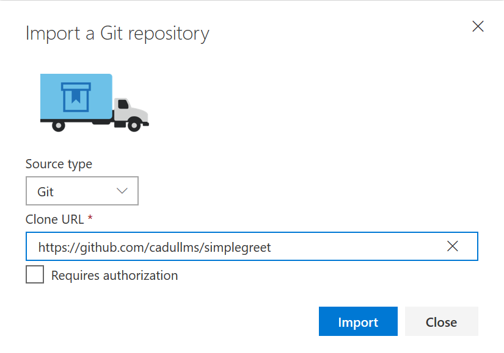

    This will start the import process, which should not take long. The imported repository is the same we cloned to get our infrastructure - it contains the code for our application as well.

1. Once the import has finished, your browser should show a code explorer view of the imported code. You can look at the `README.md` file to get some info about the application.

1. Briefly explore the application code in the `myapp` folder. The most interesting part for us is the file `pom.xml`, which contains all information we need to build the application with [Maven](https://maven.apache.org/). This is what an application developer would use to build the app on a dev machine, but we can (should) use the same file for building in the cloud. 

    But the `pom.xml` file itself is not enough for building in the cloud. Additional information is needed like on which type of agent the build should run on and where the result of the build should be put. All of this can be defined for an Azure DevOps build in a `yaml` file, which we will see in the next step.

1. Return to the root folder of the repository and inspect the file `azure-pipelines.yml`. This file defines that we should run in the `Default` agent queue (to which we added our private agent in the previous exercise) and a few steps to perform the actual product build. These are mainly two calls to the Maven toolset.

    The first step is needed because for contractual reasons the JDBC driver for SQL Server is not available on the puplic Maven repository. Instead, we install it locally here from a version we have available in our repository.

    The second steps calls Maven to do the actual build of the `pom.xml`.

1. To actually run the build, in the menu,  click **Pipelines**:

    

    You will see an empty list of Build Pipelines.

1. Click **New pipeline**. When asked, where your code is, choose **Azure Repos** and then select our repo. You should now see the content of the `azure-pipelines.yml` file. This is because by convention, if a file with that name exists in the root folder of a repo, by convention Azure DevOps assumes that this must be our build definition. You could as well choose another yml file or use a UI instead to define your build. You can explore those options [here](https://docs.microsoft.com/en-us/azure/devops/pipelines/get-started/?toc=/azure/devops/pipelines/toc.json&bc=/azure/devops/boards/pipelines/breadcrumb/toc.json&view=vsts).

1. Click **Run**. This will use all the settings as they are currently defined in the `azure-pipelines.yml` file, which is fine for us. You should see a build page where you can follow the progress of the build. The build should eventually succeed. The build is now defined as a Continuous Integration (CI) Build, which means that whenever new code is pushed to our repository, the build will run again. 

1. In the build result page, click **Artifacts**, then select **drop**:

    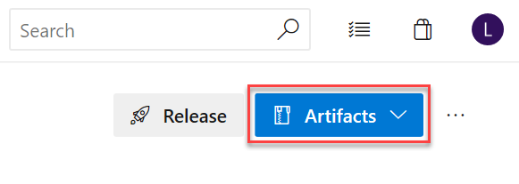

    This will open an explorer for the artifacts our build produced. In this case it is just the `myapp.war` file.

The `myapp.war` application package we just built is the result of and concludes our CI Build Pipeline creation experience. This output artifact can now be used in the next part of our pipelines, the Release Pipeline, which is the topic of the next exercise.

## Exercise 6: Create the Azure DevOps Release Pipeline

The output of the CI part of CI/CD (like the .war file we just built) should always be independent of the actual environment we are deploying to: It should not contain any environment specifics like connection strings or even passwords, instead it should only have the default values for local development. Yet to actually deploy to the different environments (in this case, one dev and one prod environment) of course we need to make the environments known to the system and define the steps of how we can actually deploy the generic package to the specific environment.

1. In your project, navigate to **Pipelines**, **Releases**. This should open an empty list of Release Pipelines.

1. Click **New pipeline**. This will open a **Select a template** drawer to the right.

1. Choose **Azure App Service Deployment** and click **Apply**.

1. Name the stage "Dev", then close this drawer with the "x":

    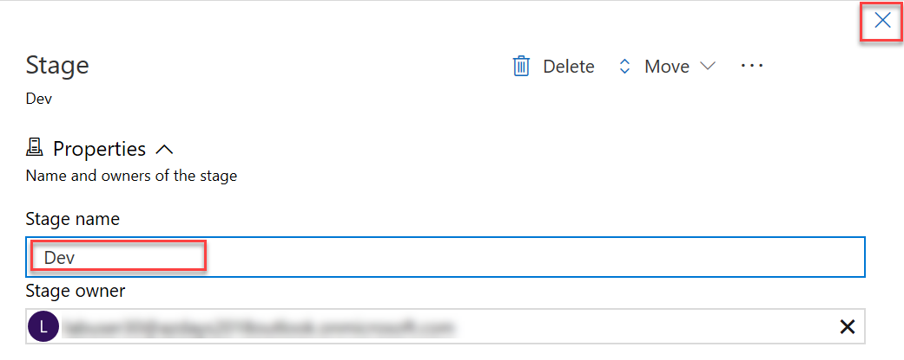

1. In the pipeline overview, under **Artifacts**, click **Add an artifact**.

1. Select our Build Pipeline, for the **Default version** choose **Latest from the build pipeline default branch with tags** and click **Add**.

1. In the pipeline overview, under **Stages**, in the **Dev** environment, click the task link:

    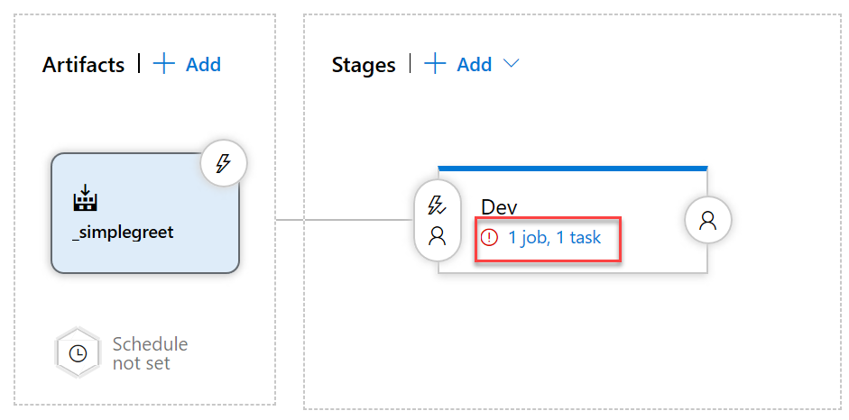

    This opens the actual steps for automating the deployment to this stage/environment. Here we will now fill in the details of how we can connect to our Azure resources.

1. Under **Parameters**, **Azure Subscription**, choose your subscription:

    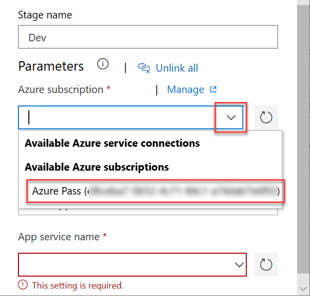

1. Click **Authorize**. Azure DevOps then tries to automatically create a so-called [Service Principle](https://docs.microsoft.com/en-us/azure/active-directory/develop/app-objects-and-service-principals) that our automation can use to authenticate against the Azure API, so that we can create resources and deploy apps. There are two prerequisites for this:
    1. The currently logged on user must have permission to create a service principal.
    1. The currently logged on user must have permission to assign the Contributor role for the whole Azure subscription.

    More often than not, at least one of those prerequisites is not met. In your case the operation may fail as well, because typically you will be missing the permission to create role assignments for the whole subscription. 

1. (If the **Authorize** step failed) Click the **Manage** link for the **Azure subscription** and then click **New service connection**. This will open a dialog in which you can more selectively scope the Service Principal to only one of the resource groups you have **Owner** permissions to:

    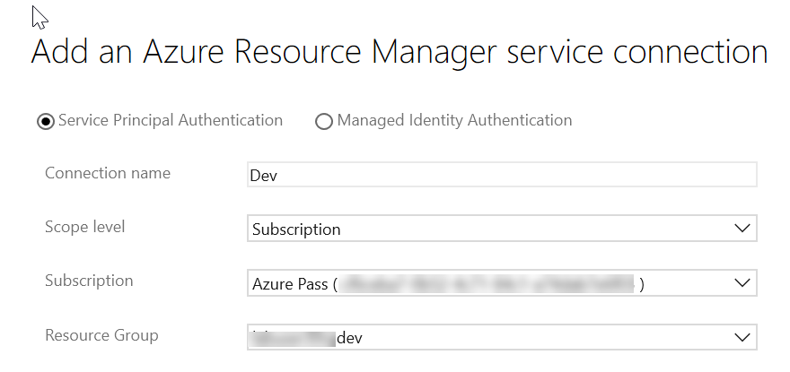

    If this fails as well, you would need to ask an administrator to create a Service Principal for you with at least **Contributor** permissions for the resource group and enter the information for that Service Principal manually in the dialog.

1. Repeat the previous step for the other resource group, but this time call the connection `Prod`.

1. Return to the new Release Pipeline you still have open in your other tab and choose the `Dev` connection for the **Azure Subscription** parameter. You might have to click the refresh button besides the drop-down box.

1. For **App Service Name** click the dropdown and you should see the app service we created in the beginning of this lab - select it:

    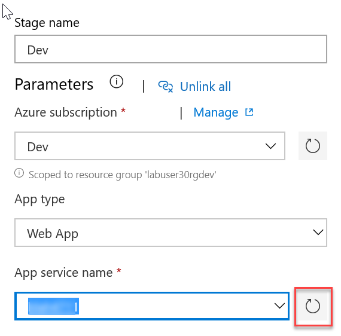

1. Click the `+` button above the task list:

    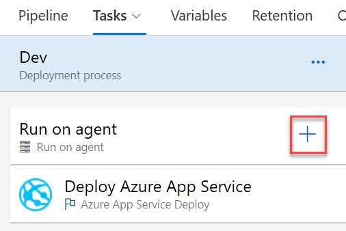

    This opens a drawer to the right containing many available tasks, ranging from simple oerations like copying files to complex integrations like creating VMs in VMWare or deploying to third party services like the Apple or Google App Stores. Even an AWS integration is available. You might want to try searching for your favorite service using the search box in the **Add tasks** drawer.

1. In the **Add tasks** drawer search box, type "bash", select the **Bash** task and click **Add**.

    As we are creating a Java application that is running in Tomcat, the easiest option to run our app as the root app is to rename its `.war` file to `ROOT.war`. We will do so with another step that will always be executed immediately before the deploy task that was already created by the template.

1. Drag the **Bash** task above the **Deploy Azure App Service** task.

1. In the **Bash** task, check the **Inline** radio button and enter the following command:

    ```shell
    mv _simplegreet/drop/myapp.war _simplegreet/drop/ROOT.war
    ```

1. In the **Deploy Azure App Service** task, for **Package or folder** enter `_simplegreet/drop/ROOT.war`.

1. Rename the pipeline to "Greetings":

    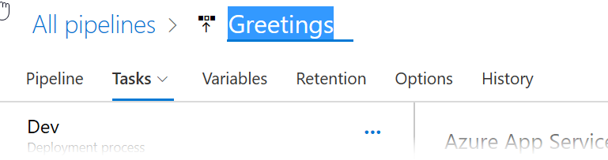

1. If the pipeline has all steps in correct order now, click **Save**:

    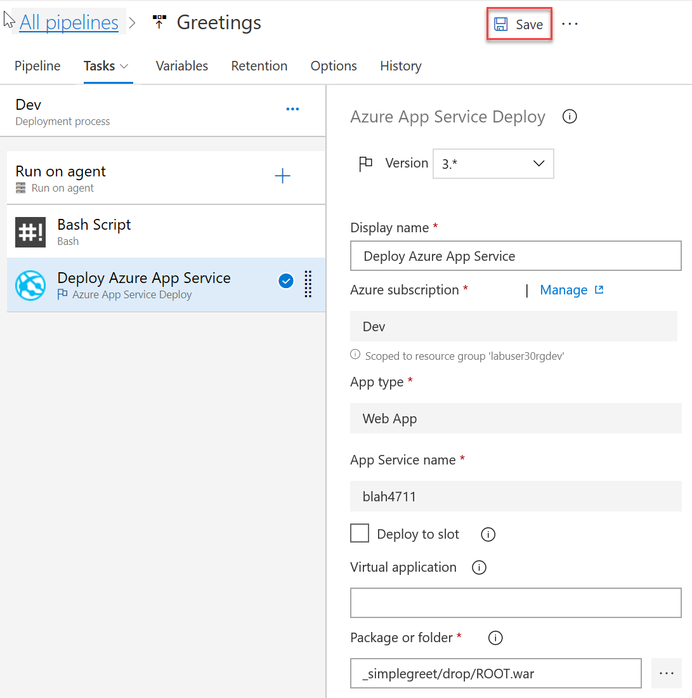

1. In the **Save** dialog, enter a comment if you like and click **OK**.

1. Next to the **Save** button, click **+Release**, **+Create new release**.

1. In the drawer coming up, click **Create**.

    In contrast to Build Pipelines, in Release pipelines we are not directly queueing the tasks to be performed immediately, instead we create a release, which keeps the exact versions of all artifacts in one place, so that this exact package can be deployed to the different stages at any time. By default, the single stage we have defined so far will be deployed automatically, but we can choose to not have any deployments be triggered automatically.
    
    Azure DevOps now shows you a page on which you can track the progress of the automated deployment. It should succeed. 