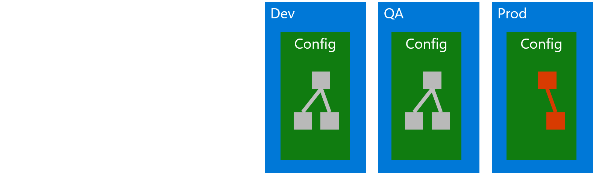
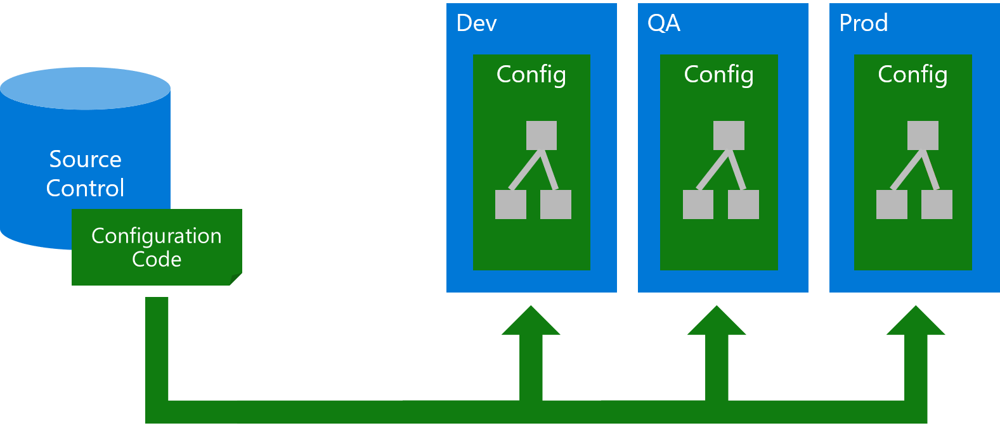
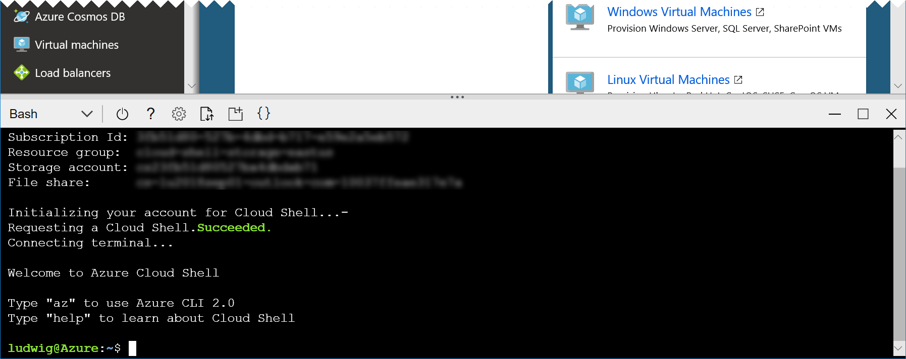
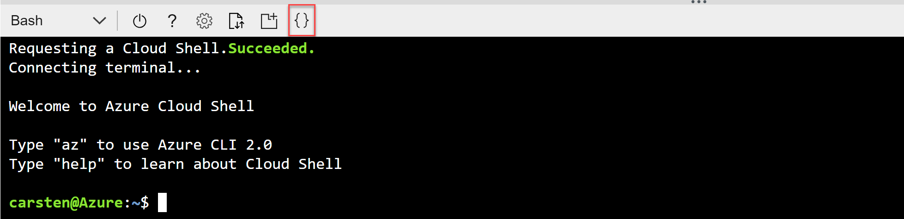
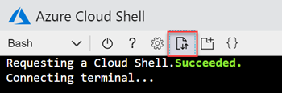

# Introduction to Infastructure as Code (IaC) for Azure

## Overview

One of the most common pitfalls in bringing applications to production is when our production environment is configured slightly different than the environments we tested in. Thus, we always want to be able to safely test any change to our application in an isolated environment that is as structurally similar to production as possible. This similarity is key to not experiencing production releases that fail badly because some detail in production was different from what we tested against.



In the past, keeping up the similarity of environments often was a matter of human discipline: Admins carefully documented all configuration steps they applied to any environment, so they could apply them to the other environment in the same way. Yet just like all processes that rely on human discipline, this approach is susceptible to human error - forgetting just one little detail can break the whole thing.

A good approach to solving this problem is called [Infrastructure as Code (IaC)](https://docs.microsoft.com/en-us/azure/devops/learn/what-is-infrastructure-as-code). In that approach, changes to an environment are always performed through scripts and templates that are version controlled and require no human interaction other than passing in some parameters. This approach makes sure that environments will only be different where necessary, e.g. they will have different database connection strings.



If we want to configure everything through this approach, the code needs to be **idempotent**, meaning that we can apply the same configuration as many times as we want and will always get the same result, regardless whether we apply it for the first time or against an existing environment. This way we can maintain and improve our configuration in an incremental way, using a workflow in which we change our code a bit, redeploy, change a bit, and so on.

Implementing IaC is much easier for cloud environments than for traditional environments because **everything** (including all networking) in the cloud is *software-defined*, meaning that everything can be configured through an API.

For Azure, the main configuration API is called Azure Resource Manager (ARM), available at https://management.azure.com/. In theory, we could provision all our Azure resources by working with that REST API directly, yet that is neither conventient nor efficient in most cases.

Instead, the two most useful and popular techniques for implementing IaC with Azure, are

* [ARM templates](https://docs.microsoft.com/en-us/azure/azure-resource-manager/resource-group-authoring-templates) and
* [Terraform](https://www.terraform.io/)

Both of which we will explore in this lab. We will start with ARM templates as the native option for Azure and then explore some additional capabilities that Terraform can provide.

The ARM templates in this lab will be fairly simple. Start points for more complex environments can be found in [Azure Quickstart Templates](https://azure.microsoft.com/en-us/resources/templates/) ([github version](https://github.com/Azure/azure-quickstart-templates)).

### Objectives

In this hands-on lab, you will learn how to:

- Automate Azure by using the Azure Command Line Interface 2.0 ([Azure CLI](https://docs.microsoft.com/en-us/cli/azure/?view=azure-cli-latest)) on Windows or Linux
- Generate a basic [ARM template](https://docs.microsoft.com/en-us/azure/azure-resource-manager/resource-group-authoring-templates) from an existing Azure deployment
- Deploy ARM templates with parameters using [Azure CLI](https://docs.microsoft.com/en-us/cli/azure/?view=azure-cli-latest)
- Use ARM [Template Functions](https://docs.microsoft.com/en-us/azure/azure-resource-manager/resource-group-template-functions) to create dynamic, repeatable templates and reduce the number of needed parameters

### Prerequisites

Typically these should be preconfigured for you (if in doubt, ask your instructor):
* An active Azure subscription or at least two resource groups (one for "dev", one for "prod") to which you have owner permissions.
* A modern web browser (Edge, Chrome or Firefox preferred, Internet Explorer 11 to some degree) with internet access.
* **Optional**: [Visual Studio Code](https://code.visualstudio.com/) with the [Azure Resource Manager extension](https://marketplace.visualstudio.com/items?itemName=msazurermtools.azurerm-vscode-tools) and Terraform extensions (from the [community](https://marketplace.visualstudio.com/items?itemName=mauve.terraform) and or [Microsoft](https://marketplace.visualstudio.com/items?itemName=ms-azuretools.vscode-azureterraform#overview)) installed.

---

Estimated time to complete this lab: **120-180** minutes.

## Exercise 1: Log on to the Azure Cloud Shell

1. Open the [Azure Portal](https://portal.azure.com), log on with your lab account, if necessary. You can see the currently logged on account in the top right of the portal:

    

    If this is not the lab user that was provided to you, please start a new "In Private" or "Incognito" window and start the Azure portal again.

1. Start the Azure Cloud Shell (Bash) by clicking the console icon in the top bar of the portal:

   

    In case you have not worked with the Azure Cloud Shell before, you will be asked a few questions. Click **Bash (Linux)** and **Create Storage**, accept all defaults. Your console should then look like this:

   

>**Tip:** *You can open another instance of cloud shell by starting a new browser tab or window and navigating to [https://shell.azure.com](https://shell.azure.com). This way you have more space and you can easily switch between the portal and the cloud shell.*

## Exercise 2: Create resources with the Azure CLI

We will start by creating something simple in Azure from the the command line, using the cross-platform [Azure CLI](https://docs.microsoft.com/en-us/cli/azure/?view=azure-cli-latest). The Azure CLI can be universally used to provision and configure Azure resources where we have a Linux or Windows shell available.

One possible approach to enabling IaC for Azure thus is simply creating scripts in PowerShell or bash that contain Azure CLI commands that create the desired resources one by one. [Azure PowerShell modules](https://docs.microsoft.com/en-us/powershell/azure/overview?view=azps-1.1.0) are available as well to create such script based provisioning of resources.

We will not explore a purely script based approach in this lab though, because shell scripts are always **imperative**. To be able to reach our goal of **idempotency** (see section *Overview* above), an imperative script will always need to actively make sure it will work with the current state of our environment. For example, it will need to check whether a resource exists, before trying to create it, to make sure the script will not fail when we apply it a second time. This checking of current state to enable idempotency requires a lot of conditionals and "overhead" code that obfuscates our original intents and is hard to maintain. Thus, we prefer **declarative** approaches over imperative ones. In declarative approaches we simply declare our desired state and some engine then checks the actual state and determines the actions needed to reach the desired state. This represents a much easier and concise approach to IaC, as well requiring less maintenance once the initial configuration has been established.

Both ARM Templates and Terraform are such declarative approaches and will be explored later on.

For now we will simply use the Azure CLI to create **something** as a start point. What **exactly** we are creating does not matter at this point. We just need something to create a template from, which we can use subsequently to create copies of our simple resources.

The simple "environment" we create will simply consist of of a [storage account](https://docs.microsoft.com/en-us/azure/storage/common/storage-account-overview).

1. Explore the different areas of what the Azure CLI can do by executing the following command in the cloud shell:

    ```sh
    az --help  
    ```
    `az` is the Azure CLI executable. As you can see in its help output, it can control many aspects of Azure, from managing Azure Active Directory to complex tasks like creating a complete Kubernetes cluster in one line.

1. Now execute the following commands:
    ```sh
    az storage account create -n <account name> -g <resource group>  
    ```
    ...where `<resource group>` is the name of the resource group you were provided with by your instructor and `<account name>` is a name you can freely choose but that must be still available globally. The client will tell you whether that is the case, choose another name otherwise.

>**Tip:** *You can copy/paste the commands from this lab into the cloud shell, but you might have to use the context menu of the browser (right click into the shell and choose "paste").*

## Exercise 3: Generate an ARM template from existing resource group

We will now use Azure CLI to generate our first ARM template (we could do it in the portal as well as described [here](https://docs.microsoft.com/en-us/azure/azure-resource-manager/resource-manager-quickstart-create-templates-use-the-portal), but it is just more efficient doing it from the command line).

1. Execute this command:

    ```sh
    az group export -g <resource group> > simpletemplate.json
    ```
    ... where `<resource group>` is the name of your resource group. This will create a template, which we will now view in the built-in editor of the cloud shell.
    
    > There will be error messages about resources that cannot be exported - these can be safely be ignored for now. 

1. In the toolbar of the shell click **Open editor**:

    

    This opens a text editor above the shell.

1. In the editor, navigate to the file `simpletemplate.json` and have a look at its json structure. This is the Azure Resource Manager (ARM) template that we just created.

    The template already contains sections for [parameters](https://docs.microsoft.com/en-us/azure/azure-resource-manager/resource-group-authoring-templates#parameters), [variables](https://docs.microsoft.com/en-us/azure/azure-resource-manager/resource-group-authoring-templates#variables) and [resources](https://docs.microsoft.com/en-us/azure/azure-resource-manager/resource-group-authoring-templates#resources). Currently, the only parameter for our super simple template is the name of the storage account (`storageAccounts_<some name>_name`), there are no variables and there is only one resource. The resource is of type `"Microsoft.Storage/storageAccounts"` and uses our single parameter as the name:
    
    ```sh
    "name": "[parameters('storageAccounts_<some name>_name')]"
    ```

    The bracket notation `[]` denotes the use of [template functions](https://docs.microsoft.com/en-us/azure/azure-resource-manager/resource-group-template-functions). The only function we are currently using is `parameters()` to get the value of the template parameter, yet template functions can do much more for us to make our template much more dynamic. We will use that later in this lab.

    Note as well that the location field for our storage account is hard coded to the location of our resource group. We will change this as well in one of the subsequent exercises.

## Exercise 4: Deploy an ARM template using the Azure CLI

Now we will deploy the template to the same resource group, but with another name, which we will pass as a parameter to the template.

1. Execute:

    ```sh
    az group deployment create --template-file simpletemplate.json --parameters storageAccounts_<some name>_name=<another name> -g <resource group>
    ```
    ...but replace `storageAccounts_<some name>_name` with the parameter name from your template, `<another name>` with another name than the one you used for your first storage account and `<resource group>` with the name of your resource group.

    This creates a new storage account in our resource group.

1. List the storage accounts in our resource group:

    ```sh
    az storage account list -g <resource group> --query "[].name"
    ```
    The `--query "[].name"` argument represents a [JMESPath expression](http://jmespath.org/) and tells az to only output the names instead of the full json description of the storage accounts. JMESPath can be used in many other ways to customize the output of az.

    The result of the above command should be the names of **two** storage accounts. The reason for this is that by default an ARM deployment is done in the **incremental** [deployment mode](https://docs.microsoft.com/en-us/azure/azure-resource-manager/deployment-modes), which means that any resource that is already there in the resource group but is not mentioned in the template will be left unchanged.

1. Deploy the template again, but now in the **complete** mode and **yet another name** than the ones you used before:

    ```sh
    az group deployment create --template-file simpletemplate.json --parameters storageAccounts_<some name>_name=<yet another name> -g <resource group> --mode complete
    ```

    > **ATTENTION!** Make sure to use the correct resource group name here, as you might destroy important resources, e.g. the storage account for your cloud shell!

1. List the storage accounts again:

    ```sh
    az storage account list -g <resource group> --query "[].name"
    ```
    This time you will only see the storage account we created last with our template, the others were deleted.

>**Note:** *While "complete" sounds harmless, it is actually the more dangerous of the two modes, as it can delete resources inadvertently.*

## Exercise 5: Use ARM template functions

We can use functions for a lot of purposes. In this case we will make our template more dynamic and reusable by replacing the hard coded location and making the storage name unique automatically.


> **Tip:** *This kind of editing can ideally be done by using [Visual Studio Code](https://code.visualstudio.com/) with the [Azure Resource Manager extension](https://marketplace.visualstudio.com/items?itemName=msazurermtools.azurerm-vscode-tools) installed. This extension allows for syntax highlighting and automatic error checking for ARM templates. If you have Visual Studio Code installed locally, just download the template file using the up-/download button of the cloud shell. Use the name `simpletemplate.json` for the download. You can then edit the file using Visual Studio Code and upload it again.*


First, we will take care of the location. To change that from the current hard coed value and make it dynamic, we will use the [resourceGroup()](https://docs.microsoft.com/en-us/azure/azure-resource-manager/resource-group-template-functions-resource#resourcegroup) function. This function returns a JSON object containing information about the current resource group, including its location.  

1. In the template file, locate the line where the location is being set. That line should look something like this:

    ```json
    "location": "westeurope",
    ```

1. Change the location value like this:

    ```json
    "location": "[resourceGroup().location]",
    ```

    As mentioned before, the brackets `[]` indicate that a function is being called, in this case just getting the location information of the current resource group.

1. Now we will use the [uniqueString()](https://docs.microsoft.com/en-us/azure/azure-resource-manager/resource-group-template-functions-string#uniquestring) function to make our storage account name more unique. To make that name reusable, this time we will not directly replace the field in the storage account resource, instead we will use our first variable. Variables make it easier to use values that occur more than once in the template, e.g. when one resource reference another one. Locate the variables section in the template:
    ```json
       "variables": {},
    ```
1. Change the section like this:

    ```json
    "variables": {
        "uniqueStorageName":"[concat('storage', uniqueString(subscription().subscriptionId))]"
    },
    ```

    This defines a new variable named `uniqueStorageName` that we will use later on. We are actually using another function here as well: The [concat()](https://docs.microsoft.com/en-us/azure/azure-resource-manager/resource-group-template-functions-array#concat) function that can combine strings.

    > The uniqueness of the name create above is not guaranteed beyond our subscription. So for any endpoint that must be globally unique (like `myappname` in `myappname.azurewebsites.net`) it might still happen that the string returned by `uniqueString()` is already taken, depending on the value that was passed to it. Yet using the subscription Id makes this highly unlikely.

1. For any real world templates, the concat function is often used to generate useful names from parameters, so that not every name must be explicitly specified on deploying. We will use this approach here as well. First, let's give our parameter a nicer name. Change the `parameters` section like this:

    ```json
    "parameters": {
        "name": {
        "type": "String"
        }
    },
    ```
    This reduces the needed input to just one string representing the name for the whole thing. For example, we could call the whole thing `myapp-dev` and derive the names as variables from this, like `myapp-dev-web` for a website. Or in our case a unique storage name like `myapp-dev-<some unique string>` in the next step.

1. Change the `variables` section (again) like this:

    ```json
    "variables": {
        "uniqueStorageName":"[concat(parameters('name'), uniqueString(subscription().subscriptionId))]"
    },
    ```
    This way, we do not simply call our storage account `storage<some unique string>` like before, but instead have the `name` parameter in front, so that we can have something meaningful in the storage account name.

1. Finally, we still need to use our new variable in the actual resource. Locate the line `"name": "[parameters('StorageAccounts_<some name>_name')]",` and change it to:

    ```json
    "name": "[variables('uniqueStorageName')]",
    ```
1. Now the template is ready and we can deploy it agin by executing the following command in the cloud shell:

    ```sh
    az group deployment create --template-file simpletemplate.json --parameters name=<some name> -g <resource group>
    ```
    > **Important**: A storage account name can have 24 characters at max. The hash value that `uniqueString()`returns is already 13 characters long, leaving only 11 for the name you choose here. If you use more than 11 characters, the deployment will fail.

    You should now have a new storage account with a nice unique name. You might want to explore that as well by using the [Azure Portal](https://portal.azure.com) (make sure you are logged in with the correct account) and navigating to your resource group.

    > **Tip:** When we create a template from an existing deployment, it often contains a lot of clutter like values set to their defaults that we do not really care about and distract the reader from the real intentions of our configuration. Thus, typically, [Azure Quickstart Templates](https://azure.microsoft.com/en-us/resources/templates/) provide for better start points. For our example of setting up a storage account, a cleaner example is available in the [Azure Quickstart Templates on github](https://github.com/Azure/azure-quickstart-templates/blob/master/101-storage-account-create/azuredeploy.json).

## Exercise 6: Multiple Resources

The deployment we did so far was super simple on purpose. In the real world, a storage account alone is not too useful.

Thusm in this exercise we will be revisiting the sample ARM template from our previous lab [Introduction to CI/CD with Azure DevOps](../06_cicd_azure_devops/cicd_azure_devops.md) to see an example that is closer to what is needed in the real world.

1. First we need to get the sample from the last lab again. This can be simply achieved using [git](https://git-scm.com/), which is preinstalled in the cloud shell. In the cloud shell, execute:

    ```sh
    git clone https://github.com/cadullms/simplegreet 
    ```
1. In the cloud shell editor, navigate to `simplegreet/template/webapp-sql.json`. This template contains a SQL Server and a web app. A few interesting aspects about this template:
    * The template defines a few dependencies (Use `Ctrl+F` to search for the term `dependsOn`) that make sure that resources are created in the correct sequence (e.g. a web site of type `Microsoft.Web/sites` cannot be created before its server of type `Microsoft.Web/serverfarms` is created).
    * The template already configures settings like the connection string to the SQL Server for the web app (use `Ctrl+F` to search for `SPRING_DATASOURCE_URL`), making the environment specific setup much easier (and adhering to the [third factor of the 12-factor-app method](https://12factor.net/config)).

1. You might want to try deploying this template like the ones before, but be aware that we might hit quota limits in our subscription, depending on the number of lab attendees.

## Extra Challenge:

Try to create an Azure DevOps pipeline as described in our previous lab [Introduction to CI/CD with Azure DevOps](../06_cicd_azure_devops/cicd_azure_devops.md), but only deploying our storage account to three environments (this time all in the same resource group): "Dev", "QA" and "Prod". Some hints:

* You can create an Azure DevOps project for free as described [here](../06_cicd_azure_devops/cicd_azure_devops.md#exercise3) (but choose another name than "greetings" for the team project). 
* You do not need a Build Pipeline.
* You can directly upload the template.json we created in the previous exercises to an Azure DevOps repo.
* You need to add the service principal that was provided to you in the credential sheet as an Azure Service Connection as described [here](https://docs.microsoft.com/en-us/azure/devops/pipelines/library/connect-to-azure?view=vsts#create-an-azure-resource-manager-service-connection-with-an-existing-service-principal).
* Create a [Release Pipeline](https://docs.microsoft.com/en-us/azure/devops/pipelines/release/what-is-release-management?view=vsts):
    * Choose empty pipeline template.
    * Use the repo containing our ARM template as Artifact.
    * Use the "Create or Update Azure Resource Group" deployment task to deploy our template.
    * Overwrite the `name` parameter in the "Create or Update Azure Resource Group" task with a different name per stage.

## ARM Template limitations

ARM templates do have limitations when deployments become more complex. To mention just two:
* It is not easy to combine ARM templates in different files. The ARM syntax structure with parameters, variables and resources is fixed and other templates can only be integrated through [Template Nesting](https://docs.microsoft.com/en-us/azure/azure-resource-manager/resource-group-linked-templates) which cannot just take a file in the same directory, instead we always ned to pass URLs, which makes it quite complex.
* ARM templates have no easy way of adding extra configuration that is outside of the ARM capabilities like adding a short script to set IP limitations.

All of this can easily be achieved by using Terraform.

**Please click [this link](terraform.md) to continue with the Terraform lab!**