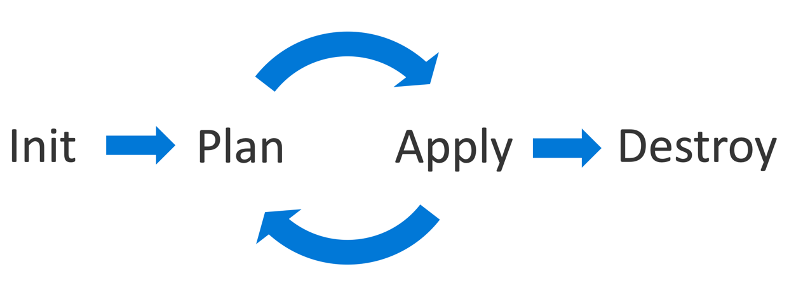
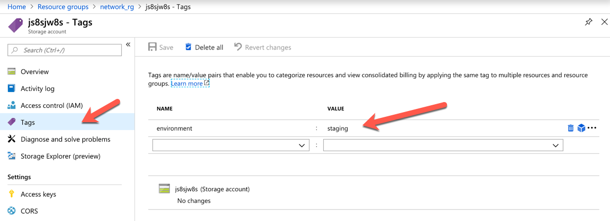

# Introduction to Terraform

## Overview

Let us start with a quick definition from Wikipedia:

> Terraform is an infrastructure as code software by HashiCorp. It allows users to define a datacenter infrastructure in a high-level configuration language, from which it can create an execution plan to build the infrastructure [...]. [Wikipedia](https://en.wikipedia.org/wiki/Terraform_(software))

Building up the infrastructure with Terraform can happen in many environments. One of them is Azure. In this lab you are going to explore the Terraform provider for Azure.

## Objectives

- Understand the Terraform Loop
- Initialize Terraform with the [Azure Provider](https://www.terraform.io/docs/providers/azurerm/)
- Create simple Azure Terraform deployments
- Explore a more complex example

## Preparation

This lab assumes that you have a resource group assigned to you. If not, please create a resource group before you start with the exercise.

Make use of the [Terraform Azure Provider Documentation](https://www.terraform.io/docs/providers/azurerm/index.html) to solve the challenges.

You can access Terraform directly from the [Azure Cloud Shell](https://shell.azure.com). There is no need to install local tooling in this lab.

## Exercise 1: Getting familiar with the Terraform Loop

### Task 1: Overview and Configuration

In the first exercise, you will learn how to run the basic Terraform loop:



* `init` - Init. Initialize the (local) Terraform environment. Usually executed only once per session.
* `plan` - Plan. Compare the Terraform state with the as-is state in the cloud, build and display an execution plan. This does not change change the deployment (read-only).
* `apply` - Apply the plan from the plan phase. This potentially changes the deployment (read and write).
* `destroy` - Destroy all resources that are governed by this specific terraform environment.

Go to the Azure Cloud Shell and issue the following commands to create a directory that will contain our Terraform configuration:

```sh
mkdir ~/tf-exercise-1
cd ~/tf-exercise-1
```

Now, we add an actual configuration that will create an Azure Storage Account via Terraform in your assigned resource group. Therefore create a new file called `main.tf` and open it in VS Code Light:

```sh
code main.tf
```

Copy the following snippet into the `main.tf` file and replace the parameter `resource_group_name` with your assigned resource group. The parameter `name` should be replaced with a unique name for your storage account:

```hcl
resource "azurerm_storage_account" "sa" {
  name                     = "<TODO>"
  resource_group_name      = "<TODO>"
  location                 = "westeurope"
  account_replication_type = "LRS"
  account_tier             = "Standard"
  tags {
    environment = "staging"
  }
}
```

Make sure to save your changes (e.g. CTRL-S) in the file! Use the console to issue the following terraform command:

```sh
terraform init
```

You should see output similar to:

```sh
Initializing provider plugins...
- Checking for available provider plugins on https://releases.hashicorp.com...
- Downloading plugin for provider "azurerm" (1.21.0)...

The following providers do not have any version constraints in configuration,
so the latest version was installed.
[...]
```

What just happened? We used the `terraform` tool which is a single binary in our environment and issued the initialization process. During the initialization process, Terraform scans the current directory for Terraform configuration files (`*.tf`) and downloads the recognized plugins that are required to execute the configuration. As we used a resource of the type `azurerm_storage_account`, Terraform knows that it needs the Azure provider.

Issue the following command in the shell:

```sh
ls -lah
```

Output should be as follows:

```sh
drwxr-xr-x  3 john john 4.0K Jan 23 20:58 .
drwxr-xr-x 11 john john 4.0K Jan 23 20:51 ..
-rw-r--r--  1 john john  209 Jan 23 20:56 main.tf
drwxr-xr-x  3 john john 4.0K Jan 23 20:58 .terraform
```

Interesting! There is a new `.terraform` directory. This is where Terraform downloaded the Azure plugin. If you are curious, explore it!

### Task 2: Creating the Storage Account

Let us actually create the storage account. We could go fast forward and immediately issue the `apply` command. But Terraform has the advantage of actually reviewing the changes that will occur during the deployment process, before you issue the apply command and capture the deployment plan.

Run this command:

```sh
terraform plan -out tfplan
```

You should now see that Terraform plans to create a single storage account according to your parameters. It also hints that you should run the following command next to perform the actual deployment:

```sh
terraform apply "tfplan"
```

You can safely do this now. The `tfplan` is just a binary file format from Terraform that is used to express the execution plan that should be ran when an apply command is issued. The advantage of an execution plan file is that it makes sure that only reviewed changes from the `plan` phase are incorporated during the `apply` phase and nothing else. If any teammate would interfere with another operation in between, Terraform would be able to detect it and would force you into a new `plan` phase.

True to the motto "seeing is believing", you can now go to the Azure Portal UI. You should see a new storage account in your assigned resource group.

### Task 3: Understanding State and Detecting Configuration Drift

Let us again investigate the changes in the local directory:

```sh
ls -lah
```

You should see new files. One of them is `terraform.tfstate`. As the suffix name suggests, this file stores state. Open it and investigate.

```sh
less terraform.tfstate
```

This file contains a version of the state that Terraform captured during the last deployment. One of the most interesting features of Terraform is the ability to detect configuration drift via that state information.

Go to the Azure Portal and change the tag name of the deployed storage account via the portal's user interface from `staging` to `development`:



Now run the following command:

```sh
terraform plan -out tfplan
```

The outlook should look like:

```sh
[...]
Terraform will perform the following actions:

  ~ azurerm_storage_account.sa
      tags.environment: "production" => "staging"

[...]
Plan: 0 to add, 1 to change, 0 to destroy.
[...]
```

As you see, Terraform will report that somebody (in this lucky case you) fumbled around at the resource, ignoring guidelines and best practices. Manually resource configuration via a user interface is not ideal as it is not easy to follow and it does not capture any history or progression. A version-controlled Terraform config file, however, comes to the rescue and allows you to get rid off the manual change immediately:

```sh
terraform apply "tfplan"
```

One note to state: State with a local file is for sure not the ideal approach to work in a team. If you are running a team setup with Terraform, you can use Azure Storage Accounts and many other services to store the state in a sharable and secure fashion.

### Task 4: Destroy

All the resources that you have built and configured via Terraform can also be torn down by Terraform. Issue the following command and acknowledge the confirmation check:

```sh
terraform destroy
```

As previously, seeing is believing. Use the Azure Portal to look at the actual resource group. Your storage account is gone.

### (Optional) Task 5: More complex example

To see a more complex example, you might want to clone [this repository from github](https://github.com/cadullms/tf-samples) and explore the [explanation](https://github.com/cadullms/tf-samples/README.md) and try applying the [vm-cloud-init](https://github.com/cadullms/tf-samples/tree/master/vm-cloud-init) sample that creates an arbitrary number of Linux VMs at once.

> If you try to apply this, please use only one VM at max! You will as well have to take the `resource "azurerm_resource_group" "myterraformgroup"` out of `main.tf` and instead reference your resource group!