# Introduction to Automated Testing with Azure DevOps

## Overview

In this lab you are going to explore Azure DevOps with a focus on automated testing. You will learn about the differences of the build and release pipelines and get to know where which type of automated test is appropriate.

The baseline of this lab is a pre-built solution called [Parts Unlimited](https://github.com/Microsoft/PartsUnlimited). Based on this solution, an Azure DevOps Environment has been prepared for you via the [Azure DevOps Demo Generator](https://azuredevopsdemogenerator.azurewebsites.net/).

The Azure DevOps environment contains all the source code, pre-configured build and pre-configured release pipelines.

## Prerequisites

* A modern browser. For example, Edge, Chrome/Chromium or Firefox.
* Visual Studio Code

Depending on your lab environment, a pre-configured Virtual Machine might be available for you.

## Preparation - Your Work Environment

Follow the guidelines from the instructor to either use a provided VM or your local environment with the outlined prerequisites.

1. Open Visual Studio Code.
 
    

1. Install the *C#* extension.

    

1. Install the *.NET Core Test Explorer* extension.

    

1. Clone the repository from the Azure DevOps project. For that, go to [Azure DevOps Start Page](https://azure.microsoft.com/en-us/services/devops/) and sign in with your provided username and password.
1. You should see your assigned pre-configured project, e.g. 'Lab1User030'.

    

1. Go to *Repos* and select *Clone*. Copy the Git Repo URL.

    

1. In Visual Studio Code, open the Command Palette (View -> Command Palette or `CTRL-Shift-P`) and type `git clone`. Paste the copied git repo URL from Azure DevOps.

    

1. Select a destination location on the local hard drive (or just use the default in the user's home dir).

    

1. Now the authentication dialog for the Git Repo appears. Continue by entering your provided credentials (same as for Azure Portal and Azure DevOps).

1. You will be prompted by VS Code whether you want to immediately open the cloned repo. Select *yes*. You should now see the full repo.

    

1. In order to do successful commits later, you need to make sure that the git environment is configured correctly. If you are working on a fresh lab VM, open a command prompt (`Windows Key + R`, type `cmd` and press `Enter`). Issue the following two commands, replacing with your actual identities:

    ```sh
    git config --global user.name "Lab1User030"
    git config --global user.email "Lab1User030@contoso.com"
    ```

    

That is it for the moment. You now have a functional local environment.

## Exercise 1.1: Update the Pre-Configured Azure DevOps Project

In its current state, the pipeline does not yet know the specific configuration details needed to actually deploy to your Azure subsription. We will fix this now.

1. Return to your Azure DevOps project (in case you are lost, go to the [Azure DevOps Start Page](https://azure.microsoft.com/en-us/services/devops/) again and sign in with your provided username and password).

1. You should see your assigned pre-configured project, e.g. *Lab1User030*.

    

1. In the menu on the left, select *Pipelines*, *Releases*.

    

1. Click *Edit* for the existing release plan.

    

1. First we need to change a pipeline-wide variable that defines the resource group target for the deployment. Open the variables tab.

    

1. Change `ResourceGroupName` to e.g. `CONTOSO_RG_LAB_030` (whatever resource group was assigned to you).

1. There are additional settings needed for each of the three stages ('Dev', 'QA' and 'Production'), which is why all three are currently marked with a red exclamation mark. We will start from left to right and fix all of them.

    

1. First select the the *Dev* stage in the *Tasks* tab.

    

1. Click on the first step *Azure Deployment* and modify the *Azure Subscription* to use the first available *Service Connection*. Do **not** select a subscription if you have been provided with a dedicated resource group.

    

1. Update the location to `West Europe`.

    

1. Now switch to the second step *Azure App Service Deploy*.

    

1. Also fix the *Azure Subscription* setting as before and enter `Dev` in the slot setting.

    

    > **Beware!** We are using [slots](https://docs.microsoft.com/en-us/azure/app-service/deploy-staging-slots) as actual stages in this lab for reasons of simplicity. For **real** pipelines this is **not recommended** as discussed [here](https://docs.microsoft.com/en-us/azure/architecture/reference-architectures/app-service-web-app/basic-web-app#deployment) and [here](https://devblogs.microsoft.com/devops/considerations-on-using-deployment-slots-in-your-devops-pipeline/). Instead, you would be using one App Service Plan per stage and use a "Staging" or "Warmup" slot per stage. This way, stages are isolated but structurally equivalent as they should always be. 

1. Switch to the *QA* task now. Apply exactly the same config as before, except for the slot name. Here you will enter `Staging`.

    
    

1. Finally, head over to the *Production* task. Repeat the config updates from before. Note, this time you don't have to enter a slot setting as the default slot is the production slot.

1. Save all your changes. If the Save button is still grayed out, you missed an error and need to fix it.

    

1. In the appearing save dialog popup you can enter any descriptive message.

    

## Exercise 1.2: Full Deployment

After finishing the boring preparation work, let's do our first end-to-end deployment!

1. Switch to the *Build* pipeline. You will notice that no build has been running so far. The build pipeline is configured to run whenever a git check-in happens. As we never committed code so far... no builds!

    

1. Before actually doing code changes, let us run a build by manually scheduling one. Click on *Queue*.

    

1. Keep all the defaults and confirm.

    

1. You can follow the progress by selecting the scheduled build. After a short while the logs from the agent are streamed to your browser session:

    

1. When the build finishes, you should see a summary page, in which you can click  `Artifacts` at the top right to see the actual artifacts our build produced. In this case the artifact is called "drop" and contains the deployment package for our website.

1. The configured automation does not stop here! Actually, there is some continuous delivery magic configured that will trigger a *Release* pipeline for every successful build that happens in the *Build* pipeline. The *Release* pipeline will pick up the artifacts from the latest build and deploy it into the *Dev*, *QA* and *Production* environments. Actually, it will not only deploy our app - it even creates all the needed resources like a database and an app service from scratch (as explained in the previous CI/CD and IaC labs (click [here](./../../index.md) for an overview).

    In the menu on the left, select `Releases` (below `Pipelines`).

    

1. Click on the scheduled release (e.g. named "Release-1") and observe the pipeline update. You should see a deployment activity being executed.

    

1. Once everything ran successful you should see something like in the following picture.

    > **Note**: You do not need to wait for all stages to finish. You can go ahead with the next steps once `Dev` has successfully deployed. On the other hand, in case you are interested in details, you might as well open one of the environments and look at the logs streaming in.

    

1. Now head over to the Azure Portal. You will see the Azure resources in your resource group that were just created by the `Dev` stage of your pipeline.

    

1. Select the `Dev` slot of the deployed web app.

    

1. In the details, look for the assigned URL and navigate to it. Please note the little `-dev` suffix attached to the hostname. This is the differentiation between the *Slots* that you have configured previously.

    

1. You should now see our great *Parts Unlimited* Web Shop experience.

    

## Exercise 2: Unit Tests

Unit tests are part of every good build pipeline. In this exercise we will forcefully create a failing build via a failing unit test and correct it again. This will give you some idea about the guardrails that unit test bring to an automation pipeline.

1. Switch to Visual Studio Code. As preparation you should already have checked out the source code (cloned the git repository) of the Parts Unlimited solution. If not, please do so now.

1. Open the file `ProductSearchTests.cs` and modify a test case as depicted in the screenshot to trigger a failing unit test:

    

    > The test verifies that the search returns at least one product matching the search term "proDuct 1" and we purposefully change it to expect "Product BUG", which breaks the test.

1. Commit your changes.

    

1. Push the changes to your central git repo in Azure DevOps. To do so, press the *sync button* in the status bar.

    

1. Go to your browser and open the *Build* pipeline. You should now see *Continuous Integration* in action. That is, the push to the central repo that you just committed, triggered an automatic build.

    

1. As expected, the build won't succeed this time as the modified unit test fails. Review the status in the build summary.

    

1. Also observe that no deployment has been performed - which is actually the whole reason behind our automated test and failure detection: If something breaks we do not want it to propagate to the next stage.

    

1. Now put everything back to normal by modifying the test code again (back to the good state), commit and push. Here you'll observe the CD pipeline kicking in again, because now all tests should be green.

    

## Exercise 3: Release Pipeline and UI Tests

### Task 1: Run a UI Test Locally

First, let's make sure that you can actually work with your environment.

1. Open a new Visual Studio Code instance/window.

1. Git clone `https://github.com/olohmann/selenium-dotnet-core-hello-world.git`.

1. Open the repository when prompted.

1. Run the *build* task.

    

1. Open the Test Explorer tab. Navigate down to the actual test and press the play button.

    

1. A Chrome instance should be opened and text should be entered automatically as stated in the UI test.

1. Later on, in our release pipeline, the tests will need to run without a desktop. There will thus be no way of launching actual browser windows. Instead, we need to run the test in "headless" mode, meaning exactly this: without a UI. Fortunately, the Chrome browser has built-in support for running headless. Let's see how that works.

    In the test code, locate this line and uncomment it:

    ```c#
    //options.AddArgument("--headless");
    ```

1. Run the test again. You will be seeing test results, but no browser comes up - *chromedriver.exe* and *chrome.exe* simply run in the background, with all the browser engine and scripting in action just as if the browser window was visible. This allows for running very realistic tests without the hassle of having to provide an actual interactive desktop.

If everything worked so far, you are good to go to the next task.

### Task 2: Integrate End-To-End (E2E) Tests into the Release Pipeline

For our pipeline we will need tests that interact with our PartsUnlimited websites by automating a browser, thereby executing the full system end-to-end from the UI down to the database. This kind of tests typically only sees the UI end of the system though (everything behind that is a black box to them), which is why we often call them "UI Tests" synonymously.

We could create such tests from scratch, that would directly work with the elements in the website, just like we did in the previous task. However, such tests become unmaintainable quickly, which is why we would like to use the [Page Object Pattern](https://www.martinfowler.com/bliki/PageObject.html). Creating the code for such Page Objects is not complicated but would take a while doing it from scratch, thus we import an existing example from a github repository into our Azure DevOps project.

1. Go to the Azure DevOps website and select *Repositories*. Hover over the pulldown menu in the top bar to open the Git repository menu. Select *Import repository*.

    

1. In the import dialog, use the Github Repo `https://github.com/olohmann/parts-unlimited-web-driver-tests.git` as the import target and click *Import*.
    

1. In order to be able to work on the UI tests later in this lab, clone the newly imported repository to your local (or lab VM) environment. Same as before, use VS Code and its `git clone` command via the Command Palette.

1. We will set up a build pipeline for the UI tests. Fortnately, the build is also already preconfigured in the repository we just cloned (in [this yaml file](https://github.com/olohmann/parts-unlimited-web-driver-tests/blob/master/build.yaml)). We will use the output of this build as the artifact that feeds into the release pipeline we already used before.

    First, navigate to the *Builds* tab and select *New*.

    

1. Follow the outlined flow from the screenshots:

    

    

    

    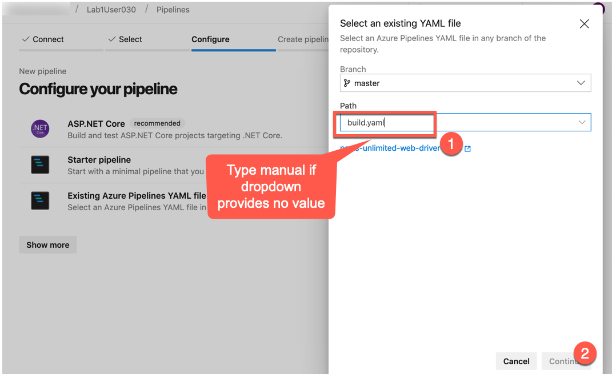

    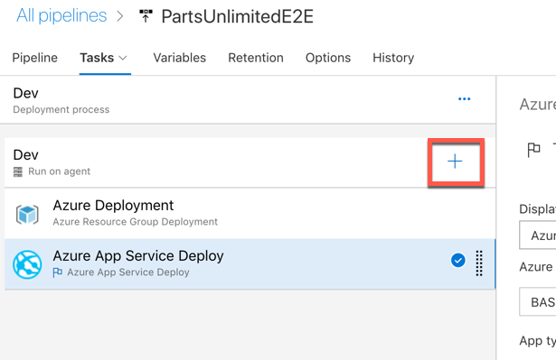

1. By executing *Run* in the last step, a build has already been triggered

    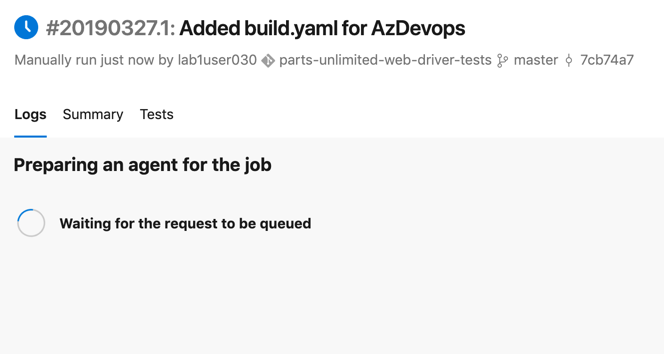

1. When the build has finished, quickly analyze if the build process was a success or not.

    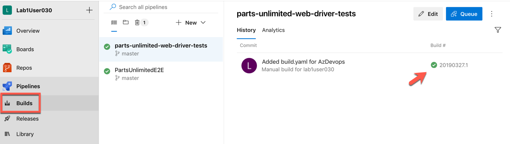

1. Head over to the *Release* pipeline and edit it.

    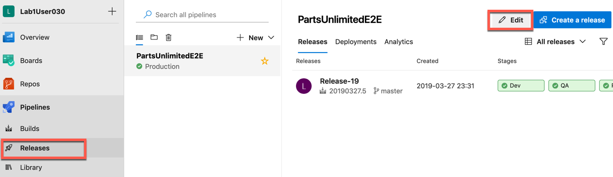

1. Add a new artifact.

    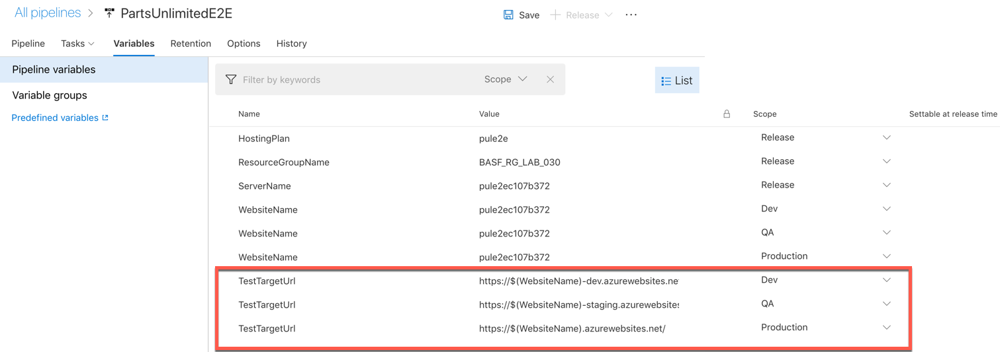

1. Let the new artifact have its origin in the new web-driver build.

    

1. Now open the task list for the Dev environment.
    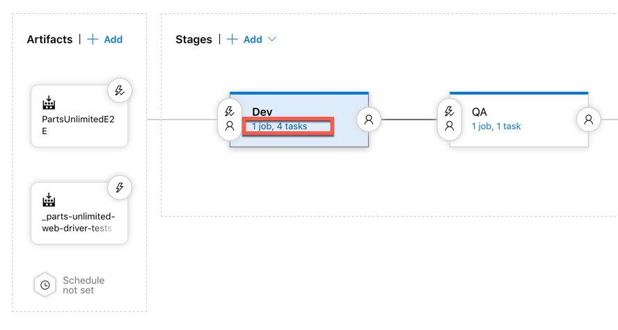

1. As our UI tests are .Net Core based, we need to change the build host to `Hosted 2017`.
    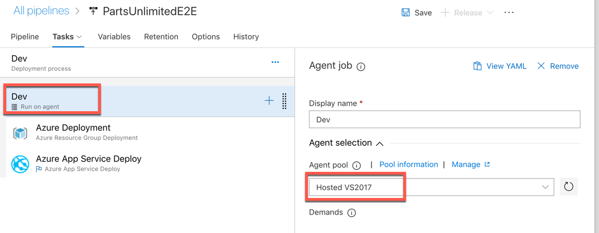

1. Next, add a new *.NET Core* step. It needs to be configured like this (also below a yaml configuration is listed to allow copy pasting into the textboxes)

    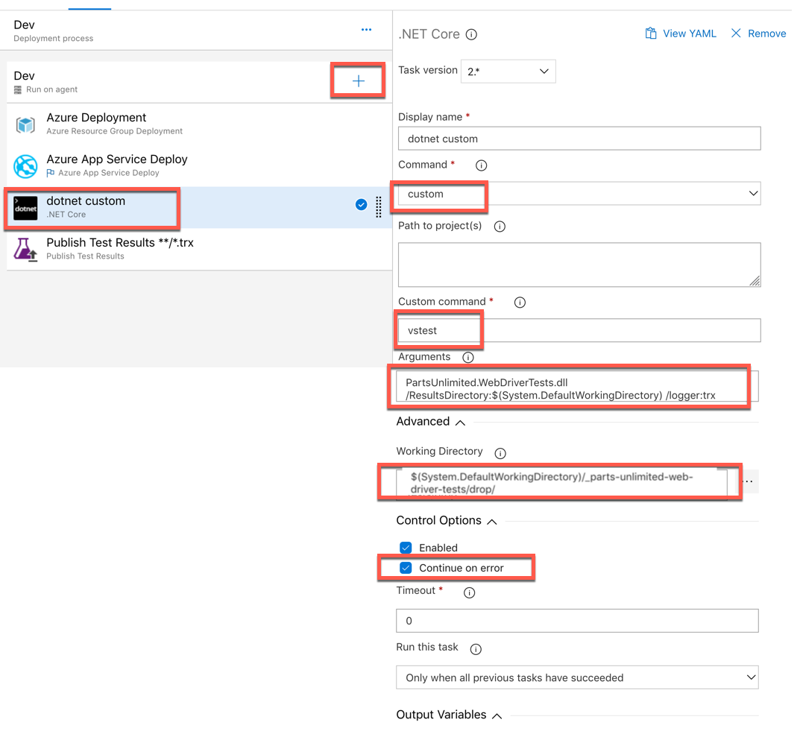

   ```yaml
   steps:
    - task: DotNetCoreCLI@2
    displayName: 'dotnet custom'
    inputs:
        command: custom
        custom: vstest
        arguments: 'PartsUnlimited.WebDriverTests.dll /ResultsDirectory:$(System.DefaultWorkingDirectory) /logger:trx'
        workingDirectory: '$(System.DefaultWorkingDirectory)/_parts-unlimited-web-driver-tests/drop'
    continueOnError: true
   ```

1. Finally, add a *Publish Test Results* step.

    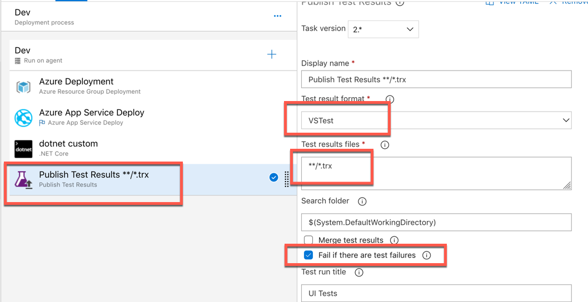

   ```yaml
   steps:
    - task: PublishTestResults@2
    displayName: 'Publish Test Results **/*.trx'
    inputs:
        testResultsFormat: VSTest
        testResultsFiles: '**/*.trx'
        failTaskOnFailedTests: true
        testRunTitle: 'UI Tests'
    ```

1. Now change the build host in the other environments (QA, Dev). Don't include the UI tests yet, this is if time allows, something that can be done later.

    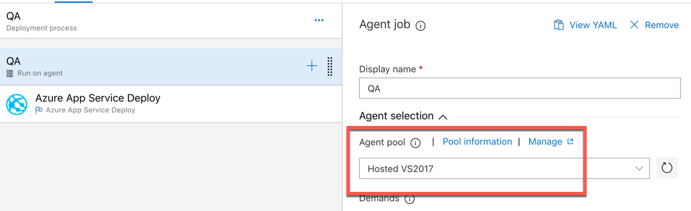

1. Before we are done, we need to provide two environment variables:

    * For the UI tests to be able to actually identify the target of the tests (obviously, the dev stage will listen at another url than prod or QA), add a `TestTargetUrl` variable per each stage.
    * Additionally, the tests are written in a way that allows us to specify which browser (web driver) should be used. The variable for this is `TestWebDriverName` and it should have the value `ChromeHeadless`, to make sure that the tests run without trying to interact with a UI (which we do not have in the pipeline anyways). That variable should be set for the complete release pipeline.

    > Azure Pipelines automatically injects pipeline and stage variables into the steps at run-time as simple environment variables (see [the docs](https://docs.microsoft.com/en-us/azure/devops/pipelines/release/variables?view=azure-devops&tabs=batch#using-default-variables)). In case you are interested in how the tests pick up those settings, please see the code in class [WebDriverProvider](https://github.com/olohmann/parts-unlimited-web-driver-tests/blob/2ed06762e22a5df7cbb7b9098a56b77623f1d31f/TestApi/WebDriverProvider.cs#L23).

    This makes four variables in total, as depicted in the following screenshot.

    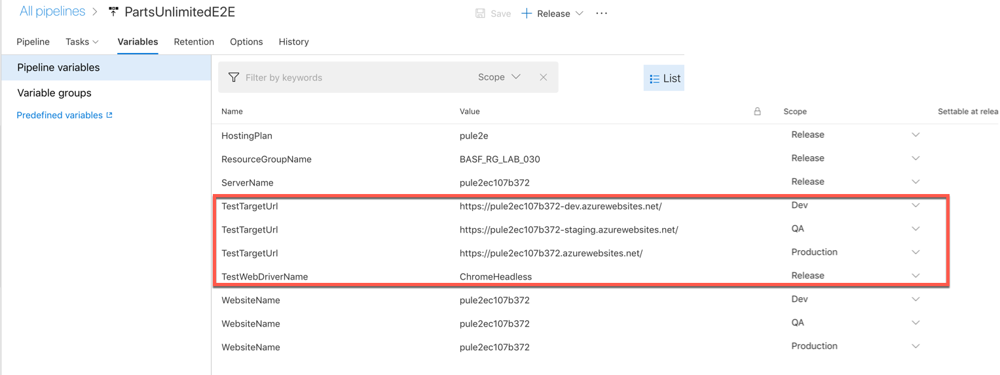

1. Save our work.

    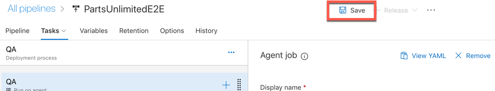

1. Run a deployment (by creating a new release).

    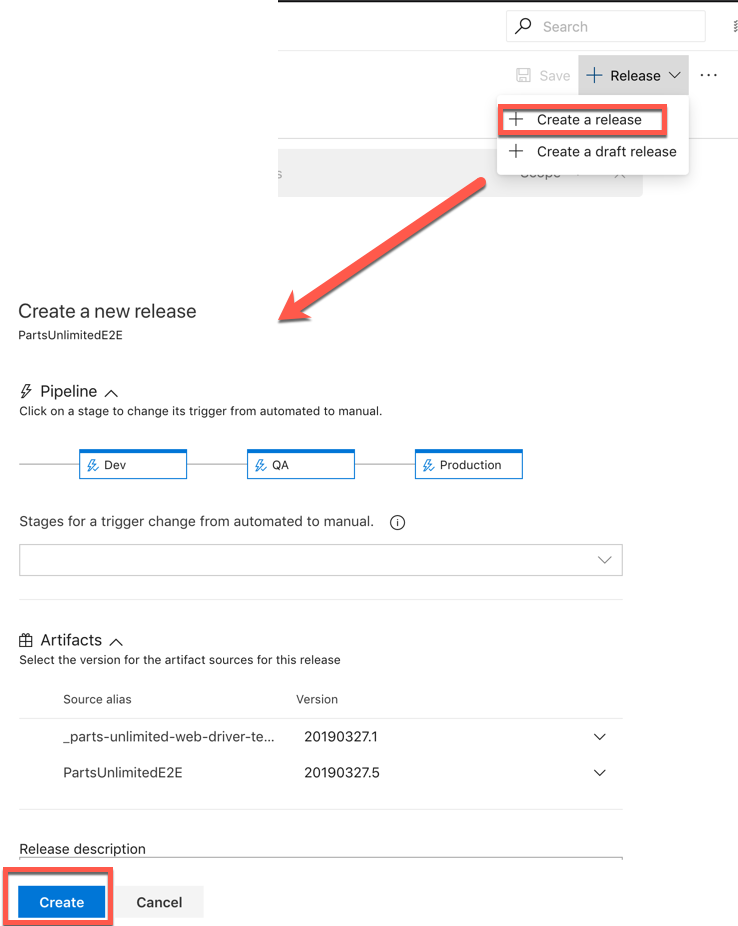

1. Examine the test results. They should look very cheerfully - 4/4 green!

    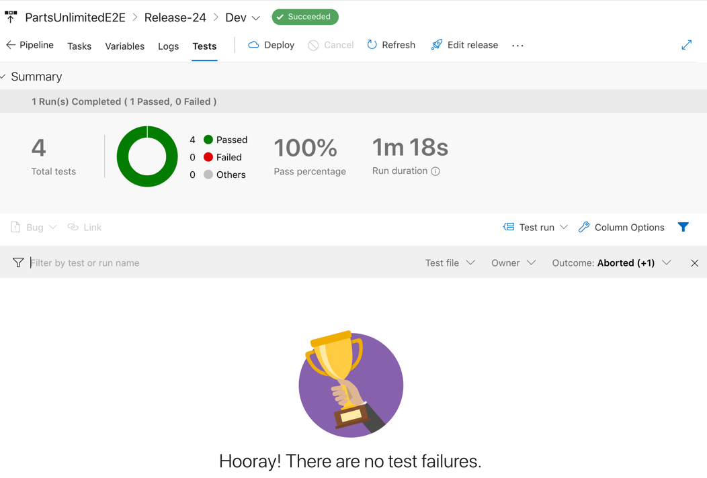

### Task 3: Extra Challenge: Create your own test with Page Objects

Now you have all the bits and pieces put together to start with something exploratory. Feel free to dig into the *Parts Unlimited* website and create an additional UI test, leveraging the and extending the *PageObject* infrastructure.