# Introduction to Automated Testing with Azure DevOps

## Overview

In this lab you are going to explore Azure DevOps with a focus on automated testing. You will learn about the differences of the build and release pipelines and get to know where which type of automated test is appropriate.

The baseline of this lab is a pre-built solution called [Parts Unlimited](https://github.com/Microsoft/PartsUnlimited). Based on this solution, an Azure DevOps Environment has been prepared for you via the [Azure DevOps Demo Generator](https://azuredevopsdemogenerator.azurewebsites.net/).

The Azure DevOps environment contains all the source code, pre-configured build and pre-configured release pipelines.

## Prerequisites

* A modern browser. For example, Edge, Chrome/Chromium or Firefox.
* Visual Studio Code

Depending on your lab environment, a pre-configured Virtual Machine might be available for you.

## Preparation - Your Work Environment

Follow the guidelines from the instructor to either use a provided VM or your local environment with the outlined prerequisites.

1. Open Visual Studio Code.
    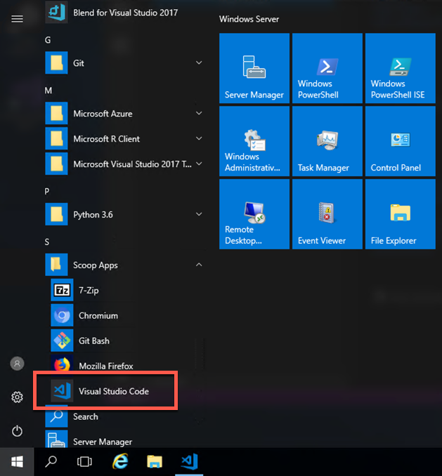

1. Install the *C#* extension.
    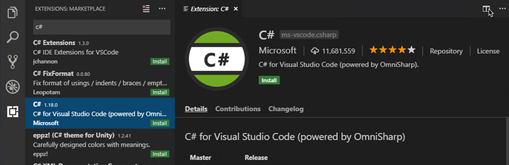

1. Install the *.NET Core Test Explorer* extension.
    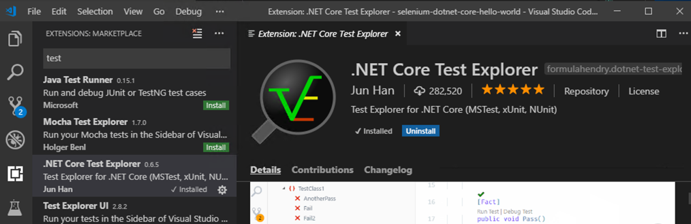

1. Clone the repository from the Azure DevOps project. For that, go to [Azure DevOps Start Page](https://azure.microsoft.com/en-us/services/devops/) and sign in with your provided username and password.
1. You should see your assigned pre-configured project, e.g. 'Lab1User030'.
    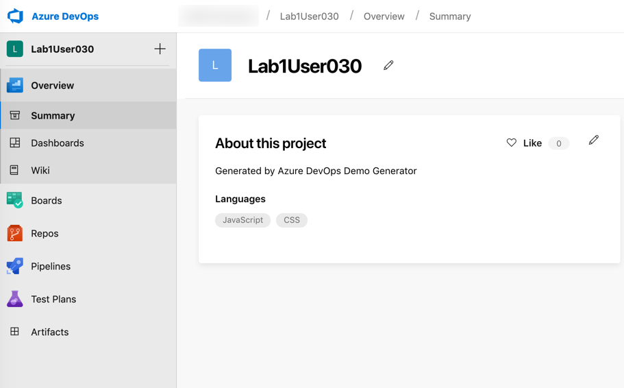
1. Go to *Repos* and select *Clone*. Copy the Git Repo URL.
    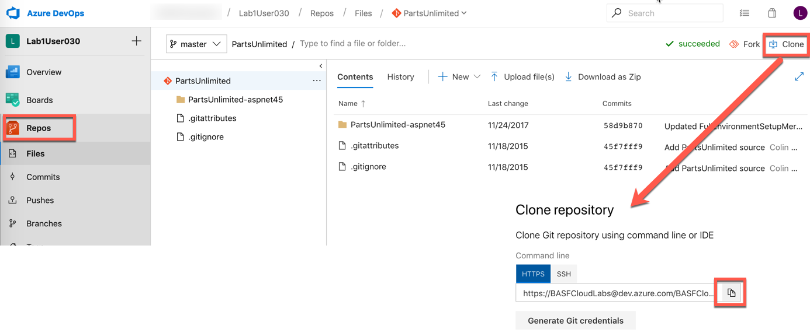
1. In Visual Studio Code, open the Command Palette (View -> Command Palette or `CTRL-Shift-P`) and type `git clone`. Paste the copied git repo URL from Azure DevOps.
    

1. Select a destination location on the local hard drive (or just use the default in the user's home dir).
    

1. Now the authentication dialog for the Git Repo appears. Continue by entering your provided credentials (same as for Azure Portal and Azure DevOps).
    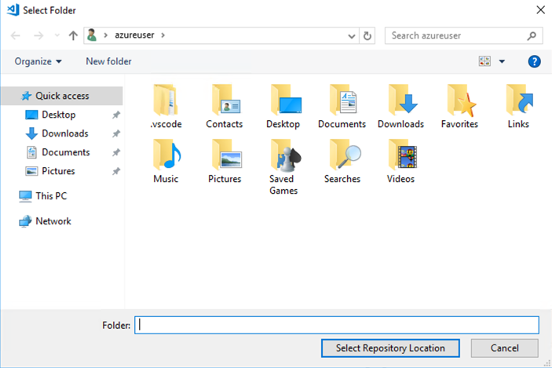

1. You will be prompted by VS Code whether you want to immediately open the cloned repo. Select *yes*. You should now see the full repo.
    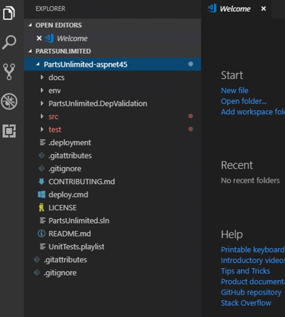

1. In order to do successful commits later, you need to make sure that the git environment is configured correctly. If you are working on a fresh lab VM, open a command prompt (`Windows Key + R`, type `cmd` and press `Enter`). Issue the following two commands, replacing with your actual identities:

    ```sh
    git config --global user.name "Lab1User030"
    git config --global user.email "Lab1User030@contoso.com"
    ```

    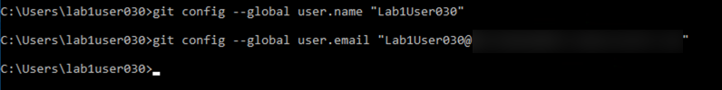

That is it for the moment. You now have a functional local environment.

## Preparation - Azure DevOps Pipelines

In its current state, the pipeline does not yet know the specific configuration details needed to actually deploy to your Azure subsription. We will fix this now.

1. Go to the [Azure DevOps Start Page](https://azure.microsoft.com/en-us/services/devops/) and sign in with your provided username and password.

1. You should see your assigned pre-configured project, e.g. 'Lab1User030'.
    

1. Select 'Releases' in the 'Pipelines' tab.

    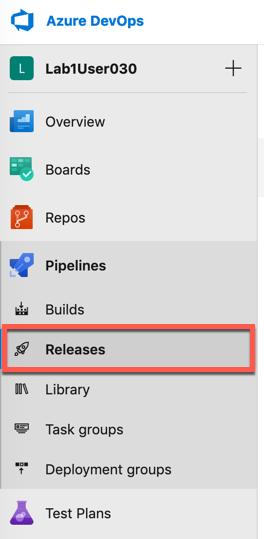

1. Click *Edit* for the existing release plan.

    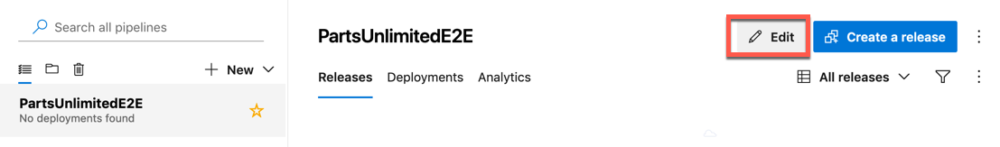

1. First we need to change a pipeline-wide variable that defines the resource group target for the deployment. Open the variables tab.

    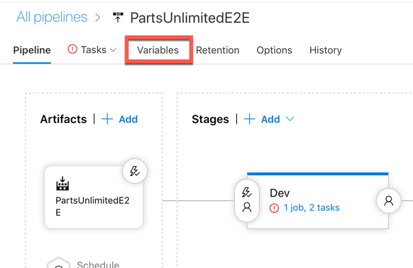

1. Change `ResourceGroupName` to e.g. `CONTOSO_RG_LAB_030` (whatever resource group was assigned to you).

1. There are additional settings needed for each of the three stages ('Dev', 'QA' and 'Production'), which is why all three are currently marked with a red explanation mark. Start from left to right with the 'Dev' environment and perform the following steps for each of them.

    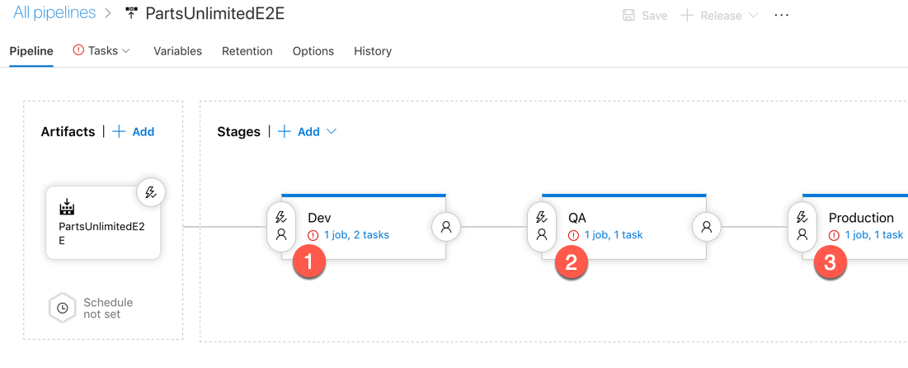

1. Now select the the `Dev` stage in the `Tasks` panel.

    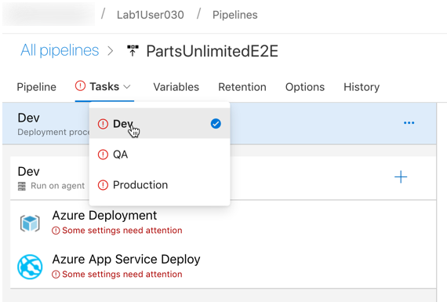

1. Modify the `Azure Subscription` to use the first available `Service Connection`. Do **not** select the subscription when you were assigned a dedicated resource group.
    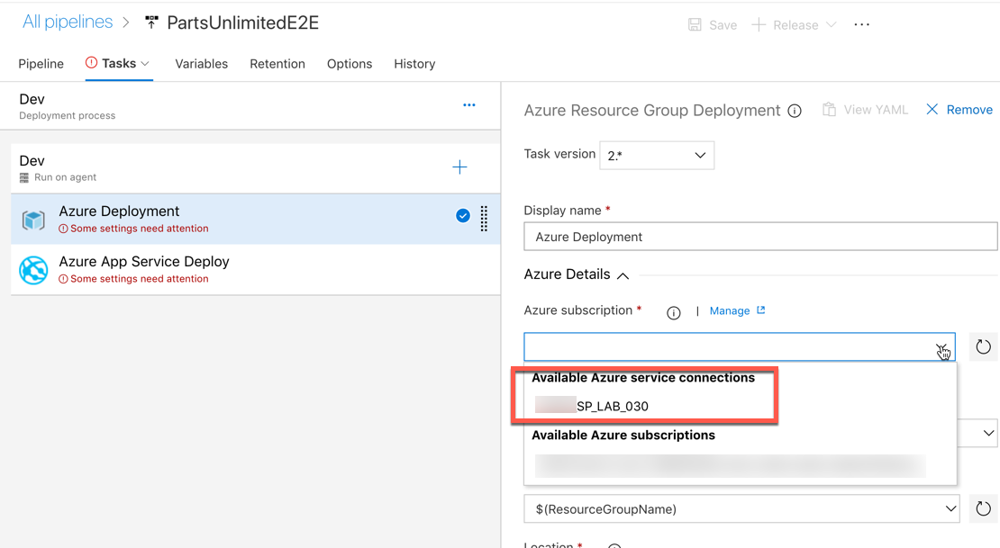

1. Update the location to, e.g. `West Europe` (stick to this for all environments).
    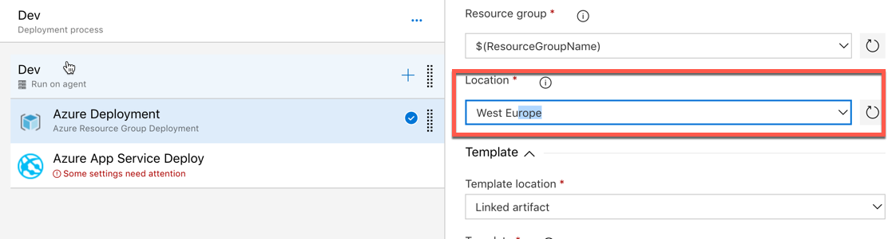

1. Now switch to the second step `Azure App Service Deploy`.
    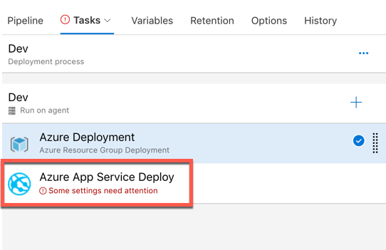

1. Also fix the `Azure Subscription` setting as before and enter `Dev` in the slot setting.
    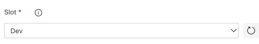

1. Switch to the `QA` task now. Apply exactly the same config as before, except for the slot setting. Here you will enter `Staging`.
    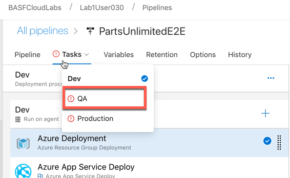
    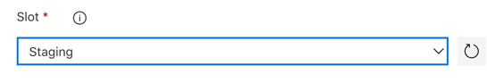

1. Finally, head over to the `Production` task. Repeat the config updates from before. Note, this time you don't have to enter a slot setting as the default slot is the production slot. Save all your changes. If the Save button is still grayed out, you missed an error and need to fix it. In the popup that appears you can enter any descriptive message.
    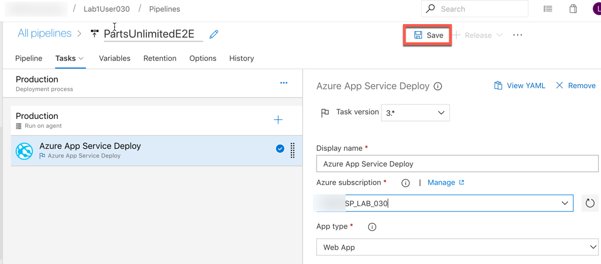
    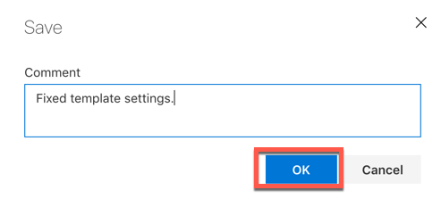

## Exercise 1: Full Deployment Run-Through

After finishing the boring preparation work, let's do our first end-to-end deployment!

1. Switch to the `Build` pipeline. You will notice that no build has been running so far. The build pipeline is configured to run whenever a git check-in happens. As we never committed code so far... no builds!
    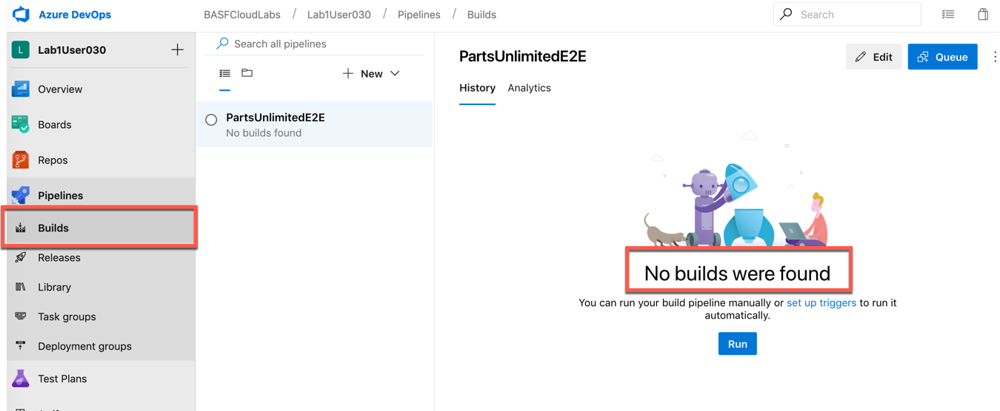

1. Before actually doing code changes, let us run a build by manually scheduling one. Click on `Queue`.
    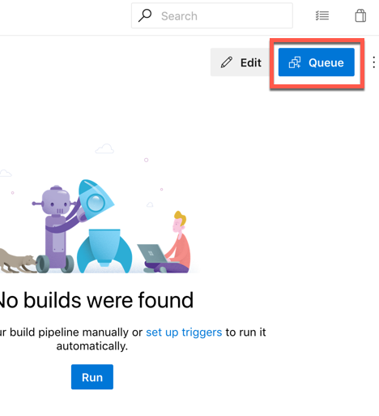

1. Keep all the defaults and confirm.
    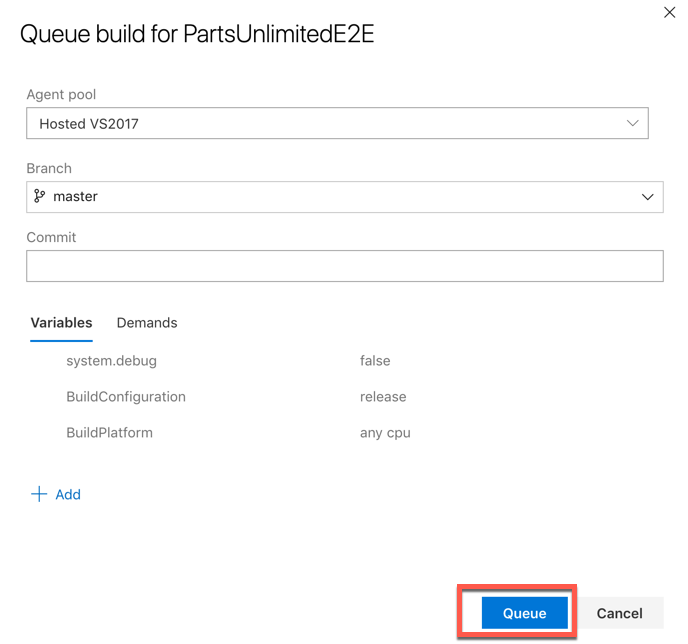

1. You can follow the progress by selecting the scheduled build. After a short while the logs from the agent are streamed to your browser session:
    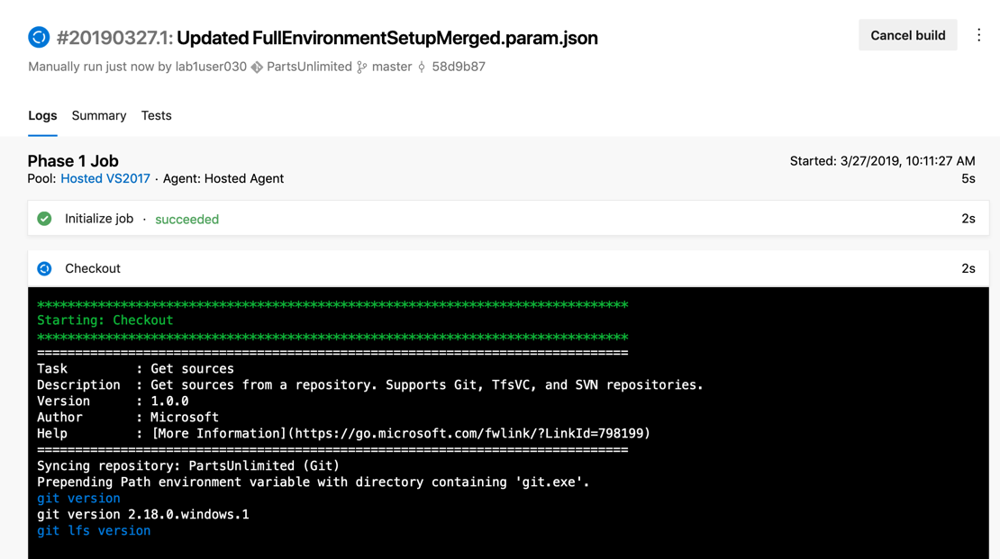

1. The configured automation does not stop here! Actually, there is some continuous delivery magic configured here. It will trigger the *Release* pipeline for every successful build that happens in the *Build* pipeline. In the *Release* pipeline, it will deploy the latest build into the *Dev*, *QA* and *Production* environment.
    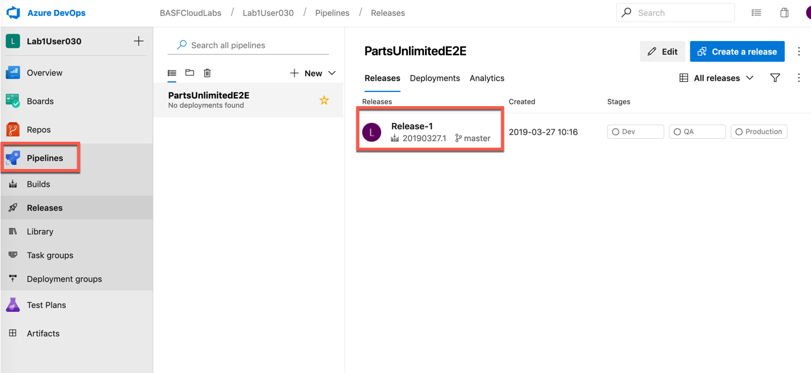

1. Click on the scheduled release and observe the pipeline update. You should see a deployment activity being executed.
    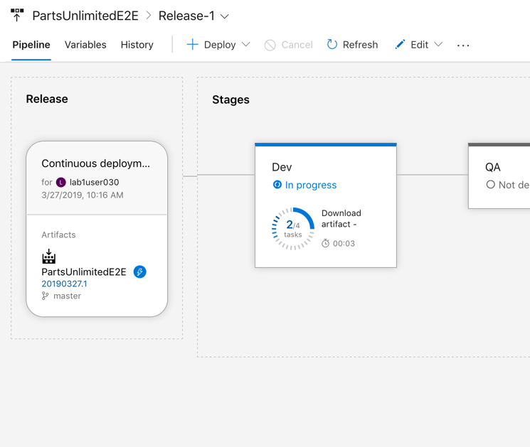

1. Once everything ran successful you should see the following picture.
    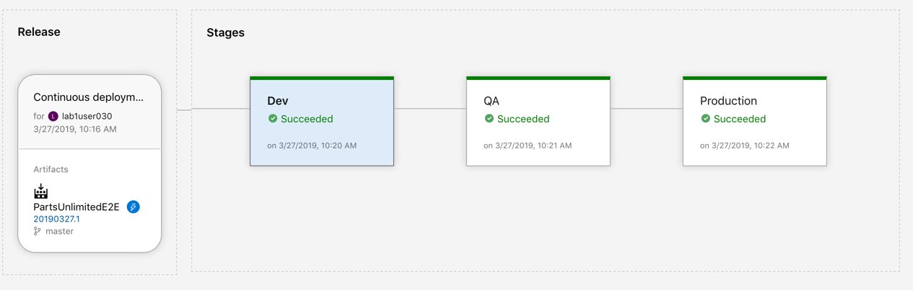

1. Now head over to the Azure Portal. You will see the Azure resources in your resource group.
    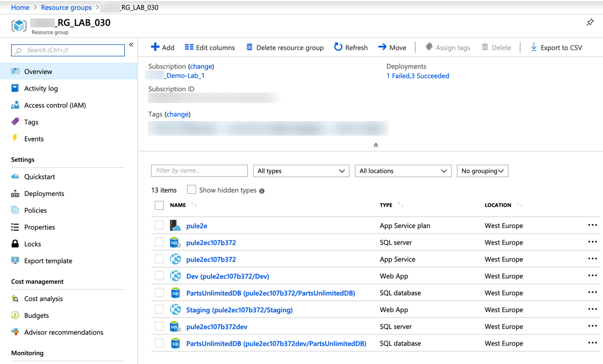

1. Select the `Dev` slot of the deployed web app.
    

1. In the details, look for the assigned URL and navigate to it. Please note the little `-dev` suffix attached to the hostname. This is the differentiation between the *Slots* that you have configured previously.
    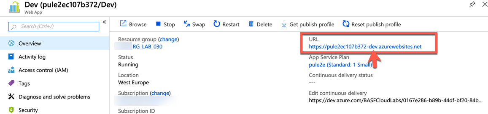

1. You should now see our great *Parts Unlimited* Web Shop experience.
    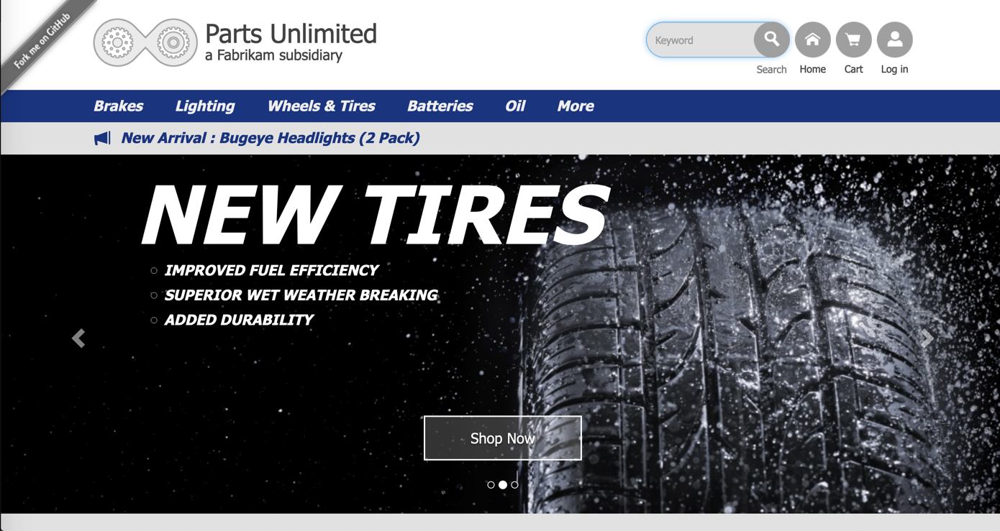

## Exercise 2: Unit Tests

Unit tests are part of every good build pipeline. In this exercise we will forcefully create a failing build via a failing unit test and correct it again. This will give you some idea about the guardrails that unit test bring to an automation pipeline.

1. Switch to Visual Studio Code. As preparation you should already have checked out the source code of the Parts Unlimited solution. If not, please do so now.

1. Open the file `ProductSearchTests.cs` and modify a test case as depicted in the screenshot to trigger a failing unit test:

    

1. Commit your changes.

    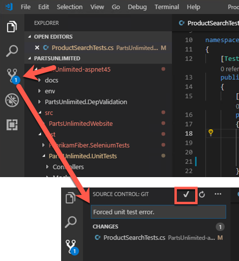

1. Push the changes to your central git repo in Azure DevOps. To do so, press the *sync button* in the status bar.

    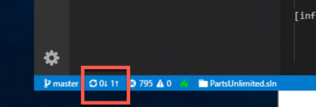

1. Go to your browser and open the *Build* pipeline. You should now see *Continuous Integration* in action. That is, the push to the central repo that you just committed, triggered an automatic build.

    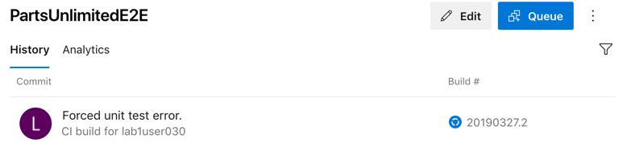

1. As expected, the build won't succeed this time as the modified unit test fails. Review the status in the build summary.
    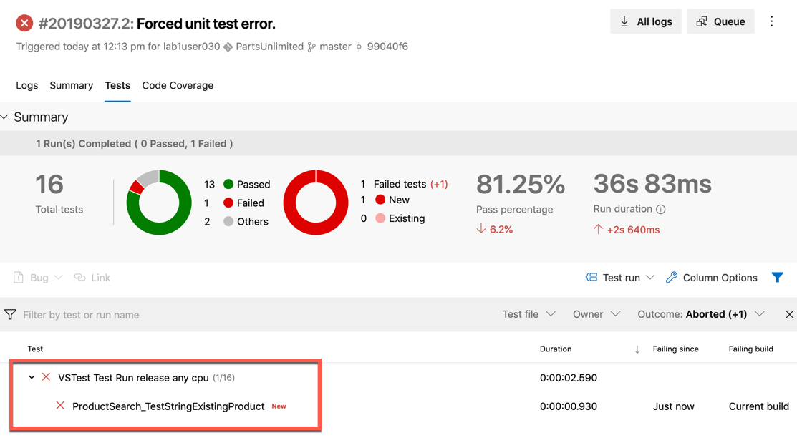

1. Also observe, that no deployment has been performed - which is actually the whole reason behind our automated test and failure detection.
    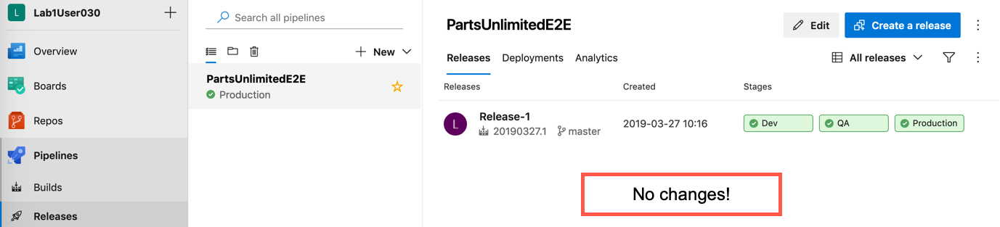

1. Now put everything back to normal by modifying the test code again (back to the good state), commit and push. Here you'll observe the CD pipeline kicking in again.

    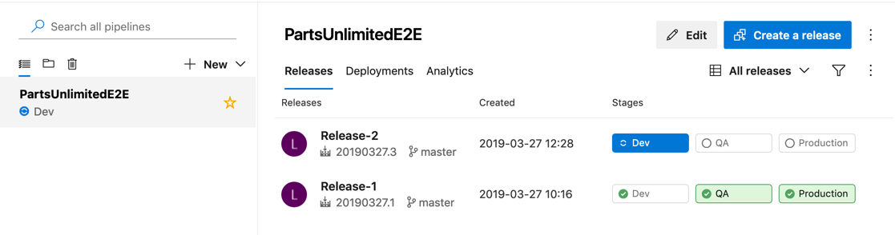

## Exercise 3: Release Pipeline and UI Tests

### Task 1: Run a UI Test Locally

First, let's make sure that you can actually work with your environment.

1. Open a new Visual Studio Code instance/window.

1. Git clone `https://github.com/olohmann/selenium-dotnet-core-hello-world.git`.

1. Open the repository when prompted.

1. Run the *build* task.
    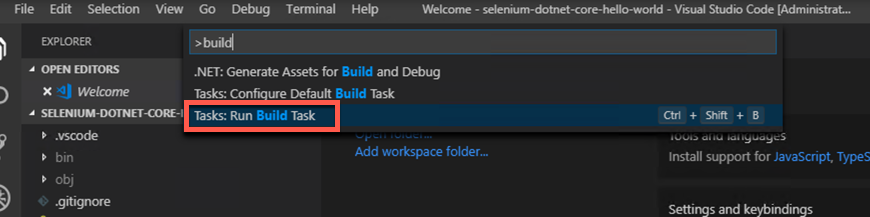

1. Open the Test Explorer tab. Navigate down to the actual test and press the play button.
    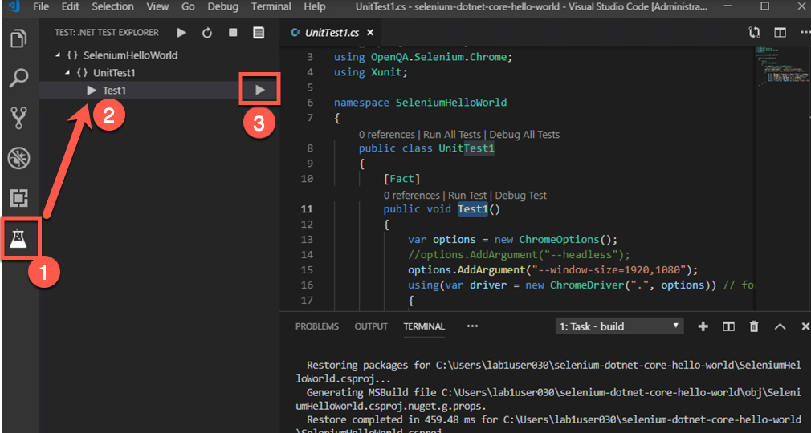

1. A Chrome instance should be opened and text should be entered automatically as stated in the UI test.

If everything worked so far, you are good to go to the next task.

### Task 2: Integrate UI Tests into the Release Pipeline

1. Go to the Azure DevOps website and select *Repositories*. Hover over the pulldown menu in the top bar, to open the Git repository menu. Select *Import repository*.
    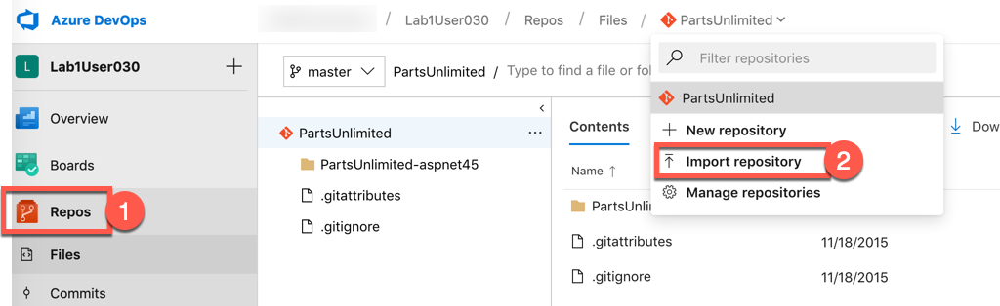

1. In the import dialog, use the Github Repo `https://github.com/olohmann/parts-unlimited-web-driver-tests.git` as the import target and click *Import*.
    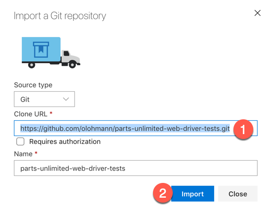

1. In order to be able to work on the UI tests later locally, clone the newly imported repository to your local (or lab VM) environment. Same as before, use VS Code and its `git clone` command via the Command Palette.
    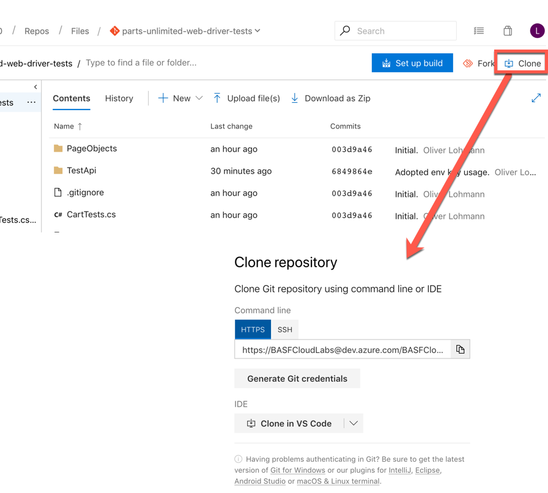

1. Next we will integrate the UI tests into the release pipeline. Select the *Release* pipeline and edit it.
    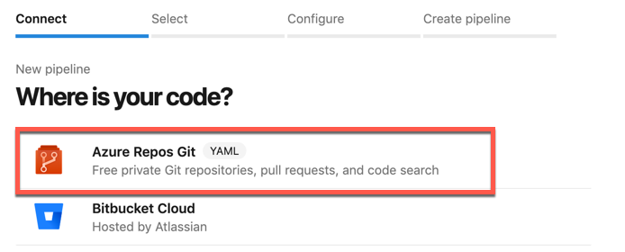

1. As we have stored our UI test code in a separate repository, the pipeline needs to be modified by adding a new artefact to it. Click the *Add+* button in the *Artefact* area.
    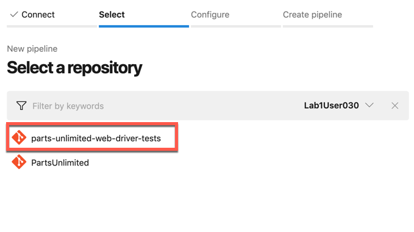

1. In the Artefact dialog, select the imported repository.
    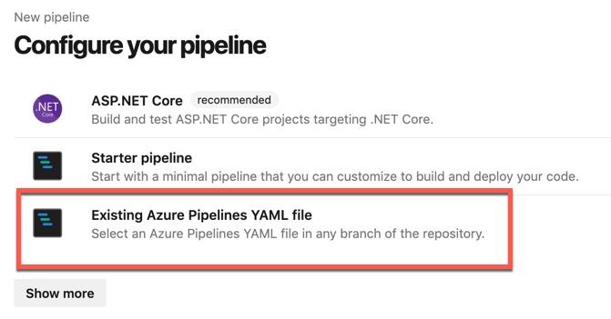
